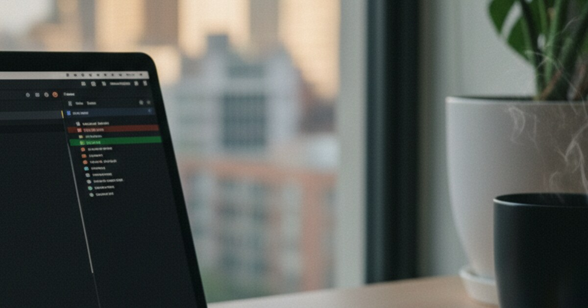

This is the full list of steps to get a new iOS developer building with EAS Build. You don't need a Mac for any of it. Everything runs on Windows or Linux through the EAS Build cloud service.

Before you start, swap a few things. The developer needs the repository URL, the project name, which branch to use and any ENV variables or secrets from you. You need their email address, their iPhone UDID and a short message when they accepted the invitations. EAS then takes care of all certificates, provisioning profiles, code signing and the bundle ID configuration automatically.

## What you do first, as the company admin

1. Add the developer to the Apple Developer account. Go to https://developer.apple.com, click "Users and Access", click the "+" button, enter the developer's email, pick the "Admin" or "Developer" role and click "Invite".
2. Add them to App Store Connect. Go to https://appstoreconnect.apple.com/access/users, click "+", enter the same email, pick the role that fits (Developer, Admin or App Manager) and click "Invite".
3. Add them to the Expo organization. Go to https://expo.dev, open Settings → Members, click "Invite Member", enter their email, pick "Developer" or "Admin" and send the invitation.
4. Get the UDID of their device. Ask them to go to Settings → General → About and tap and hold "Serial Number" until "UDID" shows up, and then send you that string.
5. Register the device in the Apple Developer portal. Go to https://developer.apple.com, open "Devices", click "+", enter a name (e.g., "John's iPhone 14"), enter the UDID and save.
6. Give them access to the repository. Add them on GitHub, GitLab or Bitbucket, give them the right permissions and send them the repository URL.

## What the developer does

7. Accept the Apple Developer invitation. It comes by email. Click the link, sign in with a personal Apple ID (or create one) and accept the terms and conditions.
8. Accept the App Store Connect invitation the same way, with the same Apple ID, and accept the terms.
9. Create an Expo account. Go to https://expo.dev, sign up with the same email, verify it and accept the organization invitation from the email.
10. Set up the computer. Install Node.js (v16 or higher), Git and VS Code or whatever editor you like, and open a terminal.
11. Install the CLI tools.
```bash
npm install -g expo-cli
npm install -g eas-cli
```

12. Log in to Expo and EAS with your own Expo account, not the company's.
```bash
eas login
# Enter personal Expo credentials (not company's)
```

13. Clone the project and install it.
```bash
git clone [repository-url]
cd [project-name]
npm install
```

## The first development build

14. Check that eas.json is there and has a development profile.
```bash
# Check that eas.json exists and has development profile
cat eas.json
```

15. Start the development build.
```bash
eas build --profile development --platform ios
```
EAS just uses the company's stored credentials. The build takes 10-20 minutes and then shows up in the Expo dashboard.

## On the iPhone

16. Turn on Developer Mode (iOS 16+). It's in Settings → Privacy & Security, but "Developer Mode" only shows up there after step 17 failed once. Switch it on, the phone restarts, then confirm "Turn On Developer Mode" and enter your passcode.
17. Install the build. Open the EAS dashboard in Safari on the iPhone, or use the direct link the terminal gives you when the build is done, and tap "Install". If Developer Mode isn't on yet, this fails, so go back to step 16.
18. Trust the developer certificate. Go to Settings → General → VPN & Device Management, find the profile under "Developer App", tap the company name profile, tap "Trust [Company Name]" and confirm.
19. Open the app. The icon is on the home screen now, tap it and it should just run.

## Every day after that

20. Start the development server.
```bash
# In project directory
npx expo start --dev-client
```

21. Connect the phone. iPhone and computer have to be on the same WiFi. Open the installed app, it connects to the Metro bundler, and you see your changes live while you code.
22. Make new builds when you need them.
```bash
# Development build (for testing)
eas build --profile development --platform ios

# Preview build (for internal testing)
eas build --profile preview --platform ios

# Production build (for App Store)
eas build --profile production --platform ios
```

23. Send it to TestFlight.
```bash
# After production build completes
eas submit -p ios
```

## When something breaks

24. If the build won't install, check that the UDID is registered in Apple Developer, that Developer Mode is on and that the device management trust is set, and rebuild with the `--clear-cache` flag.
25. If you can't get into the Expo project, check that you're logged into the right Expo account and that the organization invite was accepted, and run `eas whoami` to see who you are.
26. If the build fails, check that the Apple Developer access is still active, look at eas.json again, check that the bundle ID matches the Apple settings and read the build logs in the EAS dashboard.
