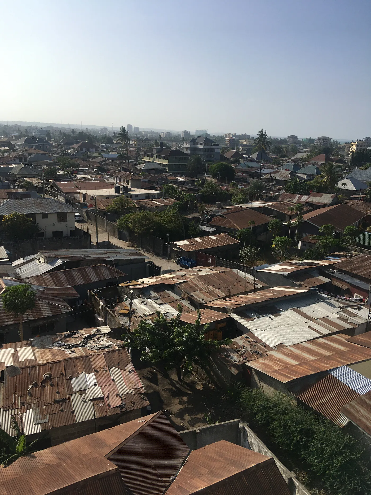

## A city that grows 5% a year

Dar es Salaam has about 8 million people (2024). In 1950 it was about 84,000, so that is nearly a 100× increase. It is one of the fastest growing cities, 3rd in Africa and 9th in the world, and it grows about 5% every year. The projections say about 13.4 million by 2035 and 76 million by 2100. That would make it maybe the 2nd largest city in the world by then.

It is the commercial hub of Tanzania and has the highest regional GDP in the country, about TZS 25.3 trillion in 2020, so around $11 billion. The whole country's GDP is about $78 billion, so Dar alone is a big part of it. The main things here are port logistics, manufacturing and services. The Port of Dar es Salaam handles about 90% of Tanzania's international trade and also serves 6 landlocked countries, and that is why the city matters so much for East Africa.

## Traffic, water and power

The infrastructure has a hard time keeping up. Traffic is really bad and people lose about 2.5 hours in jams every day. Only about 30% of households have piped water directly, and about 85% of people in Dar can get electricity, which is far above the national average, but the power still goes out a lot. In 2016 the city opened the first BRT system in East Africa. It now carries about 200,000 passengers a day and cuts a round trip on the main corridor by about 90 minutes. Still, public transport and utilities are behind other big cities of this size, and the fast growth puts a lot of pressure on them.

## Floods and waste

Then there is the environment. Dar floods often. The floods in April 2018 hit an estimated 0.9 to 1.7 million people and cost 2–4% of the city's GDP, so about $100 to 230 million. Waste is another big problem. The city makes about 5,600 tons of waste a day and only about 20% gets collected. The rest often ends up in the streets, in informal dumps, or it just gets burned. Air pollution is going up too. Fine particles (PM₂.₅) are around 15–16 µg/m³ on average, which is more than 3×+ the WHO guideline of 5 µg/m³, and that is bad for health and for the environment.

## Crime

About 1/4 of all reported crimes in Tanzania happen in Dar es Salaam. Street crime like muggings, bag snatching, car break-ins and burglaries is common. But violent crime is moderate. Tanzania's homicide rate is about 4.7 per 100,000 people, much lower than in many big African cities. Dar's crime index is about 58/100, which counts as moderate, about the same as Nairobi and a lot safer than Johannesburg, which scores around 80–90/100.

## Cost of living

Living here is expensive compared to what people earn. One person needs about $720 a month including rent, but the median monthly salary is only about $274. So living costs are about 2.6× what the average person earns, and that is why a lot of people live in informal housing or have more than one income. Compared to Nairobi, Dar is a bit cheaper, about 15–18%, but relative to wages it is still one of the most expensive cities in East Africa.

## What makes Dar special

And some facts that make Dar special. It grew from a small port of about 84,000 people in 1950 to the largest city in East Africa today. It is not the capital, that is Dodoma, but Dar is still by far the biggest city in Tanzania, and it is projected to be the second most populous city in the world by 2100. The port is a real gateway to the world and handles 90% of the country's trade. So it is one of the fastest growing cities on the planet, with a lot of economic weight in the region.
