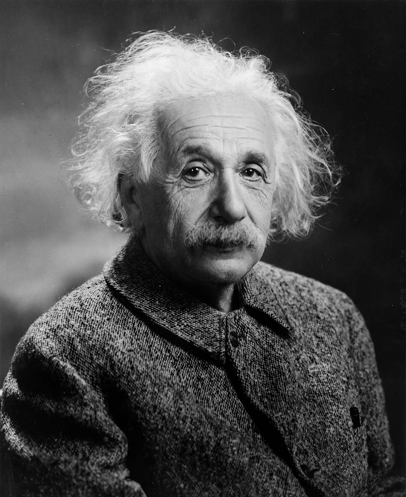

Transcript of the NBC radio program I'm an American, broadcast June 22, 1940. Albert Einstein talks with Marshall Dimock, second assistant secretary of the Department of Labor, a few hours after his final citizenship exam.

I share it because what he says about freedom, tolerance and what science can and can't do still fits today. The recording is on YouTube.

<https://www.youtube.com/watch?v=_0Iq64sYLsM>

## Transcript

**Announcer**

I’m an American.

The Immigration and Naturalization Service of the United States, in cooperation with the National Broadcasting Company, has invited a number of naturalized citizens to talk about the American citizenship which they have recently acquired — ­a possession which we ourselves take for granted, but which is still new and thrilling to them.

Today we are delighted to have with us as guest on this program the distinguished scientist, **Dr. Albert Einstein**, who has this very morning, just a few hours ago, taken his citizenship examination.

Certainly there could be no better time for Dr. Einstein to discuss with **Mr. Marshall Dimock**, the second assistant secretary of the Department of Labor, some of the reasons for his appreciation of American citizenship.

**Marshall Dimock**

Dr. Einstein, I know that you seldom give interviews, and so I want to thank you on behalf of all our listeners for coming here today. I’m sure that what you have to say will be of real interest and service to your new country.

**Albert Einstein**

It is clear to me that it was a self-evident duty to accept this invitation — though I must tell you that I do not think words alone will solve humanity’s present problems. The sound of thumping browns out men’s voices. In ordinary times, times of peace, I have great faith in the communication of ideas between thinking men; but today I am afraid the intellectual way to appeal to man is fast becoming of little avail, with brute force dominating so many million lives.

## Why he left Germany

**Dimock**

This morning, Dr. Einstein, I was privileged to be present while you took your final examination for American citizenship. **Will you tell us why you, who are international in your outlook and by virtue of your scientific interests, prefer to live in America rather than in any other country?**

**Einstein**

Seven years ago, Mr. Dimock, when asked for the reason why I have given up my position in Germany, I made this statement: As long as I have any choice, I will only stay in a country where political liberty, toleration and equality of all citizens before the law is the rule. Political liberty implies liberty to express one’s political opinion, orally and in writing, and a tolerant respect for any and every individual opinion.

**Dimock**

That is real American doctrine. **But tell me, do you feel that America still fulfills the requirements you mentioned as a place in which to live?**

**Einstein**

Yes, Mr. Dimock. Making allowance for human imperfections, I do feel that in America the most valuable thing in life is possible — the development of the individual and his creative power. There may be men who can live without political rights and without opportunity of free individual development, but I think that this is intolerable for most Americans. Here, for generations, men have never been under the humiliating necessity of unquestioning obedience. Here human dignity has been developed to such a point that it would be impossible for people to endure life under a system in which the individual is only a slave of the state and has no voice in his government and no decision on his own way of life.

## What science can and cannot do

**Dimock**

Dr. Einstein, you are a scientist and must regard scientific progress as one of man’s highest achievements, and yet it seems to many people nowadays that science and invention have brought human beings more trouble than good — technological unemployment, international quarrels for the raw materials of industry, and finally the weapons of mechanized warfare. **How do you think the discoveries of science might be turned from man’s own destruction to his advantage?**

**Einstein**

Science has provided the possibility of liberation for human beings from hard labor, but science itself is not a liberator. It creates means, not goods. Man should use them for reasonable goals. When the ideas of humanity are war and conquest, those tools become as dangerous as a razor in the hands of a child of three. We must not condemn man’s inventiveness and patient conquest of the forces of nature because they are being used wrongly and destructively now. The fate of humanity is entirely dependent upon its moral development.

**Dimock**

I have often wondered why it is that leaders in science and culture have so little influence on the course of political events. **What is your opinion in that matter?**

**Einstein**

I think it is quite understandable. Scientists and artists through their works frequently have had enduring influence even in the realm of politics. But in order to influence the course of political events directly, one must also have the gift to influence people and their actions directly. This is rather a matter of arousing and using emotion and personal confidence than of clear understanding of causal connections. For this reason, intellectuals have little chance to impress an audience. Also, they usually do not have the gift to make decisions swiftly. Among outstanding American statesmen, Woodrow Wilson is perhaps the truest example of the intellectual type, but he too did not seem to have mastered the art of dealing with men. His greatest achievement, the League of Nations, appears today as a failure on superficial observation. Yet I believe Wilson’s work will be recreated in more powerful form; only then will the importance of this great innovator be fully recognized.

## A federal order of nations

**Dimock**

**What hope have you, Dr. Einstein, that another League of Nations could prevail in a nationalistic world with its unevenly distributed resources and its unsettled economic conditions?**

**Einstein**

I am convinced that a federal organization of the nations of the world is not only possible, but even an absolute necessity if the conditions of our planet are not to become unbearable for man. The League of Nations failed because its members were not willing to give up a part of their rights of sovereignty and because the League was without any executive power. A world organization cannot ensure peace effectively unless it has control over the whole military power of its members. Exaggerated nationalism is an artificially created emotional state resulting from the necessity to be prepared for war; it would quickly disappear with the elimination of the war danger. I do not believe that unequal geographical distribution of raw materials must necessarily lead to war. As long as a nation has access to the materials necessary for its development, it can very well prosper — as is shown by Switzerland, Finland, Denmark and Norway, which belonged to the most prosperous countries of Europe before the war. One of the most important functions of such an international organization would be to secure unhampered distribution of raw materials and free access to markets. The solution of internal economic and social problems could be left largely to the individual state.

**Dimock**

**Can one strive toward an international order founded on justice while, on the other side of the Atlantic, brute force is strangling one democratic nation after another?**

**Einstein**

I am far from being optimistic, but what I have told you is not a prophecy — it is a statement of what must be done to prevent life on this earth from becoming unbearable. Everybody will agree that we are now farther removed from this goal than seemed to be the case ten years ago. This setback could have been avoided if the democracies had then shown the same solidarity and readiness for sacrifice they show now in this hour of great emergency. Will to sacrifice, solidarity and wise foresight, however, are most effective before the hour of dire necessity has arrived. May our America be spared such an hour through the resolute action of her citizens and statesmen.

## Faith in a chosen country

**Dimock**

You have great faith in your chosen country, Dr. Einstein. I hope we may be worthy of it through all our acts and decisions and attitudes during these trying times when emotions often deprive men of ability to see things clearly.

**Einstein**

I believe that most Americans act like Americans. By that I mean that they are innately just, tolerant and reasonable. But a time of crisis tests these democratic qualities. For example, with eight million naturalized Americans and four million aliens among us, we are challenged as a democracy to prove to ourselves and to the world that tolerance is not only an ideal but a practical possession of all Americans. I believe that America will prove that democracy is not merely a form of government bound to a good constitution, but also a way of life supported by a people who have a good tradition — a tradition of moral strength. And the fate of the human race is more than ever dependent upon its moral strength today.

**Dimock**

Thank you, Dr. Einstein, for your inspiring message to your chosen country.

*(End of broadcast)*

