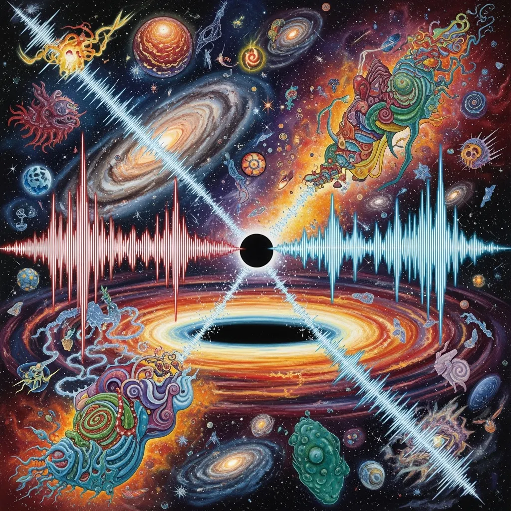

My journey started with a simple question. Could sound waves, or any waves like electromagnetic waves that turn into sound, hold the missing information from black holes? This wasn't just curiosity. The black hole information paradox has been bugging physics for decades, and I wondered if we've been looking in the wrong places.

My first thought was simple. If information can't be destroyed, and quantum mechanics insists it can't, then maybe it gets out in forms we haven't really looked at. Sound waves, electromagnetic radiation, even the quantum vibrations of spacetime itself. Could these carry the information we've been missing?

## Questions that multiplied

And then the questions multiplied. Could I prove this with math first, before I try any experiment? What if sound waves alone aren't enough and we need to add electromagnetic waves to get the full picture? Could we borrow tricks from data recovery and hide reconstruction manuals in the radiation that gets out?

What if photonic and electromagnetic waves share quantum error correction properties? Synthetic AI generated data can have redundancy built in on purpose so you can identify it, and maybe nature uses the same kind of redundancy to keep information. That made me think about compression algorithms that include error correcting redundancy. About fingerprinting algorithms that prove two pieces of data are the same without rebuilding all of it. And what if we only need to prove that *some* information got out, not all of it?

## An AI model as a digital black hole

Then I realized I don't need a real black hole to test this. What if I use an LLM or another AI model as a digital black hole? I feed data in, look at what comes out, and test if information is kept, without leaving Earth. So my thinking grew to include AI generated sound and sound models as test environments, the best error correction and fingerprinting methods we have today, and tools that can prove how input and output are connected. And those tools are useful outside physics too, for example to prove authorship or intellectual property.

## Two worlds

The more the idea grew, the more I was standing in two worlds. One is the physics problem, and solving the information paradox is still the top priority. The other is the practical side, building tools for creatives and scientists so they can prove an idea is theirs.

## Partial matches and proofs

I started wondering about partial matches. What if we can detect a 50% or 75% match with something like Blake3 hashing? Could error correction push these partial matches up to a higher confidence?

And that made me question some basic assumptions. Why is a mathematical proof seen as more valid than a computational demonstration? Could we reproduce existing analog proofs digitally, with new methods? And if we use more and more coding LLMs, could a private key someone pasted by accident be reconstructed?

## Where it ended up

So what started as a question about sound waves and black holes is now one approach that puts together wave physics (sound and electromagnetic), quantum error correction, information theory and cryptography, AI and ML models as labs, and practical uses for IP protection.

What I like about this is that every question gave me new ideas, and every idea gave me new questions. I started by wondering if sound could get out of black holes, and now I have a framework that could test information preservation digitally, build new tools to prove who owns data, connect theoretical physics with practical uses, and maybe, just maybe, crack open the black hole information paradox.

## What comes next

From here my plan is to build digital test environments with LLMs and sound models, and to implement error correction and fingerprinting algorithms. Then I test how well partial information can be recovered and improved, and I turn the computational results that work back into mathematical proofs. And I keep the information paradox as the north star while I build the practical tools.

I went from a simple question about sound waves to a whole framework for testing if information is kept, and it shows how far curiosity can take you when you mix different fields. I don't know yet if this solves the information paradox. But the journey already gave me ideas that connect physics, computer science and practical things people can use.
