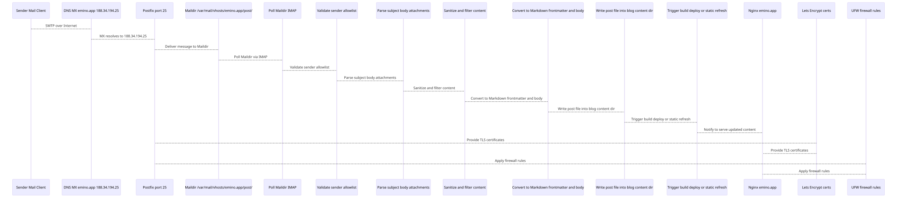

This is the whole technical path from an email to post@emino.app to a published post on my blog. It covers DNS and TLS, SMTP and IMAP, the filtering and validation, and what the importer does inside. The flowchart at the end now also shows the sender checks and the parsing.

## The short version

Here is the short version. DNS has an A record for emino.app pointing to 188.34.194.25 and an MX record 0 emino.app.

TLS is a Let's Encrypt cert in /etc/letsencrypt/live/emino.app/, and Nginx, Postfix (for STARTTLS) and Dovecot (for IMAPS) all use it. certbot.timer renews it automatically.

Mail comes in through Postfix on port 25, and the virtual mailbox post@emino.app goes into the Maildir /var/mail/vhosts/emino.app/post/. Dovecot runs on port 993 with the same Let's Encrypt cert, so the importer or a normal mail client can read the mail over IMAP. The ufw firewall has 22, 80, 443 and 25 open, and 993 only if you need IMAP access.

The importer polls the Maildir or IMAP, checks the sender, parses and cleans the mail, turns it into Markdown, writes it to posts/ (or whatever content folder you use) and triggers the build and deploy. And Nginx serves the static blog over HTTPS.

## What the importer does

The importer runs on a timer, a systemd timer or cron, or as a watcher that just keeps running. It reads new/ and cur/ in the Maildir, or the IMAP inbox.

It checks the From header against an allowlist, for example your own addresses, and unknown senders get skipped and logged. The subject becomes the title and the slug, and the body becomes the Markdown body. Attachments can be ignored or saved, and if that's on, it only keeps text and image types.

Then it cleans things up. It strips dangerous HTML, normalizes encodings and can also clean up links and emoji if you want. It builds the front matter with title, date, tags and author, puts the Markdown body under it and saves the file in content/posts/ or whatever path you set. After it writes the file it can run a build and deploy hook, like the static site generator or a cache refresh.

It logs to its own file, and when something fails it should log it and leave the message in the Maildir so it can try again.

## Setting it up

1. DNS. `A emino.app 188.34.194.25` and `MX 0 emino.app.`
2. TLS. Run `certbot --nginx -d emino.app -d www.emino.app --redirect` and check the timer with `systemctl list-timers | grep certbot`.
3. Postfix with a virtual mailbox. Put `post@emino.app emino.app/post/` into /etc/postfix/vmailbox, then run `postmap /etc/postfix/vmailbox`, `postconf -e "virtual_mailbox_domains=emino.app"` and `postconf -e "virtual_mailbox_maps=hash:/etc/postfix/vmailbox"`. For TLS run `postconf -e "smtpd_tls_cert_file=/etc/letsencrypt/live/emino.app/fullchain.pem"`, `postconf -e "smtpd_tls_key_file=/etc/letsencrypt/live/emino.app/privkey.pem"` and `systemctl reload postfix`.
4. Dovecot for IMAP and IMAPS. In /etc/dovecot/conf.d/10-ssl.conf set `ssl_cert = </etc/letsencrypt/live/emino.app/fullchain.pem` and `ssl_key  = </etc/letsencrypt/live/emino.app/privkey.pem`, then run `systemctl reload dovecot`.
5. Maildir permissions. /var/mail/vhosts/emino.app/post/ is owned by vmail:vmail, with modes 700 and 600.
6. Firewall with ufw. `ufw allow 25/tcp`, `ufw allow 993/tcp` if you need IMAP access, and `ufw allow 80,443/tcp`.
7. The importer job. It reads from the Maildir or IMAP for post@emino.app, only accepts allowlisted sender addresses and writes posts into your blog content path, like content/posts/ or posts/. Run it with a systemd timer or cron, log to its own file and trigger the build and deploy if you need it.
8. Nginx. Port 80 does return 301 https://$host$request_uri; and port 443 uses the Let's Encrypt cert paths, with the root at your blog folder, and serves the static site.

## Monitoring and fixing it

To keep an eye on it, check when the cert expires with `openssl x509 -in /etc/letsencrypt/live/emino.app/fullchain.pem -noout -enddate`.

The mail flow from Postfix and Dovecot is in /var/log/mail.log. The importer has its own log, and you want an alert when it fails. If renewals act up, look at `journalctl -u certbot`. And as a health check, send a test mail to post@emino.app every now and then and see that the file lands in the Maildir and the importer publishes it.

Most things that break are simple. An expired cert is handled with the nginx HTTP challenge and certbot.timer, which is already in place. If port 25 is blocked, you open it in ufw, and that's done.

If the importer is down, check that the timer or service is active and look at the logs. For the Maildir permissions, keep the vmail ownership and the 700 and 600 modes. And an email from an unknown sender just gets skipped, so add the address to the allowlist if you want it.

That's the complete email to blog setup on emino.app, from DNS and TLS through SMTP, IMAP and the sender check to the Markdown and the published post, and you can set it up again just from this.

