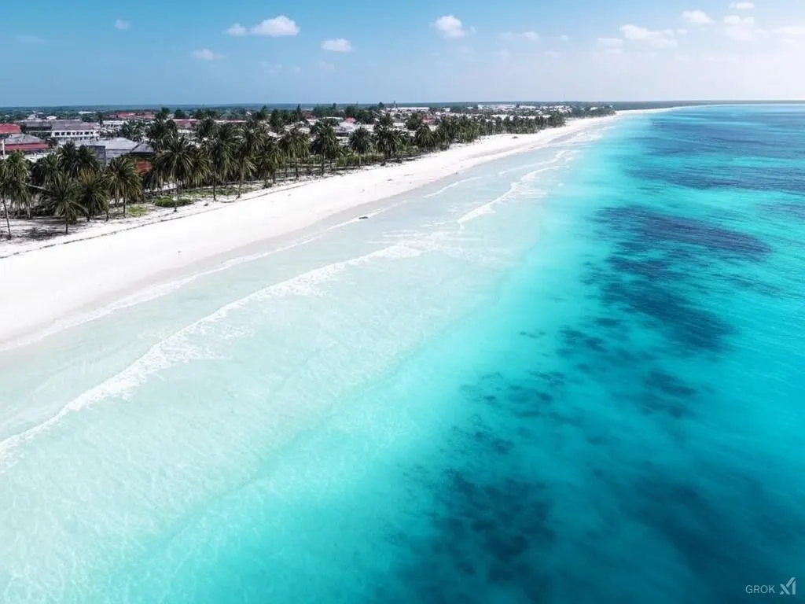

*Paje Beach, Zanzibar*

The short version.

As a foreigner you can't own land outright in Zanzibar. But you can get a 99-year lease, or a lease of 33+33+33 years that gets renewed. There are five ways to do it. (1) You set up a 100% foreign-owned company through ZIPA. (2) You lease land directly from a local. (3) You buy an existing leasehold interest. (4) You go into a joint venture with a local. (5) You inherit land.

Every way needs certain documents, like a purchase contract, the seller's ID, proof that the seller owns the land and a letter from the Sheha. Always talk to a local [lawyer](mailto:emin@emin.de) so you stay inside Zanzibar's land laws.

## Five ways to get land

Zanzibar has amazing nature and a growing economy, so a lot of foreign investors want to come here. But the land laws in Zanzibar don't let foreigners own land outright. What you can get instead is a long lease, usually for 99 years or for 33-year terms that get renewed. Here are the legal ways to get land, the papers you need and the things to think about as a foreign investor.

The first way is a 100% foreign-owned company through ZIPA. You register a company with the Zanzibar Investment Promotion Authority (ZIPA) and the company takes the land lease. The good part is that you have full control over the company and the lease. The downside is that you have to follow the ZIPA rules and meet their investment thresholds.

The second way is to lease land directly from a local. You lease the land from a local who holds a Right of Occupancy. You don't need a company and you talk directly to the landowner. But you don't own the land, so you depend on what the lease says.

The third way is to buy an existing leasehold interest. You buy the rest of a lease from a local who already holds one. You get the land right away and don't wait for a new lease to be approved. But the term can be shorter, depending on how much time is left on the lease.

The fourth way is a joint venture with a local. You partner with a local who holds the Right of Occupancy, and you bring the investment. This fits the local ownership rules and you share the investment and the risk. But you need a local partner you can trust, and there can be fights over who owns what.

The fifth way is to inherit land. You inherit land through a will or through the laws on intestate succession. You skip the normal process of getting land. But this only works when you are legally entitled to inherit.

## The documents you need

Now the documents you need. A letter from the Sheha, the local village leader. It confirms that the sale is legit and that the seller owns the land.

The names and IDs of the neighbours. They help to check the borders of the land and avoid disputes.

A purchase contract. That's the legally binding agreement with the terms of the sale.

The seller's passport and ID. They confirm who the seller is and that they have the legal capacity to sell the land.

The land ownership documents. They prove the seller's legal right to the land, for example a Right of Occupancy.

A site plan and beacons. They mark the borders of the land and prevent disputes.

A family consent agreement, if it applies. It confirms that every family member agrees to the sale.

Stamp duty and tax receipts. They prove you paid the stamp duty (1% of the property value) and the land transfer tax (1-5%).

An application for land transfer approval. That's the formal request to the Zanzibar Land Commission to approve the transfer.

Building permits, if they apply. You need them for any construction on the land.

## In short

So as a foreigner you can get land in Zanzibar through different lease setups. You set up a company, lease from locals, buy an existing leasehold interest, go into a joint venture or inherit land. Every way needs its own documents and you have to follow the local laws. Always talk to a qualified lawyer so your investment is safe and legally sound.

Zanzibar has a special charm and real potential for investors, but you need to plan carefully and do your legal due diligence to get through the land ownership rules.

For more, just contact me at [emin@emin.de](mailto:emin@emin.de)
