## What the solver is and why it exists

The Near Intents protocol lets users say "I want to swap X for Y under conditions Z", and that is an intent. A solver, so this app, watches those intents and acts as a market maker. It keeps track of an on-chain AMM pool with the reserves for two NEP-141 tokens, it computes prices plus a margin for that pair, and when an intent is profitable with your margin, it executes the swap through your NEAR account. The solver also has an HTTP status API at /status and a dashboard at /dashboard that shows health, reserves, quotes, intents and balances.

My instance runs right now as the pm2 process near-solver and listens on 127.0.0.1:4010. You can reach it at https://emino.app/status for the JSON health and at https://emino.app/solver/ for the dashboard. When it says ready:true and ws_connected:true, the solver is live and processing relay traffic.

## From the browser to the solver

A user opens https://emino.app/solver/ in the browser. The Nginx vhost for emino.app terminates TLS with a Let's Encrypt certificate and has two locations. /solver/ goes with proxy_pass to http://127.0.0.1:4010/dashboard and /status goes to http://127.0.0.1:4010/status. The browser loads the HTML dashboard from /dashboard, and the inline JS calls /status right away and then polls it every few seconds for live data. The HttpService in the solver builds the payload for /status and renders the dashboard template for /dashboard.

## The solver process

It's Node.js and it runs under pm2. I start it roughly like this.

    NODE_ENV=local pm2 start "npm start" --name near-solver

And npm start runs

    node -r tsconfig-paths/register -r ts-node/register src/main.ts

These are the important files. src/main.ts calls loadEnv() from src/utils/load-env.ts and then require('./app').app(). src/utils/load-env.ts calls dotenv.config with the path ./env/.env.local, because NODE_ENV=local. It validates process.env against a Joi schema in src/configs/env.validation.ts, throws if anything required is missing or invalid, and copies the validated values back into process.env. And src/app.ts creates the services.

    const cacheService   = new CacheService();
    const nearService    = new NearService(); await nearService.init();
    const intentsService = new IntentsService(nearService);
    const quoterService  = new QuoterService(cacheService, nearService, intentsService);
    await quoterService.updateCurrentState();
    const cronService    = new CronService(quoterService); cronService.start();
    const websocketSvc   = new WebsocketConnectionService(quoterService, cacheService); websocketSvc.start();
    const httpService    = new HttpService(cacheService, quoterService, nearService); httpService.start();

That gives you a live NEAR connection, AMM pricing and state, a WebSocket stream from the solver relay, a periodic state refresh and the HTTP API.

## The services

NearService uses near-api-js to build the connections. The network comes from NEAR_NETWORK_ID, so mainnet or testnet. The node URLs come from NEAR_NODE_URLS or NEAR_NODE_URL, and if you set nothing it takes the defaults, https://free.rpc.fastnear.com and https://near.lava.build for mainnet, and https://test.rpc.fastnear.com and https://neart.lava.build for testnet. It loads the identity of the solver from the env. NEAR_ACCOUNT_ID is your solver account, for example my-solver.near, and NEAR_PRIVATE_KEY is an ed25519:... key string for that account. It also has helpers. getBalance() shows how much NEAR the solver holds for gas and liquidity, and the others make view calls and send signed transactions to NEAR contracts.

IntentsService wraps the API of the intents contract, the INTENTS_CONTRACT env if you use it. With it the solver reads pool data and reserves and works with intents, for example the settlement logic.

QuoterService knows the two token IDs from AMM_TOKEN1_ID and AMM_TOKEN2_ID, and the margin you want, MARGIN_PERCENT, where 0.3 means 0.3%. It keeps an internal snapshot of the state, so the reserves for each NEP-141 token and any other AMM parameters it needs. updateCurrentState() gets the fresh on-chain pool state through NearService and IntentsService, and other methods get called by WebSocket events to adjust the state for new quotes and intents. The quoter decides if an intent is worth executing with your current pool and margin.

CacheService is an in-memory key-value cache. The keys you'll see are ws_connected, a boolean, ws_last_event_at, the timestamp of the last relay event, reserves, the current pool reserves, and reserves_updated_at, when the reserves were last refreshed. Then recent_quotes, a list of the latest quotes, recent_intents, a list of the latest intents with tx hashes, and total_supply, which is cached for 60s so you don't spam the NEAR RPC.

WebsocketConnectionService connects to the solver relay. RELAY_WS_URL is for example wss://solver-relay-v2.chaindefuser.com/ws, and RELAY_AUTH_KEY is a JWT or auth token that you get from the relay operator. It opens a WebSocket, authenticates with the auth key and then receives new quotes, so price offers, new intents, so user swap requests, and execution and settlement updates. For every event it updates CacheService with the recent quotes, intents and timestamps, and it tells QuoterService about the changes that matter, so prices and state stay fresh.

CronService runs a periodic job, for example every 5-10 seconds depending on the implementation, that calls QuoterService.updateCurrentState(). So even if the WebSocket traffic stutters, the picture the solver has of the pool stays correct.

HttpService is a pure Node http server, no Express. It listens on APP_PORT, in my case 4010. The route / gives back simple JSON, { ready: true }. The route /status builds the full status payload. ready is always true if the process is up. Then there are ws_connected and ws_last_event_at, reserves and reserves_updated_at, margin_percent, and recent_quotes and recent_intents. deposit_addresses has the BTC and EURe deposit addresses. near_balance is in yocto NEAR, and near_balance_near is the same as NEAR you can read, through a formatYocto helper. And total_supply has the token supplies from ft_total_supply view calls.

The route /dashboard gives back a static HTML page with embedded JS. It injects the bootstrap data, which is the current /status JSON, and the list of token IDs with the token meta, so symbols and decimals. Then it renders a grid of cards for health and readiness, deposit addresses, WebSocket status, reserves on the intents contract, total supply on NEAR, recent quotes and recent intents. And it starts a loop that calls /status again every few seconds and updates the UI.

## The systems around it

The solver doesn't live alone, it's part of a bigger system.

The solver relay (RELAY_WS_URL) is a central hub that feeds intents and quotes to registered solvers. You authenticate with RELAY_AUTH_KEY, and solvers send signed transactions for the intents they accepted.

The NEAR RPC nodes are used for view calls, like ft_total_supply and the pool state, and for sending transactions from NEAR_ACCOUNT_ID. The solver uses more than one URL for redundancy and simple failover.

The intents contract (INTENTS_CONTRACT) holds the logic and the pools for EURe and BTC and other pairs, and it manages reserves and settlement.

And then there are the deposit addresses, which is an off-chain bridge. There is a BTC mainnet address where users send BTC, and an EURe address on Gnosis where users send EURe tokens. A separate bridge system outside this repo watches those and mints and burns the matching NEP-141 tokens on NEAR.

## How to start your own solver, step by step

This part turns the chart into a checklist.

### What you need

You need a machine or VPS with Linux, with Node.js 20+ and npm or pnpm.

You need a NEAR account just for the solver, for example your-solver.near. Never use your personal main wallet, create a new account only for the solver, and fund it with enough NEAR for gas and the liquidity you want.

You need a full access private key for that solver account. You export it from the NEAR CLI or the wallet, and the format must be ed25519:.... Keep it secret. Never commit it to git, never paste it into a chat, never share it.

You need a relay auth key, RELAY_AUTH_KEY. The relay or intents operator gives it to you, and it's usually a JWT-like token that identifies your solver.

And if you want, a domain name with TLS, for example a subdomain like solver.example.com, if you want a nice dashboard URL, and Nginx to proxy from HTTPS to the internal port.

### Clone and install

    git clone https://github.com/near-intents/near-intents-examples.git
    cd near-intents-examples/near-intents-amm-solver

    # Using npm
    npm install

Replace the repo URL with whatever remote you really use.

### Create and fill your env file

The solver looks for the env in `./env/.env.<NODE_ENV>`. For local and dev we usually use NODE_ENV=local, so

    cd near-intents-examples/near-intents-amm-solver
    mkdir -p env
    cp env/.env.example env/.env.local

Open env/.env.local and set the core variables that are required.

    # Network
    NEAR_NETWORK_ID=mainnet

    # Tokens for this solver (example: EURe ↔ BTC)
    AMM_TOKEN1_ID=nep141:gnosis-0x420ca0f9b9b604ce0fd9c18ef134c705e5fa3430.omft.near
    AMM_TOKEN2_ID=nep141:btc.omft.near

    # Non-TEE mode (simplest setup)
    TEE_ENABLED=false

    # Your solver NEAR account (dedicated!)
    NEAR_ACCOUNT_ID=your-solver.near
    NEAR_PRIVATE_KEY=ed25519:YOUR_SOLVER_PRIVATE_KEY_HERE

Then node, relay and margin.

    # NEAR RPC, you can override; otherwise defaults are fine
    NEAR_NODE_URL=https://rpc.mainnet.near.org
    # or:
    # NEAR_NODE_URLS=https://free.rpc.fastnear.com,https://near.lava.build

    # Relay endpoint and auth
    RELAY_WS_URL=wss://solver-relay-v2.chaindefuser.com/ws
    RELAY_AUTH_KEY=YOUR_RELAY_AUTH_TOKEN

    # HTTP server port for the solver
    APP_PORT=3000          # or 4010 on your server

    # Logging and margin
    LOG_LEVEL=info         # error | warn | info | debug
    MARGIN_PERCENT=0.3     # 0.3% margin, adjust to your risk
    ONE_CLICK_API_ONLY=true

The Joi schema in src/configs/env.validation.ts checks that AMM_TOKEN1_ID and AMM_TOKEN2_ID are set, that either TEE mode or NEAR_ACCOUNT_ID and NEAR_PRIVATE_KEY are set the right way, and that MARGIN_PERCENT is positive. If the solver fails at startup with a validation error, it tells you which env variables are missing or invalid.

### Run it locally

From the solver directory

    # Make sure you're in near-intents-amm-solver
    NODE_ENV=local npm start

You should see logs like "Using Near RPC nodes: ..." and "Cron service started", and once it's connected, WebSocket logs like "Received intent: {...}". Then check

    curl http://localhost:3000/status   # or your APP_PORT

and open http://localhost:3000/dashboard in the browser. You should see the Solver Monitor dashboard.

### Run it in the background with pm2

That's the production-ish way. On your server

    cd /path/to/near-intents-examples/near-intents-amm-solver

    NODE_ENV=local pm2 start "npm start" --name near-solver
    pm2 save
    pm2 startup   # sets up pm2 to auto-start on boot

Check the logs with

    pm2 logs near-solver --lines 50

and the HTTP side with your APP_PORT.

    curl http://127.0.0.1:3000/status

### Put it behind Nginx and TLS

It's optional, but recommended. A basic Nginx server block for a domain solver.example.com looks like this.

    server {
        listen 443 ssl http2;
        server_name solver.example.com;

        ssl_certificate     /etc/letsencrypt/live/solver.example.com/fullchain.pem;
        ssl_certificate_key /etc/letsencrypt/live/solver.example.com/privkey.pem;

        location / {
            proxy_pass http://127.0.0.1:3000;  # APP_PORT
            proxy_set_header Host $host;
            proxy_set_header X-Real-IP $remote_addr;
            proxy_set_header X-Forwarded-For $proxy_add_x_forwarded_for;
            proxy_set_header X-Forwarded-Proto $scheme;
        }
    }

For my setup on emino.app I did it differently. I keep the existing blog at / and add these locations, which are already in the vhost.

    location = /solver/ {
        proxy_pass http://127.0.0.1:4010/dashboard;
        ...
    }

    location /solver/ {
        proxy_pass http://127.0.0.1:4010/;
        ...
    }

    location /status {
        proxy_pass http://127.0.0.1:4010/status;
        ...
    }

Then

    nginx -t
    systemctl reload nginx

Now the solver is reachable at https://yourdomain/solver/ for the dashboard and at https://yourdomain/status for the status JSON.

## Security and running it

Keys first. Use a dedicated NEAR account for the solver. The private key must have full access, otherwise the solver can't send txs. Treat NEAR_PRIVATE_KEY and RELAY_AUTH_KEY as secrets. Store them in .env.local on the server, make sure the repo directory is not world-readable, and never commit `.env*` files to git.

Then the funds. Only keep as much liquidity and NEAR as you are willing to risk. Take the profits out from time to time and think of the solver account as a "hot wallet".

For monitoring, pm2 logs near-solver shows you what happens at runtime, and curl /status is for monitoring from code, you could plug it into Prometheus or a health check.

And for upgrades you pull the new code, run npm install if the dependencies changed, and restart with pm2 restart near-solver.

Here is the chart.

https://mermaid.emino.app/?c=eJx1Vt1u6zYMfhXCwLk6-WmKYcNyMaAJip0ztFkXtygwpSgUW4m1Y0s-kuIkWHe7B9gj7klGSvJP0B0EsE3qI0V-JKX8mWQ6F8k82RteF3C33iiADx_gyQoDH0EoZ861lsqR3h62AUarpABYsIXRRxI3qnCutvPpVFRS6Qmv66nVZSPM9IWwQuUbdeHlNt8LtklWe6lOuNfjXQqss33ZJC9hixULiKbQ1uE2A8jQ7QLG45_eNsmnx8eHFNqtgT19fkGjVuu4O1hgv6S_rnCHN1gFY8w49QZQG50Jay8CDUsYqhLcjJEMpMWOeVWNwy7A6up6Dn41aPro77lUrMLHxFmMo9Q8v1UNOA1tBgA3dc1QCoijNAKQ0EZiHBHwCZll9EiDHmG1Ng6-u5pd4XdMawTTnNtiq7nJo-Fzyp7F1ursi3BLrZTInNSq92JEyc-AkNRDICsl5haNl0YrRo_BrsJIncsMjNgZYYuI_O2gHRIUXj365v4e-ZSZVHusLwUpWtc8KwTzzx4u1bgSlTZnhGrTQlfIKqNHD1zd3qxh_bAkp3KviG4P_Rwqw-J76NkrINPYzzxzUIiyjmZdA2EPkKFRvAQsAgZNWqofdRYViWR8eZGqMZSf06FErA3lwMwFgnIfKijFoRyT6GKjDoZdqY8kr2KzY7eezn2zY1fNrn-YXOFvNqfm6BuCihfBYQbeY8MCTUWbHL0vo-00fUadqs2gVWB8NGdINi9d4buN-lpgo34la3zHwoxgy0uusOFp90WX84JnX_ZGH1QOf-itH0piNjrHD7I3DS_JrI8ofEWUbzuwite20M5vELOJm6z9DHxsY-k47s-pU-gKPADaT7Bn60RluzH3Tlg8Q7xAo2zpOAzFGftRGzfXk8mktXlYsq6VFR7DNP47bh0dJCMoecNHYOpsQseHEu6yy5dtm3ddjda3T2tBlV08LqHWuowmKDJSRUeQi1pbSQazu4X8vQ-J7Jl3guT-rBBEMV2dZj9-v2xR3cAE4ojlUM4Bh3hznEQGhzpH8u1bnI7nNNYk6H1HZIh_jfZTiHJ04yl8zcK5JXJcL5GdV9Hg4qCOA8c7gTC_boct4aNFkgnUSHGEjJelbY-PHNwJY2zbt6V1MITLgX75fjqJ2pgYXZuRXQqfVkr59SBz6c4U0dCh5_n_7fzSNwzfdXguMpkLurl20vFtKaDnj-Po8AonKBAy3J7ybWcEaSA2qLQbZY8cr27hHHpCZoZ2yShxEvXtH4Y5XN7f3d0M__79D3zj3iYn55p80KhlBTcu-es_a-zoSA

