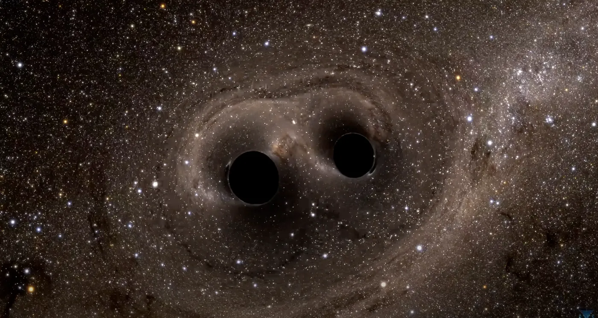

<https://www.youtube.com/watch?v=1agm33iEAuo>

The gravitational waves we detect from black hole mergers show complex orbital dynamics. They fit general relativity, but I think they may not tell the whole story.

<https://www.youtube.com/watch?v=I_88S8DWbcU>

The inspiral, merger and ringdown pattern we see looks a lot like electromagnetic field interactions, and so we should look at whether electromagnetic effects play a real part in these systems.

## The idea: a short-lived charge

The idea is this. Black holes are seen as electromagnetically neutral in a steady state, but they may carry a short-lived or leftover charge during dynamic events. That charge could change the merger dynamics in ways that pure gravitational models don't fully capture. And the electromagnetic radiation from these events may carry information about black hole properties that gravitational waves alone can't show.

There are three reasons why I think this makes sense. The first is about how information is encoded. Sound waves carry a lot of detail about their source in frequency, amplitude and phase modulation, and in the same way electromagnetic waves from the area around a black hole may carry information about structure and dynamics that gravitational wave detectors can't see. The second is the coupling of different physics. In extreme gravitational fields the coupling between spacetime curvature and electromagnetic fields, through nonlinear effects in general relativity, could give signatures we can observe and that are different from pure gravitational predictions. The third is the gap in what we observe. Current models assume electromagnetic neutrality, but a short charging during accretion or merger events could create electromagnetic counterparts we can detect, with information that adds to what gravitational waves give us.

So we suggest three things. A systematic analysis of electromagnetic signatures that happen at the same time as gravitational wave events, coupled gravito-electromagnetic models for merger dynamics, and a search for correlations between features in the electromagnetic spectrum and the black hole parameters we infer. It's based on the idea that complex systems often need multi-messenger observations to really understand their physics, just like astronomy moved forward by combining optical, radio and X-ray observations.

## Multi-messenger astronomy as the key to understanding black holes

The multi-messenger approach changes a lot how we understand the universe, because it looks at different carriers of information at the same time. Instead of relying on just one kind of signal, it combines gravitational waves, electromagnetic radiation, neutrinos and cosmic rays. Each messenger carries its own information about the same astrophysical event.

For black holes this means gravitational waves show masses and rotation speeds, electromagnetic signals can show charge states and the structure of magnetic fields, and X-ray radiation tells us about the direct surroundings. It's like an orchestra where every instrument adds a different voice to the whole piece, and every messenger brings its own puzzle pieces to the full picture.

There are people and places working on exactly this. Kip Thorne at Caltech, Nobel Prize winner and LIGO pioneer, is very open to new theories. Alessandra Buonanno at the Max Planck Institute in Potsdam is one of the world leaders in gravitational wave modeling. Luis Lehner at the Perimeter Institute is a specialist in electromagnetic effects in extreme gravitational fields. Vasileios Paschalidis at the University of Arizona does research on magneto-hydrodynamic couplings. Luciano Rezzolla at Goethe University Frankfurt is an expert in multi-messenger astronomy. And Sheperd Doeleman at Harvard is the director of the Event Horizon Telescope. The institutions I'd recommend are the Max Planck Institute for Gravitational Physics in Potsdam, the LIGO Scientific Collaboration, the Perimeter Institute in Canada and the European Gravitational Observatory in Italy.

Relevant current research and publications are Multi-messenger Astrophysics with Gravitational Waves in Annual Review of Astronomy and Astrophysics, Electromagnetic Counterparts of Gravitational Wave Sources in Nature Reviews Physics and Charged Black Holes in Modified Gravity in Physical Review D. You find the current work in the arXiv.org archives under the categories gr-qc for General Relativity and astro-ph.HE for High Energy Astrophysical Phenomena.

## Multi-Messenger-Astronomie als Schlüssel zum Verständnis Schwarzer Löcher

Der Multi-Messenger-Ansatz verändert sehr, wie wir das Universum verstehen, weil er verschiedene Informationsträger gleichzeitig anschaut. Statt sich nur auf eine Art von Signal zu verlassen, kombiniert diese Methode Gravitationswellen, elektromagnetische Strahlung, Neutrinos und kosmische Strahlung. Jeder Bote trägt seine eigenen Informationen über dasselbe astrophysikalische Ereignis.

Bei Schwarzen Löchern heißt das, dass Gravitationswellen uns die Massen und Rotationsgeschwindigkeiten verraten, elektromagnetische Signale Ladungszustände und Magnetfeldstrukturen zeigen können und Röntgenstrahlung uns etwas über die direkte Umgebung sagt. Es ist wie bei einem Orchester, wo jedes Instrument eine andere Stimme zum ganzen Stück beiträgt, und so liefert jeder Bote Puzzleteile zum Gesamtbild.

Es gibt Leute und Orte, die genau daran arbeiten. Kip Thorne am Caltech, Nobelpreisträger und LIGO-Pionier, ist sehr offen für neue Theorien. Alessandra Buonanno am Max-Planck-Institut Potsdam ist weltweit führend in der Modellierung von Gravitationswellen. Luis Lehner am Perimeter Institute ist Spezialist für elektromagnetische Effekte in extremen Gravitationsfeldern. Vasileios Paschalidis an der University of Arizona forscht an magneto-hydrodynamischen Kopplungen. Luciano Rezzolla an der Goethe-Universität Frankfurt ist Experte für Multi-Messenger-Astronomie. Und Sheperd Doeleman an der Harvard University ist Leiter des Event Horizon Telescope. Die Institutionen, die ich empfehlen würde, sind das Max-Planck-Institut für Gravitationsphysik in Potsdam, die LIGO Scientific Collaboration, das Perimeter Institute in Kanada und das European Gravitational Observatory in Italien.

Relevante aktuelle Forschung und Publikationen sind Multi-messenger Astrophysics with Gravitational Waves in Annual Review of Astronomy and Astrophysics, Electromagnetic Counterparts of Gravitational Wave Sources in Nature Reviews Physics und Charged Black Holes in Modified Gravity in Physical Review D. Aktuelle Arbeiten findet man in den Archiven von arXiv.org unter den Kategorien gr-qc für General Relativity und astro-ph.HE für High Energy Astrophysical Phenomena.
