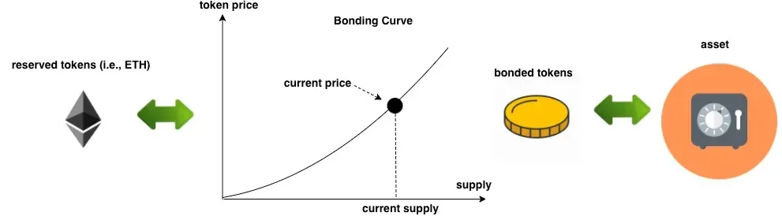

*via [https://blog.oceanprotocol.com/enabling-short-selling-in-bonding-curves-part-1-af871ad75d40](https://blog.oceanprotocol.com/enabling-short-selling-in-bonding-curves-part-1-af871ad75d40)*

The idea is to fix the funding problem of open source projects with an economic model that pays for itself, and it runs on a token bonding curve. Every time someone buys or sells tokens, a part of the transaction goes to the project maintainers, for example 21%. So the developers get a reliable income and it's paid directly by the community. Early supporters buy tokens at a lower price and that gives the project its first money. When more people join, the price goes up, and that rewards the early supporters and funds the project even more.

If you hold tokens, you automatically give liquidity to the bonding curve. You get a share of the transaction fees, for example 3%, and you don't have to manage any liquidity pool yourself. There are no middlemen and you also don't need a decentralized exchange, a DEX, because the bonding curve itself is the market and it always has liquidity. The design of the curve discourages big sell-offs, so it keeps the price stable and protects the project against whales and pump and dump.

There are also two kinds of NFTs. A maintainer NFT proves official ownership of the project, so only verified maintainers can earn the fees. A supporter NFT gives early backers a permanent proof that they helped.

## How it fixes open source funding

I see four problems this fixes. The first one is income. Open source maintainers mostly live from donations or a sponsorship now and then, and you can't rely on that. The bonding curve creates continuous funding through transaction fees. Every time someone buys or sells tokens, the maintainers earn a percentage, for example 21%, and so the income is predictable and it grows with the project.

The second problem is that traditional funding like grants and donations is centralized and limited. With the bonding curve anyone can contribute just by buying tokens. Early supporters get tokens at a lower price and later supporters pay more, and that is a fair model that also scales.

The third problem is support over a long time. A lot of open source projects struggle to keep contributors and supporters. Token holders earn passive income from the transaction fees, so they have a reason to hold the tokens and stay with the project. Maintainers can also use tools like the Drips Network to pass earnings on to contributors.

The last problem is trust. Traditional funding is often not transparent and so people don't trust it. The bonding curve runs completely on-chain, so every transaction and every fee distribution is public and anyone can check it.

## The math

When you buy tokens, you mint them. You send ETH to the contract and the contract calculates how many tokens you get based on the current supply. If the supply is low, you get more tokens for your ETH, and if the supply is high, you get fewer.

When you sell tokens, you burn them. You send the tokens back to the contract and it calculates how much ETH you get, again based on the current supply. If the supply is high, you get less ETH per token, and if it's low, you get more ETH per token.

On every transaction a percentage is taken as a fee. Let's say someone buys tokens worth 10 ETH. Then 21% goes to the maintainer and that's 2.1 ETH, 3% is shared among the token holders and that's 0.3 ETH, and 1% goes to the platform, so 0.1 ETH. The holders get their part of the 3% fee pool based on how much of the total supply they own. If you own 10% of the tokens, you get 10% of the 0.3 ETH fee pool.

Early supporters bring the first money a project needs to get development going. As the project grows, the token price goes up, and that rewards the early backers and brings in more supporters. After that the transaction fees keep the money flowing, so maintainers can work on the project and not on fundraising. Token holders have a reason to support the project for a long time, and that builds a strong community where people really take part. And because it all runs on-chain, every transaction and every fee distribution is open and you can check it.

So the bonding curve gives open source projects a decentralized funding model that anyone can check and that keeps paying. It brings maintainers, supporters and token holders to want the same thing, and that's how it solves the funding problem and keeps the project and its community growing.

There is more information on [paymentrequired.com](http://paymentrequired.com).
