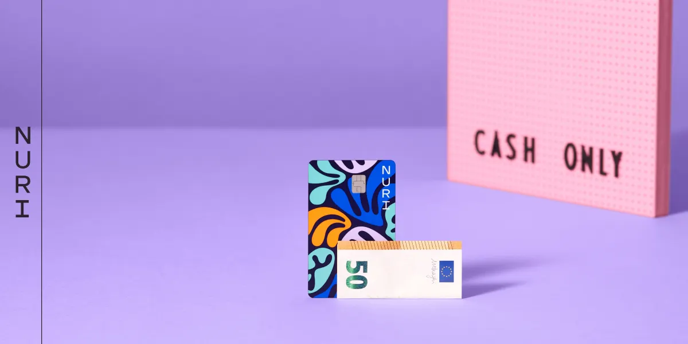

Here are the key takeaways from the video about the Nuri branding process:

- The client, previously [Bitwala](http://bitwala.com), wanted a major brand shift to appeal more broadly, beyond just crypto users [[03:02](http://www.youtube.com/watch?v=5izlzod-RXk&t=182)].
- The branding process was iterative rather than strictly linear [[04:16](http://www.youtube.com/watch?v=5izlzod-RXk&t=256)].
- The name “Nuri” was chosen for its simplicity, inclusivity, and availability [[07:16](http://www.youtube.com/watch?v=5izlzod-RXk&t=436), [10:20](http://www.youtube.com/watch?v=5izlzod-RXk&t=620)].
- Key insights guiding the brand direction included boldness in typography, symbolizing growth, positivity, optimism, and diversity [[25:10](http://www.youtube.com/watch?v=5izlzod-RXk&t=1510)].
- The main project takeaways highlighted by the agency were [[30:36](http://www.youtube.com/watch?v=5izlzod-RXk&t=1836)]:
- Never underestimate the client.
- There is no perfect process.
- Build cohesive brands, not fragmented ones (“Frankensteins”).
- Always connect branding decisions to the overall strategy and vision.
- Make decisions collaboratively and see them through.

[www.nuri.com](http://www.nuri.com)
