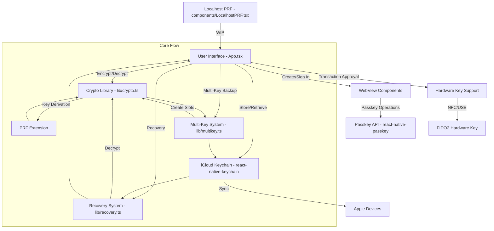
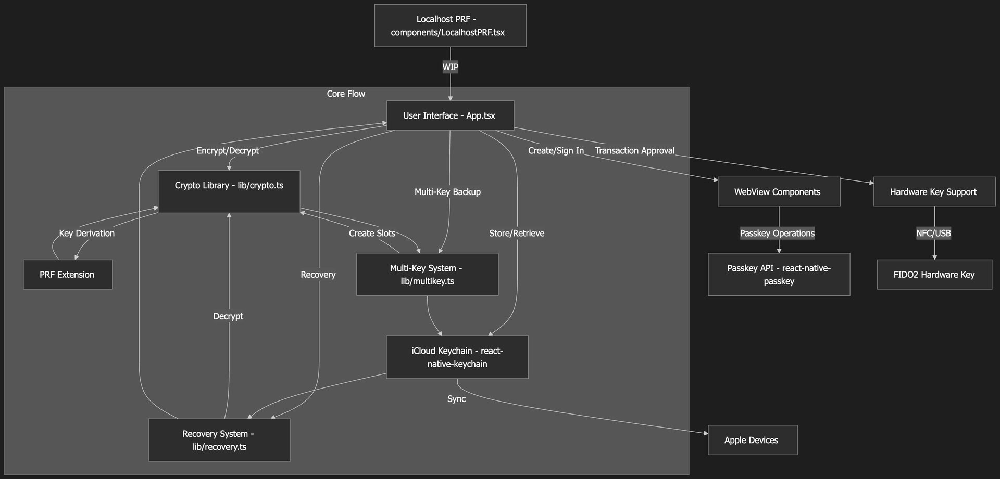

This is a look at the codebase of the Nuri wallet, based on the
README.md and the main App.tsx file. First what the code does, and
then a Mermaid chart of the architecture.

Nuri here is a React Native Expo app built around passkey based
Bitcoin seed encryption. It uses WebAuthn passkeys with the PRF
extension, PRF meaning Pseudo-Random Function, to encrypt Bitcoin
seeds, store them in iCloud Keychain and recover them with more than
one passkey. The app is made for iOS 16+ devices with Face ID or Touch
ID and iCloud Keychain turned on.

You create a passkey and sign in with it, and the app derives
encryption keys from it via PRF. With those keys it encrypts the
Bitcoin seed using XChaCha20-Poly1305. A backup can be decrypted by
several passkeys, and that's the version 3 format. The encrypted
backups go into iCloud Keychain with a namespace per user.

There is also support for hardware security keys like a YubiKey to
approve transactions, but iOS limits PRF on hardware keys. And
recovery works with any passkey that belongs to the backup, or with
guardian DEKs.

At the root you find the config and entry points, so `App.tsx` with
the main UI and logic, `index.js` as the React Native entry,
`package.json`, `tsconfig.json` and so on. The core utilities live in
`lib/`. There `crypto.ts` does the key derivation with HKDF-SHA256,
the encryption with XChaCha20-Poly1305 and the PRF normalization.

`multikey.ts` handles multi key backups with key slots for more
passkeys, `recovery.ts` finds out the backup version and recovers
seeds, and `inAppLocalhostServer.ts` is probably for an in-app server
and still WIP. In `components/` there is `LocalhostPRF.tsx` for a
localhost PRF server, also still work in progress.

Then there are the WebView components, `EmbeddedPRF.tsx` for domain
bound passkey authentication and `CreatePasskeyWebView.tsx` for making
new passkeys. `docs/` has a lot of documentation and server examples,
like HTML files to test PRF and the PWA. `scripts/` has things like
`guardian-server.mjs` for the guardian features, and `assets/` has the
app icons and splash screens.

The heart of the app is `App.tsx`. It holds the UI and the wallet
state, so the state for PRF, the DEK (the Data Encryption Key),
guardians, hardware keys and backups. The UI walks you through the
steps. Create a passkey, sign in, encrypt the seed, store it in
iCloud, add recovery keys and recover the seed.

Passkey operations go through WebViews that are domain bound to
`passkey.nuri.com`. Hardware keys approve transactions over NFC or
USB. And the recovery flow handles single key backups (v1) and multi
key backups (v3) and asks you to pick the key.

On security, the encryption uses a master key that is encrypted into a
slot for each passkey. Backups are stored per user in iCloud Keychain
with their own service name, for example `com.nuri.seed.backup.Alice`.
There are limits too. PRF is tied to the device, so recovery on
another device needs manual DEK sharing, and iOS restricts PRF on
hardware keys.

The main dependencies are `react-native-passkey` for WebAuthn,
`react-native-keychain` for iCloud, `@noble/hashes` for the crypto
primitives and others like `expo-random` and `react-native-webview`.
The whole thing is a proof of concept with some WIP features, like
localhost PRF and guardian recovery. It's MIT licensed and it puts a
lot of weight on security warnings.

This Mermaid flowchart shows the high level architecture and flow, so
the main parts and how they work together when you encrypt and
recover.

It starts with what the user does in the main app, then shows the
flows for passkeys, encryption, backup and recovery, and also the
links to outside systems like hardware keys and iCloud.

