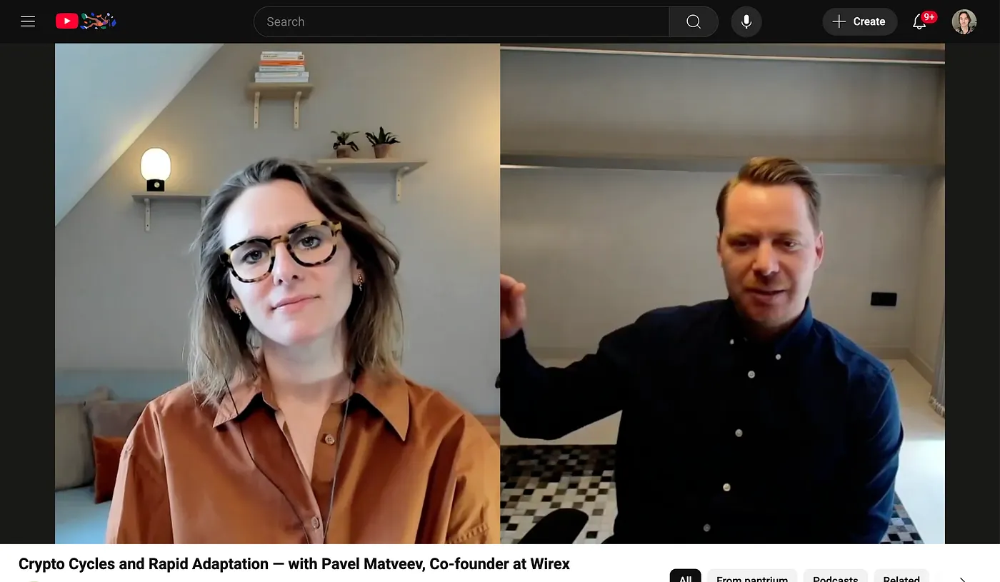

A summary of a talk by Pavel Matveev, co-founder of Wirex. Every point links to the moment in the video where he says it.

## Main recommendations

His main recommendations are these. Get a mentor and learn from people with more experience, because entrepreneurs often run into the same problems [00:00](http://www.youtube.com/watch?v=VyGUQ3QBsRQ&t=0). Be careful with growth and don't hire or expand too fast, even when the first success comes, because it can hurt you [00:15](http://www.youtube.com/watch?v=VyGUQ3QBsRQ&t=15). Quality and a good company culture come before fast scaling [00:32](http://www.youtube.com/watch?v=VyGUQ3QBsRQ&t=32). See every problem as a chance to find a solution [00:46](http://www.youtube.com/watch?v=VyGUQ3QBsRQ&t=46). Split the areas of focus between co-founders, so you get more done and fight less [12:26](http://www.youtube.com/watch?v=VyGUQ3QBsRQ&t=746), and talk openly with each other so you solve the problems together [11:12](http://www.youtube.com/watch?v=VyGUQ3QBsRQ&t=672). A co-founder with technical skills helps a lot today [15:12](http://www.youtube.com/watch?v=VyGUQ3QBsRQ&t=912). Look for personalities that complement each other, not two people who want to lead in the same way [16:00](http://www.youtube.com/watch?v=VyGUQ3QBsRQ&t=960). Hire carefully, because it's about the quality of the people and not the number [25:19](http://www.youtube.com/watch?v=VyGUQ3QBsRQ&t=1519). Let several people from your team meet a candidate, so you see better if they fit [28:11](http://www.youtube.com/watch?v=VyGUQ3QBsRQ&t=1691). Look beyond the resume, at motivation, enthusiasm and how well someone learns, not only at experience [30:04](http://www.youtube.com/watch?v=VyGUQ3QBsRQ&t=1804). And start using AI tools like GPT, to understand what they can do and where they fit in your business [38:13](http://www.youtube.com/watch?v=VyGUQ3QBsRQ&t=2293), and try different AI models to find tasks you can automate and work you can do faster [39:29](http://www.youtube.com/watch?v=VyGUQ3QBsRQ&t=2369).

## How Wirex got big in Japan

The fun fact in the talk is how Wirex suddenly got big in Japan. It started with an unexpected email that invited them to Tokyo's first fintech festival, Fininsome [02:46](http://www.youtube.com/watch?v=VyGUQ3QBsRQ&t=166). They were a UK-focused company and first not sure if they should go [02:55](http://www.youtube.com/watch?v=VyGUQ3QBsRQ&t=175), but the organizers offered to pay all the costs and said it was really important that they come [03:10](http://www.youtube.com/watch?v=VyGUQ3QBsRQ&t=190). At the event Wirex joined a startup competition and won first place [03:49](http://www.youtube.com/watch?v=VyGUQ3QBsRQ&t=229). That pushed them forward a lot. They got funding from a strategic venture capital firm in Japan [04:07](http://www.youtube.com/watch?v=VyGUQ3QBsRQ&t=247), and Japan became Wirex's second-biggest market at that time [04:16](http://www.youtube.com/watch?v=VyGUQ3QBsRQ&t=256). The organizers really wanted foreign companies like Wirex to come to Japan [04:51](http://www.youtube.com/watch?v=VyGUQ3QBsRQ&t=291).

## Hard lessons and stressful times

Some of the hardest lessons he learned. The path of an entrepreneur isn't straight, and success is about how you get through the hard times [06:39](http://www.youtube.com/watch?v=VyGUQ3QBsRQ&t=399). Hiring too many people or expanding too fast can really hurt a company [23:37](http://www.youtube.com/watch?v=VyGUQ3QBsRQ&t=1417). The quality of the team and the culture matter more than growing fast [00:32](http://www.youtube.com/watch?v=VyGUQ3QBsRQ&t=32). Every challenge is a chance to find a solution [00:46](http://www.youtube.com/watch?v=VyGUQ3QBsRQ&t=46). And it's important to have a mentor who gives you advice and guidance [00:08](http://www.youtube.com/watch?v=VyGUQ3QBsRQ&t=8).

For stressful times, and this is only what Pavel says in the video, he talks about a few things that helped him. A business partner gives you support when things get tough [08:39](http://www.youtube.com/watch?v=VyGUQ3QBsRQ&t=519). Talk through the problems and the different opinions with your partners, because that's how you find better solutions [11:22](http://www.youtube.com/watch?v=VyGUQ3QBsRQ&t=682). Make clear who does what, so you avoid fights and work faster [12:26](http://www.youtube.com/watch?v=VyGUQ3QBsRQ&t=746). Learn from your mistakes, like his own over-hiring and expanding too fast, so you plan better next time [23:37](http://www.youtube.com/watch?v=VyGUQ3QBsRQ&t=1417). Build a strong team with the right skills and the right fit, not just a big one [25:19](http://www.youtube.com/watch?v=VyGUQ3QBsRQ&t=1519). He regrets that he didn't have a mentor earlier and says how much it's worth to get guidance from people with more experience [32:42](http://www.youtube.com/watch?v=VyGUQ3QBsRQ&t=1962). And he uses tools like AI to work faster and automate tasks, which helps with the workload when it's stressful [35:04](http://www.youtube.com/watch?v=VyGUQ3QBsRQ&t=2104).

## Co-founders

On co-founders he says a lot. A co-founder is your support system, and hard times are easier because you have someone to rely on [08:39](http://www.youtube.com/watch?v=VyGUQ3QBsRQ&t=519). Open communication is what keeps the working relationship healthy [11:12](http://www.youtube.com/watch?v=VyGUQ3QBsRQ&t=672). Split the areas of responsibility clearly, so the relationship stays good, you get more done and you avoid conflict [12:26](http://www.youtube.com/watch?v=VyGUQ3QBsRQ&t=746). It's better when your skills complement each other, because when they overlap it can turn into competition [16:20](http://www.youtube.com/watch?v=VyGUQ3QBsRQ&t=980). In business today a co-founder with technical skills is a real advantage [15:12](http://www.youtube.com/watch?v=VyGUQ3QBsRQ&t=912). It's normal that co-founders have friction and sometimes strong disagreements [14:58](http://www.youtube.com/watch?v=VyGUQ3QBsRQ&t=898). And co-founders usually go through the same personal and business challenges together on the way [32:29](http://www.youtube.com/watch?v=VyGUQ3QBsRQ&t=1949).

## Cycles, hiring and motivation

He also talks about cycles. Industries like crypto go through cycles. The upward trends speed up growth [20:08](http://www.youtube.com/watch?v=VyGUQ3QBsRQ&t=1208), but every cycle also has a downturn, and that can be hard or, in his word, "painful" [21:09](http://www.youtube.com/watch?v=VyGUQ3QBsRQ&t=1269). Being an entrepreneur isn't a straight path up either, and success depends a lot on how you handle the "down moments" [06:58](http://www.youtube.com/watch?v=VyGUQ3QBsRQ&t=418). At Wirex, in what he calls the "first growth cycle", they made mistakes. They hired too fast and expanded into too many places [23:37](http://www.youtube.com/watch?v=VyGUQ3QBsRQ&t=1417). When the market turned down, that meant layoffs and closing offices [24:32](http://www.youtube.com/watch?v=VyGUQ3QBsRQ&t=1472). In the later cycles they learned from it and focused more on the quality of the people and the company culture, and less on growing fast [25:19](http://www.youtube.com/watch?v=VyGUQ3QBsRQ&t=1519), [25:37](http://www.youtube.com/watch?v=VyGUQ3QBsRQ&t=1537).

And on hiring, motivation and learning skills. Skills are not the only thing that matters when you hire [30:14](http://www.youtube.com/watch?v=VyGUQ3QBsRQ&t=1814). The motivation of a candidate to grow and move forward is very important, and so is enthusiasm [30:14](http://www.youtube.com/watch?v=VyGUQ3QBsRQ&t=1814). He says again that skills are valuable but anyone can learn them [30:39](http://www.youtube.com/watch?v=VyGUQ3QBsRQ&t=1839), so what he looks for is whether someone can learn and wants to learn [30:39](http://www.youtube.com/watch?v=VyGUQ3QBsRQ&t=1839).
