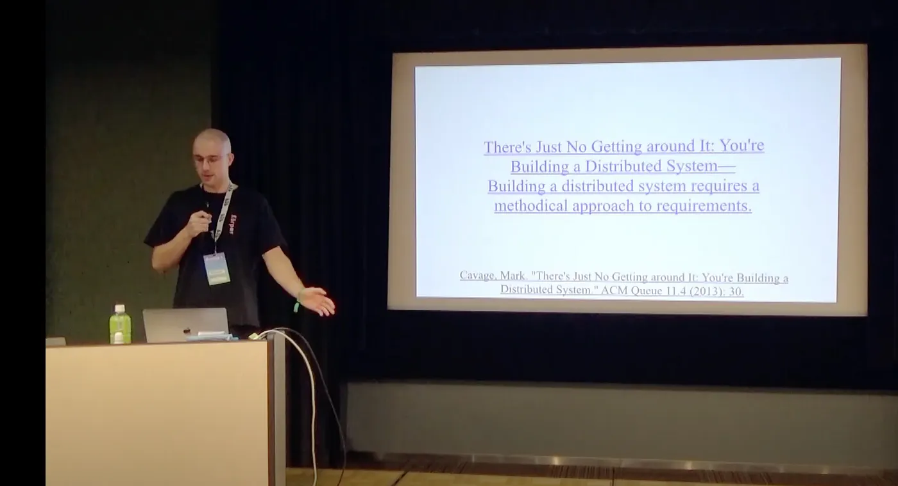

A summary of a video talk by Sascha Hanse.

Sascha Hanse talks about why protocols are important in decentralized networks. Protocols are the rules for how the different parts of a system interact with each other. You can use them to reward good behavior and to stop bad behavior.

He says it's important to design protocols that are simple, easy to understand and hard to attack. And they should also work in a lot of different situations.

He also talks about thinking about the long-term impact of a protocol. Protocols can change a lot about who has power and how people interact with each other, so when you design one, you have to be aware of that.

At the end he says that you should be respectful of others when you design protocols. Protocols should include people and help them cooperate.
