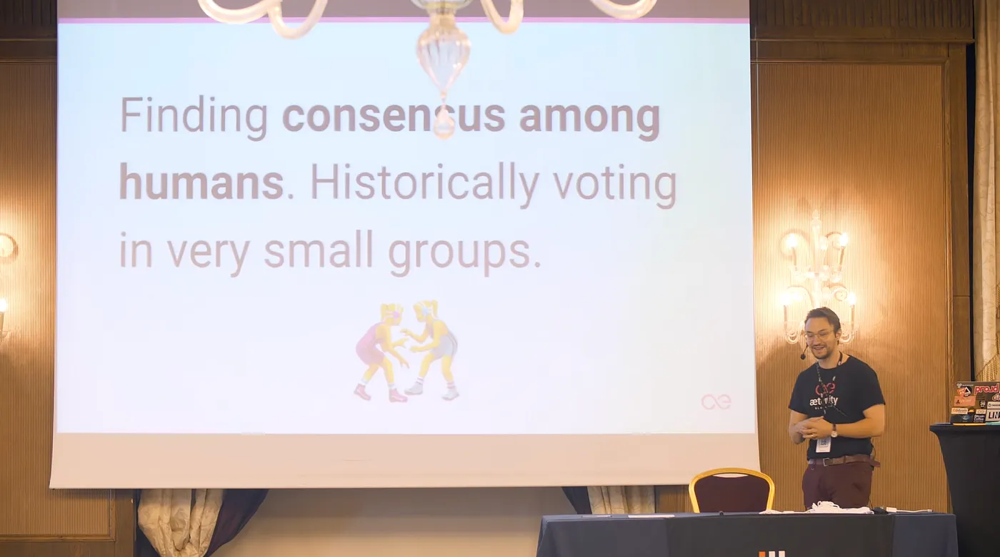

# The Complexities of Governance Among Humans, in Blockchain and Open Source Software Development

*Blockchain Governance*

In my recent talk, I delved into the intricate world of blockchain governance. Here are some key takeaways:

- **Decentralized Governance is Hard:** While the decentralized nature of blockchains is a powerful tool, it presents significant challenges when it comes to making collective decisions.
- **Finding Consensus:** Aligning the diverse interests of different stakeholders (miners, users, developers) is a complex task. How do we ensure that decisions reflect the best interests of the entire community?
- **The Challenge of Voting:** Traditional voting mechanisms might not be the best fit for blockchain governance. We need to explore innovative ways to ensure fair and transparent voting processes.
- **Stakeholder Alignment:** How can we balance the interests of different stakeholders? For example, miners may prioritize higher fees, while users may want lower fees. This tension can create significant challenges.
- **Alternative Approaches:** We need to explore alternative governance models, such as proof-of-stake, proof-of-work, and delegated voting. Each approach has its own strengths and weaknesses.
- **Open Source and Transparency:** Open-source development and transparent communication are crucial for building trust and ensuring accountability in blockchain governance.
- **Join the Conversation:** I encourage everyone to participate in the ongoing conversation about blockchain governance. Together, we can shape the future of this technology.
