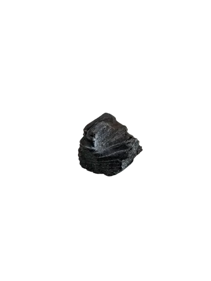
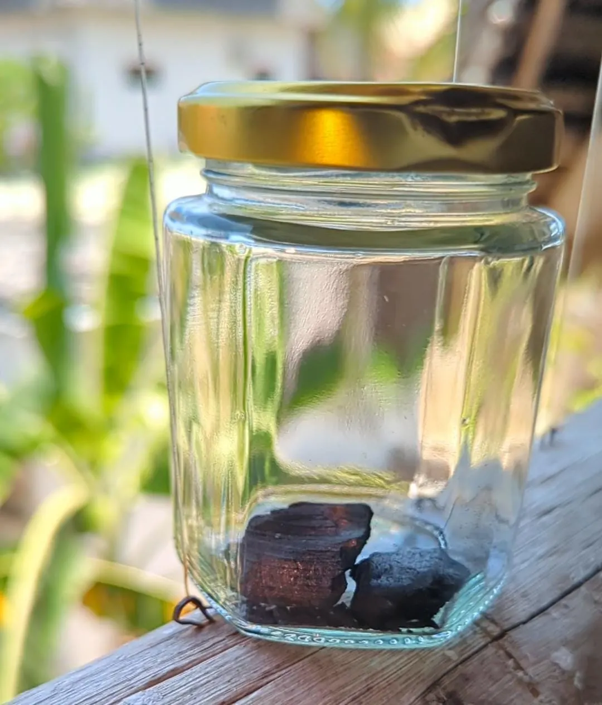
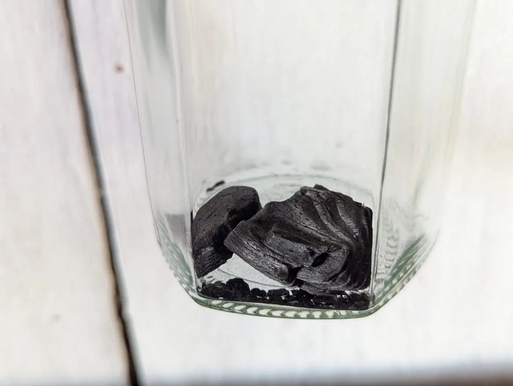

*Unveiling the secrets of the Murchison meteorite*

**TL;DR:**

- **Presolar grains:** This meteorite contains stardust that predates our planet and Sun.
- **Origins of life:** Contains amino acids, hinting at the extraterrestrial origins of life’s building blocks.
- **Own a piece of history:** Acquire exclusive jewelry or fractional ownership of this cosmic wonder.

*a piece of the Murchinson meteorite*

Diamonds may be a girl’s best friend, but let’s be honest, they’re relative newcomers on the cosmic scene. For those who seek something truly extraordinary, something that whispers of the universe’s dawn, look no further than the Murchison meteorite. After all, as Douglas Adams once wisely noted, “Space is big. Really big. You just won’t believe how vastly, hugely, mind-bogglingly big it is.” And this meteorite has seen a lot of it.

Imagine a time capsule from the birth of our solar system, a relic that crash-landed on Earth in 1969, carrying within it secrets older than time itself. This is the Murchison meteorite, a seemingly ordinary rock that harbors within it microscopic grains of stardust, each one a witness to cosmic events that transpired billions of years ago.

**Presolar Grains: A Glimpse into the Universe’s Past**

Forged in the fiery hearts of ancient stars, these presolar grains are like tiny time travelers, whispering tales of a universe long before our own. They witnessed the birth of galaxies, the creation of elements, and the celestial dance of stardust that ultimately led to the emergence of life.

To hold a fragment of a star that predates our own, a star that gazed upon the universe in its infancy, is to encounter a profound sense of perspective, a humbling reminder of our place within the vast cosmic tapestry.

**Unraveling the Mysteries of Our Origins**

But the Murchison meteorite is far more than a mere curiosity. Within these presolar grains lies a wealth of knowledge, a key to unlocking the mysteries of stellar evolution, galactic formation, and perhaps even the genesis of life itself. Scientists are meticulously studying these grains, hoping to decipher the intricate code that governs our universe.

**Did Life Begin in Space?**

Adding to its allure, the Murchison meteorite contains organic molecules, including amino acids — the fundamental components of life. This discovery ignites the imagination, suggesting that the very seeds of life may have been sown on Earth by celestial emissaries like the Murchison meteorite.

Want to delve deeper into the science? Visit Murchison.net to explore the latest research and discoveries surrounding this fascinating meteorite.

## Own a Piece of the Universe

**Murchison Meteorite Jewelry: A Limited-Edition Masterpiece**

Want to wear a piece of the cosmos? Murchison.net has partnered with a renowned jewelry artisan to create a limited-edition collection of exquisite pieces featuring fragments of the Murchison meteorite. Only **42** of these unique works of art will ever exist, each one a unique testament to the artistry of both human craftsmanship and the cosmos itself. Imagine the conversations sparked by a piece of jewelry that encapsulates the very essence of Earth’s origins.

**Fractional Ownership: A Piece of the Universe for Everyone**

Soon, you’ll also have the opportunity to acquire a digital certificate representing fractional ownership of this cosmic wonder.

Think of it like owning a piece of a masterpiece, a tangible connection to the universe’s dawn. These certificates, available through Pump.fun, democratize access to this ancient relic, allowing anyone to claim a piece of the universe as their own.

The Murchison meteorite serves as a poignant reminder of the universe’s boundless capacity for wonder and the profound interconnectedness of all things. It is a cosmic treasure, offering us a glimpse into the depths of time and a deeper understanding of our place within the grand cosmic narrative. And soon, it can become an integral part of your own personal story.

**Want to learn more about this ancient cosmic treasure? Check out this documentary:**

Prepare to be captivated as you embark on a journey through the universe’s history and the profound implications of this extraordinary meteorite.

[www.murchinson.net](http://murchinson.net)

**Murchison meteorite** contains **pre-solar stardust**. That means it’s **older than the solar system**. It is **very valuable** because it is a **time capsule** from the **early solar system**. It’s **4.6 billion years old** and hasn’t changed much since it formed.

It is a **carbonaceous chondrite**, a **carbon-rich meteorite**. It’s a **very rare type** of meteorite. Only **4% of meteorites** that fall to Earth are carbonaceous chondrites.

The meteorite came from a **carbon-rich asteroid**, probably from the **outer asteroid belt**. It traveled more than a **million years** until it reached Earth. The total mass recovered was about **100 kilograms**. Much of the mass was lost in the **atmosphere** upon **entry**. It was the **largest meteorite of that type** that ever landed on Earth.

It’s a mixture of different compounds. It contains **organic matter** with **amino acids, sugar-related compounds, alcohols, and acids**. Some of those can be considered **prebiotic chemistry**.

The **study of Murchison** appears in labs and **scientific conferences** around the world. It keeps on giving new information. Every **museum** and **university** who studies **meteorites** wants to have it.

At first sight, it looks **not very spectacular**. But it is actually a sample of our **galaxy**. It is **extremely valuable**.
