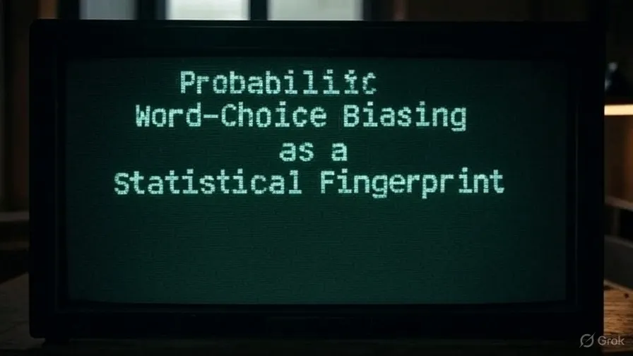
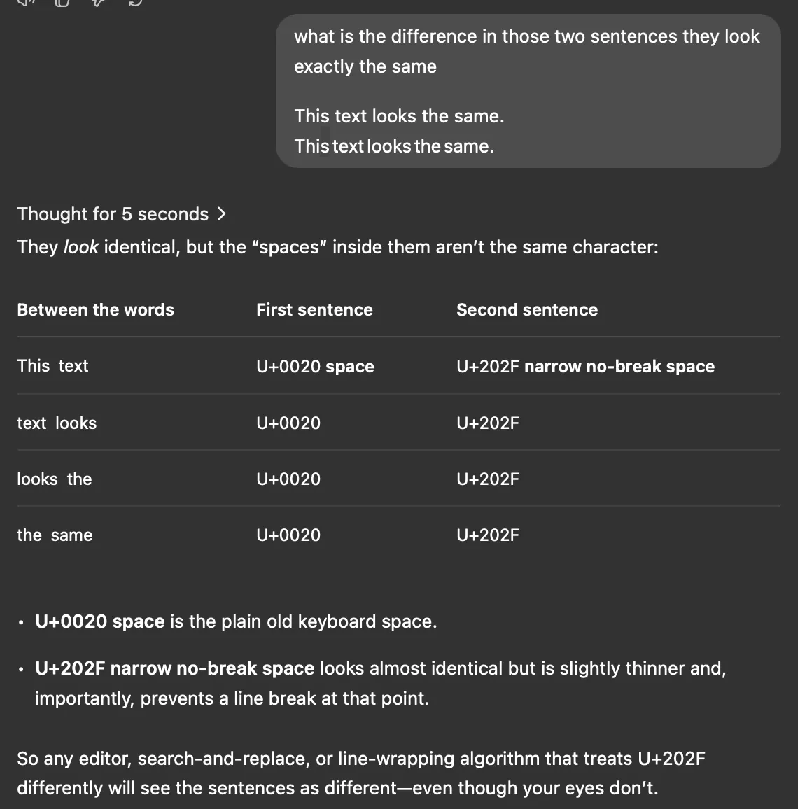

# The Watermarker: Probabilistic Word-Choice Biasing as a Statistical Fingerprint in LLM Outputs and AI Texts

My assumption was that ChatGPT must be embedding invisible characters to fingerprint its answers.



And this was true, OpenAI responded and said that this was a temporary bug they had, not the real implementation.

This made me even more curious, there must be, in practice, purposeful fingerprinting at a higher semantic layer.

I came to understand that instead of embedding special bytes, a watermark works by biasing the statistical distribution of ordinary tokens. It creates a small shift, so the text contains an unlikely surplus of "preferred" words. You can't see it, but you can measure it.

The zero-width spaces were a temporary bug. For me it looked like a deliberate tracer. But during my research I learned that the real watermark works on token probabilities, not raw characters.

```
This text looks the same.
This text looks the same.
```

They look identical, but the "spaces" inside them aren't the same character. U+0020 space is the plain old keyboard space. [U+202F narrow no-break space looks almost identical but is slightly thinner and, importantly, prevents a line break at that point.](https://www.compart.com/en/unicode/U+202F)

So any editor, search-and-replace, or line-wrapping algorithm that treats U+202F differently will see the sentences as different, even though your eyes don't.



Because of this, removing or normalising whitespace doesn't affect a real watermark, the signal is in the words that appear. For example, if an answer included "data [U+202F] set", deleting the space removes the artifact, but a statistical watermark would survive, because the words "data" and "set" themselves are still there.

## What is "probabilistic word-choice biasing," and how is it recognised?

I think the best way to understand it is to see it as a nudge with a secret seed.

For each word position, the system combines a secret key with the ID of the previous token and feeds that into a pseudorandom function. The output defines a temporary "green list" for that position. The model then adds a small log-probability bonus to every green-listed token before it samples.

A single choice still looks natural, but over fifty or more tokens the text collects far more of these green-listed words than chance allows.

A detector with the same key has to repeat the whole calculation, count how many tokens fall inside the green list, and turn that surplus into a z-score. When the score gets high enough, the probability that a human wrote it drops to almost nothing. This is also why short or heavily rewritten passages fall below the detection threshold.

## Is that similar to proving membership with a Merkle-tree hash?

My next question was how it compares to the deterministic proofs used in blockchains. A Merkle tree compresses a data set into a single public root hash. You can verify a specific piece of it with a short path, and even a one-bit change breaks the proof. It's a hard line.

Watermarking is different. The key stays private, with the "Watermarker", and each token position gets a new random subset of "preferred" tokens. Verification is probabilistic, not all-or-nothing. Light editing weakens the signal but doesn't break it. Only a lot of rewriting brings the z-score back down to human levels. Changing one byte breaks a Merkle proof, but you have to rewrite half the words to kill a watermark.

## Is there a single hash I can match against?

No. The secret key acts like a seed for a stream of outputs, one per token, and these seeds never show up in the final text. You have to replicate the whole per-token process and look at the statistics over all tokens. If you do that, the secret key and the tokenizer are all you need.

## Can I embed my own secret key to prove authorship?

I wanted a way to prove that a text is mine. The hosted ChatGPT interface doesn't give you a key parameter, but open-source models do. If I run a model like Mistral-7B-Instruct locally, I can attach a `WatermarkLogitsProcessor`, give it my own private key, and generate text that carries my fingerprint. If I store the key, I can verify authorship later, and anyone without the key can't confirm or fake the mark. For example, a script I run might paraphrase an article, and the detector with my key reports a z-score of 5.2. If someone rewords half of it, that score falls below 2.

## How do I tokenise the text correctly?

Detection only works if you use the same tokenizer as the generator. This is where it easily goes wrong. GPT-3.5/4 models use the open-source `tiktoken` encodings. If you tokenise with the wrong table, the green lists don't line up anymore and you get false negatives. Even small things like straight versus curved quotes can shift token boundaries and throw off the whole thing.

## Could I just ask ChatGPT to embed my key?

I tried to see if a clever prompt could inject my key. The answer was a clear no. The public interface keeps the watermark hook on the server, so nobody can abuse it. If you could set any key, people could track others or fake attribution. So a personal watermark needs local inference. Sending "Please watermark with key 12345" to the API changes nothing.

## What if I copy an answer and regenerate it under my own key?

In the end a practical workflow came out of this. I paste an original ChatGPT answer into my local model's prompt, ask for a light paraphrase, and generate it with my private watermark settings. The new version keeps the facts but now carries my fingerprint. So I get the quality of the ChatGPT content plus my own private attribution. For this to work you have to keep at least 70% of the token IDs, otherwise the signal gets weak. Heavy rewriting or machine translation pushes the watermark below the threshold.

## The tool I built

This took me from a myth about invisible Unicode characters to a working understanding of how a private key can bias token probabilities. The main thing I learned is that the proof is statistical, not deterministic.

I built a 20-line Python script with Hugging Face processors that lets me stamp text with my private key and verify it later. The generation part uses Mistral-7B with a `WatermarkLogitsProcessor`, and the verification part uses a `WatermarkDetector` with the same key. The script flags anything with a z-score over 4.

With this I can claim authorship of AI-assisted writing, show it mathematically, and know that small edits won't strip the fingerprint.

## Part 1, embed a watermark

```python
# pick model + tokenizer
model, tok = load_model("Mistral-7B"), load_tokenizer("Mistral-7B")

# choose private 128-bit key and watermark settings
KEY = 0xA7F3_42EA_9C11_BEEF
GAMMA = 0.50 # green-list fraction
DELTA = 2.0 # logit boost

# attach watermark processor
wm = WatermarkLogitsProcessor(vocab_size=model.V,
 greenlist_ratio=GAMMA,
 bias=DELTA,
 hashing_key=KEY)

# generate text
prompt = "In a world where the oceans are made of soda…"
output = model.generate(prompt,
 logits_processor=[wm],
 max_tokens=300)

print(output) # ordinary text, invisibly watermarked
```

## Part 2, detect the watermark

```python
# reload same model + tokenizer
model, tok = load_model("Mistral-7B"), load_tokenizer("Mistral-7B")

# same secret key and gamma
KEY = 0xA7F3_42EA_9C11_BEEF
GAMMA = 0.50

# set up detector
det = WatermarkDetector(vocab_size=model.V,
 gamma=GAMMA,
 hashing_key=KEY)

# analyse unknown text
ids = tok.encode(text_to_check)
z, p = det.detect(ids)

if z > 4:
 verdict = "Watermark present (p ≈ {:e})".format(p)
else:
 verdict = "No convincing watermark"

print(verdict)
```

So in short. To generate, every new token goes through PRF(KEY, previous_token), that gives the green list, the logits of the green tokens get a boost, and then the model samples. To detect, you rebuild the same lists with the key, count the green hits and compute a one-proportion z. A high z confirms the signature.
