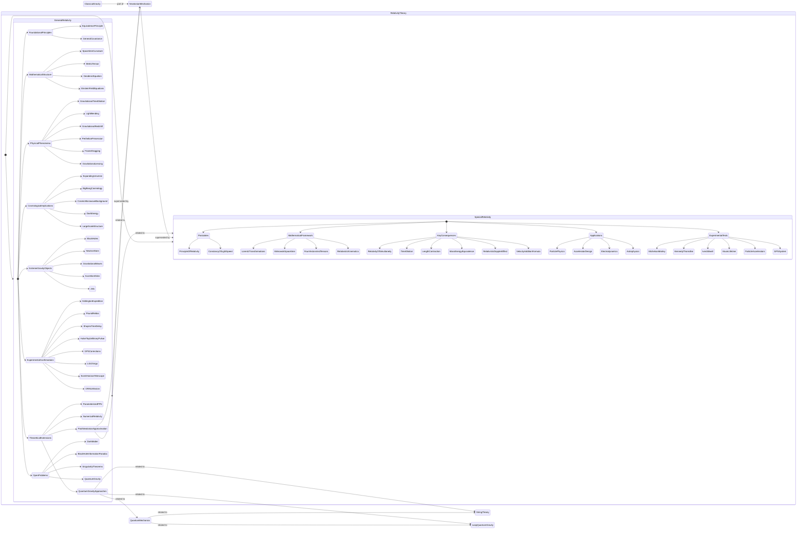

Note to myself on this one: make the chart vertical, not horizontal aligned.

It's a state diagram of relativity theory. Special and general relativity, what they are made of, how they replaced Newtonian mechanics, and how the quantum gravity approaches connect to it.

I made it with Mermaid Share. Chart ID chart_1756354351463_48ybl32fi, version 1, created and last updated 8/28/2025, 7:12:31 AM (2025-08-28T04:12:31.464Z created, 2025-08-28T04:12:31.465Z updated). You can [view it live](https://mermaid.emino.app/?chart=chart_1756354351463_48ybl32fi) here https://mermaid.emino.app/?chart=chart_1756354351463_48ybl32fi
