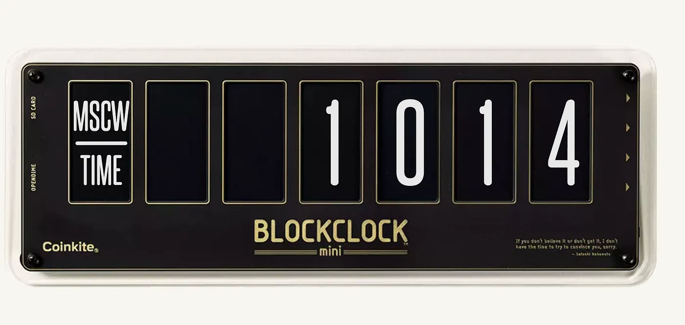

# What time is it? It's Moscow time. Or, how much Bitcoin you can buy with 1 US dollar

In Bitcoin and crypto circles people say "What time is it? It's Moscow time." It's a joke about Moscow Time, or MSAT, and it's just a short way to say how much Bitcoin you can buy with one US dollar.

You get Moscow Time when you take 1,000,000 and divide it by the Bitcoin price in US dollars. That gives you the number of satoshis per dollar. It's called Moscow Time because when Bitcoin was at around $10,000, you got close to 10,000 sats for a dollar, and that looked a bit like the time zone of Moscow, UTC+3:00, which is "1000" on a military clock.

The lower the Bitcoin price, the more sats you get for a dollar, so sats are cheaper. And when the price goes up, Moscow Time goes down, because you get fewer sats for each dollar. Bitcoiners use it as a unit to follow what Bitcoin can buy in small units.

An example. If Bitcoin is at $40,000, then 1,000,000 divided by 40,000 is 25, so you get 25 sats for every $1. If Bitcoin drops to $20,000, then 1,000,000 divided by 20,000 is 50, so you get 50 sats for $1 and the sats are cheaper.

Bitcoiners like it because it gets you to think in sats first and not in whole bitcoins. It also shows how Bitcoin gets more scarce over time, and it pushes people to keep stacking sats while they are still cheap.

So when someone says "It's Moscow time!", they might just mean how many sats you get for a dollar right now. It's a way to follow the Bitcoin price in satoshis and not in fiat.
