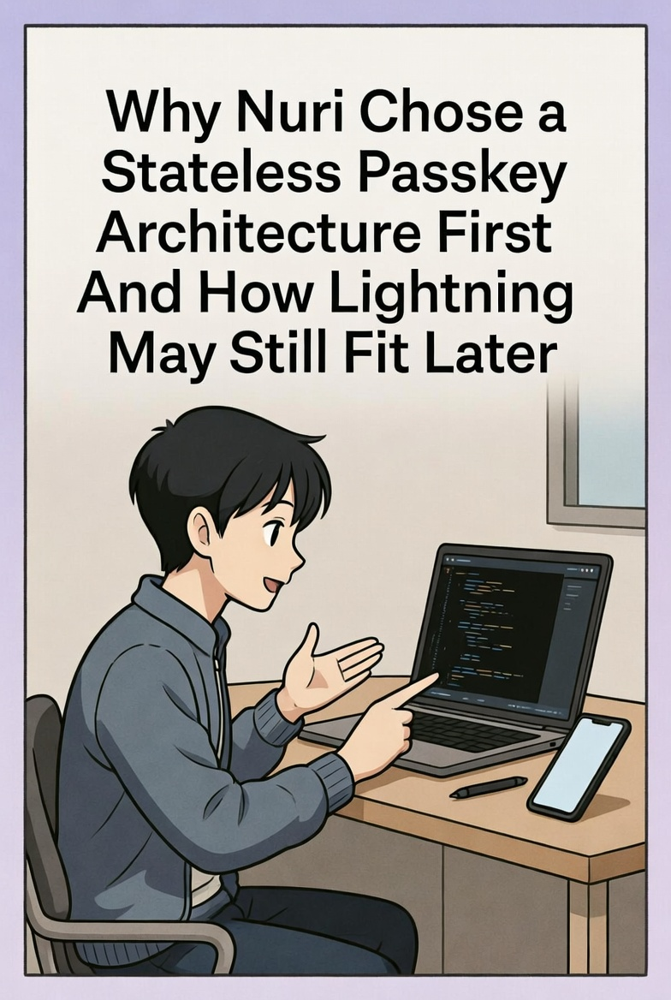

# Why Nuri Chose a Stateless Passkey Architecture First, and How Lightning May Still Fit Later

Over the last months we had great conversations with the Breez team about Spark, Nodeless and their bigger idea of Lightning as a service. Breez is one of the most careful engineering teams in Lightning, and their work made Lightning usable for developers who don't want to run full nodes or manage liquidity themselves. They invited us to the Spark early access program and the Q3 and Q4 cohort promotions. The outreach and the support from Breez were fantastic and we really appreciate it.

But after a lot of prototyping and research we took a different direction for our first release. This post explains why we did that, how it connects to the principles we built Nuri on, and how Lightning can still play a role later.

## 1. Our core principle is stateless self-custody

Most wallets that call themselves self-custodial still store keys somewhere. The key is encrypted on the device, or encrypted on a server, or backed up with a seed phrase. And that brings the risks everyone knows. The device gets compromised, the backup gets lost, the server gets attacked, the UX gets complicated and running it all costs a lot of work.

Our goal with Nuri was to store no private key at all, anywhere, and still get more security and a better recovery experience. That's how we got to the next two pieces.

### 1.1 A Stateless Passkey Signer for Bitcoin
https://emino.app/posts/a-stateless-passkey-signer-for-bitcoin/

We never store a private key. We use passkeys that the platform secures (FIDO2 WebAuthn) and derive short-lived signing material from them, the same way every time, and only when we need it. There are no encrypted blobs and no seeds and no secrets at rest, so there is nothing to steal.

### 1.2 A Passkey-Derived 2-of-2 Taproot Wallet
https://emino.app/posts/a-passkey-derived-2-of-2-taproot-wallet-architecture-elimina/

We extend the signer into a 2-of-2 Taproot multisig. One key is derived locally with a passkey and the other key is derived remotely with a separate passkey. Neither side keeps a long-term private key, and recovery comes with the passkey identity itself.

For Nuri being stateless is not a detail of the implementation. It's the base everything stands on, and every architecture in the first release has to follow it.

## 2. Why Spark and hosted Lightning are hard to combine with statelessness today

Lightning needs state that lasts. It needs channel commitments, HTLC updates, liquidity reservations, revocation secrets, channel backup material, channel monitoring over a long time and protection with justice transactions. That's how the Lightning protocol works. It depends on state that keeps changing and must never get lost, and that goes against the "no secrets, no state" idea behind Nuri.

So we basically had two options. Option A was to break our stateless model and store channel state locally or remotely, which weakens the guarantees we designed Nuri around. Option B was to hand the long-lived state to a hosted node like Spark. That's the Spark model, where the user keeps the signing keys and the hosted infrastructure keeps channel state, gossip, liquidity and HTLCs.

Spark is well designed. But adopting it this early would mean we build around a dependency that doesn't fully match where our architecture is going. We want the Nuri security model to be as small, as deterministic and as close to the platform as possible before we put stateful protocols on top of it.

## 3. Why we chose submarine swaps first

You can still use Lightning without running a Lightning node or keeping channel state. Submarine swaps let you receive over Lightning and settle on-chain, and send on-chain and pay over Lightning. You don't manage channels, you don't need channel backups, you don't keep persistent secrets and you don't tie yourself to one LSP or hosted service. For Nuri that means we can talk to Lightning, the architecture stays simple, we don't depend on one vendor and everything still fits the stateless signing principle. It's the right step before we commit to something more stateful like hosted channels.

## 4. A note to Breez, why this isn't about you

This decision is not a critique of Breez or Spark. Breez ships some of the best engineering in Lightning again and again. Spark is a clean and modern hosted node architecture. Nodeless plus Spark gives developers a really good experience, and the Breez SDK makes Lightning a lot simpler for mobile apps.

We only went a different way because of architecture, not because of quality. Lightning today needs persistent state and Nuri today is built on stateless building blocks. Once our base is stable we can look again at Spark or at hybrid models that keep our stateless guarantees. The door stays open.

## 5. What Nuri is shipping now

Nuri just passed Apple review (TestFlight https://testflight.nuri.com). The first features are these. You can buy Bitcoin with no KYC up to €700 with Apple Pay (through Mercuryo). There's a self-custodial Visa debit card with GnosisPay and an IBAN with instant SEPA on and off ramp from Monerium. Bitcoin signing is stateless and based on passkeys, on a 2-of-2 Taproot architecture with no stored private keys, and we store zero secrets on the client and on the server. It's one cross-platform Expo app for iOS, Android and Web. And all parts will be fully open source, also the signer and the wallet UI.

Our priority is to get the stateless model perfect first. Lightning comes once it fits cleanly into that architecture.

## 6. Can Lightning become stateless?

This is an open research area and we care about it a lot. There are promising directions like Taproot-based channel designs, eltoo-like update schemes, state commitment trees, short-lived channel construction, Lightning signing roles driven by passkeys and hosted channels from several providers without lock-in. As these things move forward we expect Lightning to work better with stateless clients. When that happens, Spark or something like it can become a natural fit.

## 7. Thank you, Breez

To the Breez team. Thank you for reaching out again and again, for inviting us into Spark and your cohort programs and for always being open to talk. Your work is very important for the future of Lightning. Our architecture goes a different way for now, but we have a lot of respect for what you are building. When our stateless building blocks are fully mature, Lightning integration goes back on the roadmap, and Spark will definitely stay an option.

⚡️

