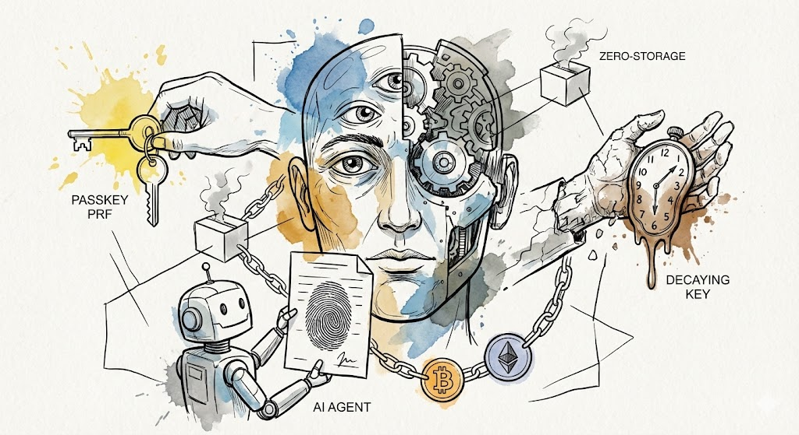

# Agentic wallets and passkey PRF, the security setup behind nuri.com

Wallet security usually makes you pick one of two things. Self-custody with a seed phrase, or convenience with someone holding your money for you. At nuri.com we built a third way with the WebAuthn PRF (Pseudo-Random Function) extension. It's a wallet that is backed by hardware, deterministic and multisig, and we made it for a time when AI agents do a lot of the work.

## The hardware is the seed

The main idea is that we don't store a secret anymore. No master password and no stored JSON file. We use the passkey PRF extension to get the entropy straight from the authenticator, like TouchID, FaceID or a YubiKey.

Every time the user authenticates, the PRF extension gives back exactly the same output for the same input and salt. So nothing has to be stored, $Seed =
\text{HMAC-SHA256}(\text{AuthenticatorSecret}, \text{Salt})$. Because we can derive this $Seed$ again at any time, the private keys are made on the fly and wiped (zeroized) right after the signature is done.

## A multisig that decays

To have security and still always get to your money, we use a decaying multisig script. In normal use it needs 2-of-2 signatures, the key from the PRF and a key held by the service. If the service (the Relying Party) goes away or the domain is lost, a time-lock (CheckSequenceVerify) lets the wallet move to a 1-of-1 state. So a service provider can never lock you out of your money, and in normal times you still get the security of a co-signer.

## Agents prepare, you sign

When AI agents start to handle things on-chain, the hard part is the line between who is allowed to do something and who actually does it.

It works like this. An agent watches the chain and prepares a complex transaction, for example "Rebalance my DeFi positions if gas is low". The agent does all the legwork and hands the user a payload that is ready to sign. But the private key needs a biometric trigger through the passkey PRF, so the agent can't spend money on its own. That gives you a guardrail that is bound to hardware. The agent is the pilot, but the thumbprint of the user is the ignition key.

## Not only EVM

A lot of passkey wallets only care about EVM (via ERC-4337). Our setup at nuri.com works on any chain, because we derive a master seed. On Bitcoin that means native SegWit and Taproot transactions through deterministic BIP32 derivation. On EVM it means full support for Ethereum-based chains and Account Abstraction.

## Why it matters

This moves us toward a future without secrets. There is no seed phrase to lose, no master password someone can phish, and no service provider that can freeze your money forever. We want to open source this orchestration logic, so it can be the base layer for agentic wallets that are secure and keep a human in the loop.

