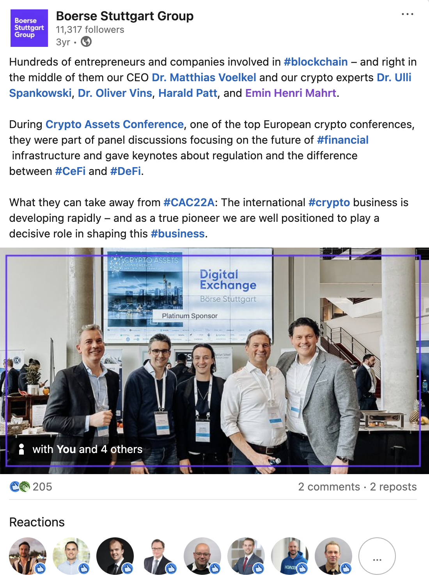

Exploring the synergy between centralized security and decentralized innovation.

The debate has long been framed as a zero-sum game: **Centralized
Finance (CeFi)** vs. **Decentralized Finance (DeFi)**. As someone
deeply embedded in the infrastructure side of this industry at [Börse
Stuttgart Digital Exchange (BSDEX)](https://www.bsdex.de), I see it
differently. We aren't looking at a takeover; we are looking at a
convergence.

### The Bridge to the Next Billion

For the average user or a conservative institutional investor, jumping
straight into a permissionless DeFi protocol is often a bridge too
far. There are technical risks, UI hurdles, and—most
importantly—regulatory question marks.

This is where CeFi plays its most vital role. By acting as a
regulated, transparent gateway, entities like
[BSDEX](https://www.bsdex.de) provide the "seamlessness" that the mass
market requires. We provide the legal certainty of **MiCAR
compliance** and secure custody, while still giving users exposure to
the underlying efficiency of blockchain technology.

### Complementary Strengths

Rather than viewing them as rivals, we should look at their unique
value propositions:

1.  **DeFi is the Engine**: It provides 24/7 liquidity, transparency
through on-chain audits, and automated yield through smart contracts.
It is the laboratory of financial innovation.
2.  **CeFi is the Interface**: It provides the "human" layer—customer
support, regulatory reporting, and simplified on-ramps. It translates
the complexity of the code into a service that a bank or a retail user
can trust.

### The Rise of "CeDeFi"

In the coming years, the line between these two will blur. We are
moving toward a **CeDeFi** model—where centralized front-ends connect
to decentralized back-ends. This allows us to maintain the security
and compliance required by law while leveraging the speed and global
reach of decentralized protocols.

My goal remains the same: professionalizing the crypto ecosystem so
that digital assets become a standard part of every portfolio, backed
by the reliability of traditional financial standards.

***

### Watch My Full Talk
In this session, I dive deeper into how we are bridging these two
worlds and what it means for the future of European digital asset
regulation.



---

### Resources & Further Reading

*   **Watch the Interview**: [Emin Mahrt: CeFi vs DeFi Explained
(YouTube)](https://www.youtube.com)
*   **Our Exchange**: [Börse Stuttgart Digital Exchange
(BSDEX)](https://www.bsdex.de)
*   **Stay Connected**: [Follow me on LinkedIn](https://www.linkedin.com)
*   **Regulatory Framework**: [Understanding MiCA via European
Commission](https://finance.ec.europa.eu)

