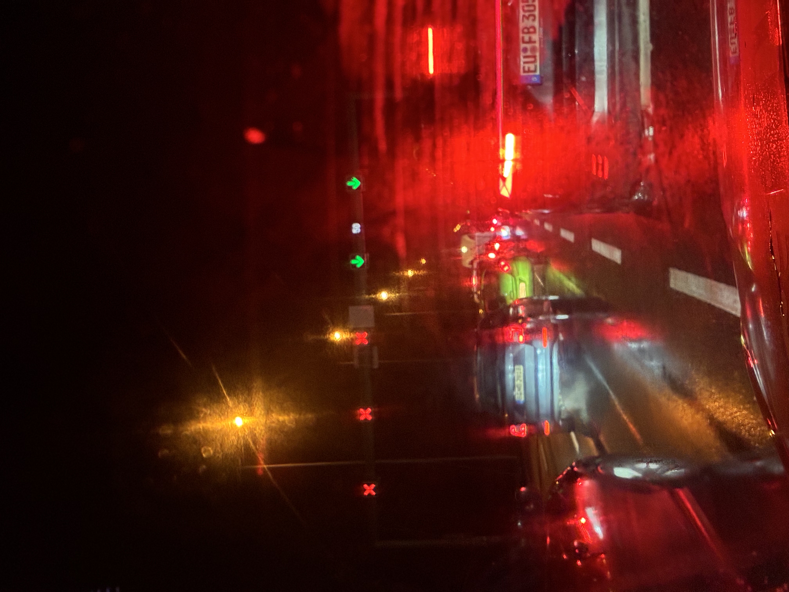

I started with a biology question, what lives on and in us, and pretty fast it turned into something bigger, and that's information. In biology information becomes alive in the Darwin sense when it gets copied with heredity and variation and then goes through selection.

So I asked if physics can do something like that too, especially quantum entanglement over distance. Can states compete, can information be kept, can the local environment react? The answer is subtle.

Entanglement makes correlations that no classical system can make, but it doesn't let you control anything far away (that's no-signaling).

And then there is Quantum Darwinism, which is a real and well worked out framework. Decoherence picks stable states and the environment makes a lot of copies of records of them, and that gives you a process you can test in a lab that looks a lot like Darwin and explains how the classical world shows up.

## From microbes to the stomach of the world

The first question was how many different species live in or on the human body all the time, sorted from most to least, and all of them named.

There is no final list like that, because we keep finding new microbes and all the time depends on the body part and the person.

A summary from the Human Microbiome Project that a lot of people use says humans host about 10,000 bacterial species in total, while one person carries around 1,000 at a time.

Then I wanted it simpler and closer to us, so only animals with a nervous system and something like a heart, and a top 10 of the ones that live on or in humans.

That moves the answer away from microbes to mostly arthropods like mites and lice and a few parasites that stay.

The most constant real residents in that group are Demodex mites, which are widely described as common or even permanent residents of our hair follicles and oil glands.

Next was who is really at the top of the food chain, alone, and doesn't get eaten like we do. In nature no big living thing gets away from being eaten in the end, and if it isn't a predator it's the decomposers.

I called it the stomach of the world, and that framing is strong. In the long run the closest thing to the final consumer is the decomposers, microbes and fungi and so on, that turns biomass back into chemistry.

## Aliens, meteorites and the first spark

Then the most likely alien we'll find. Is it microbes, and is that just because microbes are everywhere? The careful mainstream view is that the first finds will probably be microbial life or biosignatures, because microbes are tough and because chemical and shape traces are easier to detect than complex living things.

NASA's astrobiology material says it directly, a biosignature is any feature that can be evidence for life now or in the past.

I also asked if one event, a meteorite like Murchison bringing amino acids and other organics, could be the big moment. Meteorites like Murchison are strong evidence that organics, amino acids too, came from space, and isotope analyses argue against simple dirt from Earth on Earth.

But bringing the ingredients is not the same as starting Darwinian life.

And I didn't accept the vague billions of years happened answer, I wanted a specific spark. In evolution terms the smallest step from chemistry to evolution is this.

> A self-copying system with heredity and variation, able to undergo Darwinian evolution, often imagined as an RNA-like replicator in a compartment (a protocell).

That's where information becomes a process in a population and not just a chemical pattern that happens once. A later big step toward human level complexity is often described as eukaryogenesis with mitochondria, a jump in energy and in how complex cells can get, but that part of our talk was more an idea than something we backed with sources.

## My comparison with physics

My actual proposal was a comparison. In physics matter changes (fusion and fission), chain reactions branch out, and big systems kind of fight toward equilibrium, like warm and cold air mixing.

Maybe information is kept and passed on, maybe even as quantum information over long distances, a bit like RNA.

Maybe quantum states compete and some of them stay, and that looks like Darwin. And going further, maybe black hole interiors, the expansion of the universe and the creation of matter are entangled in a way that creates change and chaos far away.

To be fair to that idea you have to pull three things apart. First amplification and equilibrium, which are normal in physics. Second Darwinian evolution, which needs copying from a template plus variation you can inherit plus selection.

And third quantum correlations, so entanglement, versus the quantum to classical "selection" that decoherence and Quantum Darwinism describe.

## Where entanglement breaks the idea

My core claim was that if A and B are entangled, a change of A updates B, and if B is not alone, B must influence what's around it. This is where it breaks.

Entanglement means strong correlations that aren't classical in the whole system, but what B sees locally doesn't change in a way you can control just by doing something at A.

That's the no-communication theorem, also called no-signaling. You can't use operations on A to send information to B faster than light, and B's reduced state, so everything B can access locally, stays the same in the sense that matters.

The thought experiment where I ended up was the up and down 50 50 point. Say A and B share a Bell pair. If both measure along the same axis, the results are perfectly correlated (or anti-correlated).

But B alone still sees up half the time and down half the time, no matter what Alice decides to measure.

So anything around B that reacts to up or down sees the same local mix, until it later gets Alice's classical record.

Do you have to change both sides at the same time? No. To show entanglement you measure both sides and look at the correlations. In the strong experiments the settings are picked on their own and fast, so no classical coordination can sneak in.

That's the logic behind Bell tests and the loophole-free experiments. The standard way to prove entanglement is a Bell inequality violation, often CHSH. Loophole-free Bell tests with separated spins in diamond are the classic example that rule out local realist ideas under really strict rules.

## Teleportation, qudits and spin in fusion

I was also kind of pointing at long distance quantum information transfer, when I said information gets passed over distance. Quantum teleportation is the clean case.

It moves the identity of an unknown quantum state, but it needs classical communication, so it can't be faster than light.

I asked if entanglement is only about spin, 0 or 1, and if other entangled properties could affect the surroundings in a different way. It's not limited to spin or two levels.

Lots of properties can be entangled, polarization, path, energy and time-bin, orbital angular momentum, and systems can be qudits with d levels or continuous-variable modes.

Qubits win in tech because they're easier to engineer, not because of some basic limit.

Then spin in nuclear fusion and fission. Does it matter physically, and could entanglement change fusion pathways? Spin does matter locally in nuclear reaction channels.

One concrete example is spin-polarized deuterium tritium fuel, which is predicted to raise the D-T fusion cross section by about a factor of 1.5, so about 50%, if the polarization is ideal.

But that's a local spin effect and not entanglement giving you remote control.

## Quantum Darwinism

This is the heart of what I was looking for, a process where some states stay, others die out, and information spreads into the surroundings.

Quantum Darwinism is a framework, strongly tied to Zurek's program, that describes how the classical world can come out of a quantum base.

A system interacts with an environment. Decoherence kills certain superpositions. A preferred set of stable states, the pointer states, get selected because they survive the environment watching them.

And then the environment does the key thing, it stores a lot of copies of information about these pointer states, so many people can find the same classical fact on their own without disturbing the system much.

That copying is the Darwin part, selection (pointer states) plus replication (records in the environment). The number people measure is the quantum mutual information between the system and pieces of the environment.

When you grab bigger and bigger pieces, the information about the pointer state goes up fast and then hits a plateau, which means lots of small pieces already tell you the same thing. That plateau is widely seen as the signature of Quantum Darwinism.

So where does it match Darwin? Selection, because only some states are stable under watching. Replication, because the environment makes many copies of the pointer information.

And fitness is stability under decoherence, not having more kids. But there is an important difference to biology.

Darwinism in biology gives open-ended adaptation because the template, the genome, can encode lots of complex functions and gets copied with variation. Quantum Darwinism is about which states become objective and classical, and it doesn't build complex machines through selection over time.

## A two-wing experiment

What I wanted in the end was two entangled systems, each with its own surroundings, where the entanglement causes a Darwin-like reaction on both sides. The way to make that real and testable is this.

Entanglement gives the correlations that aren't classical between A and B, the global structure.

Quantum Darwinism gives the local Darwin-like process, each environment picks pointer states and records them many times. Entanglement doesn't trigger changes in the environment far away, the Darwin-like reaction happens locally on each side.

But you can start with entanglement and watch how it turns into objective classical records.

You could run it on superconducting circuits, with many qubits you can control and environments you can engineer, or on photonics, which gives you distributed systems and natural environment pieces through scattered photons.

Superconducting circuits are attractive because full Quantum Darwinism signatures were shown there in a recent Science Advances paper. The two-wing protocol would go like this.

Step 0 is preparing entanglement, so in item 1 you put two system qubits A and B in a Bell state. Step 1 is checking the entanglement before any Darwinism, so in item 2 you run a CHSH Bell test (or state tomography) for the correlations that aren't classical, with the same logic as the loophole-free tests, even if a lab setup is probably not spacelike-separated.

Step 2 is attaching the environments, items 3 and 4. You couple A to an environment E_A, a register of ancilla qubits or photonic modes, and B to a separate environment E_B.

Step 3 is building the copying into the environment. In item 5 you do repeated controlled steps that print the pointer-basis value of A into several ancillas in E_A, and the same for B into E_B. That's the replication, many environment pieces carry the same record.

Step 4 shows the Darwinism signature locally. In item 6, for each side on its own, you compute the mutual information between the system and environment pieces as a function of piece size, and you look for the fast rise and then the plateau.

Step 5 shows selection. In item 7 you repeat it with the system in a superposition of non-pointer states and show that the environment doesn't record that information many times, it just gets decohered away. That shows the environment picks a pointer basis.

And step 6 shows the move from entanglement to classical. In item 8 you track how the starting A-B entanglement goes down while local records multiply, and how the classical correlations between the records in E_A and E_B, which fit the starting entanglement, become the reality you can access.

This would prove entanglement at the start, local Darwin-like redundancy, and a controlled move from correlations that aren't classical to objective records. It would not prove any faster than light influence or remote control, no-signaling rules that out.

## How realistic it is

How realistic is it? Some parts are pretty safe because they're already done in some form. Bell violations and checking entanglement are routine and there are loophole-free examples.

Quantum Darwinism signatures, many copies of records and the branching structure where the classical world shows up, were shown in superconducting circuits in Science Advances in 2025.

The new part is the combination. Start with A-B entanglement, then build two separate environments full of copied records E_A and E_B, and map how entanglement turns into objective records.

That's simple as an idea but heavier as an experiment, because you need more qubits and modes, tighter tuning and careful bookkeeping of what information is many times over accessible and what stays quantum.

So the ingredients exist, and the combined experiment is a believable next step and not science fiction.

## What I take from it

So what I take from it is simple. Entanglement is a structure of correlations, not a remote control wire. How B affects its surroundings is fixed by what B has locally, and A can't change that in a controlled way without classical communication.

My Darwin idea fits best not on entanglement itself but on decoherence plus many copies of records, and that's exactly what Quantum Darwinism describes and tests.

If you want a Darwin-like quantum thought experiment, the right picture is the environment selecting pointer states plus replicating records, and the right test is the mutual information plateau, plus tracking how entanglement goes down and objective classical correlations go up.

And spin can strongly change nuclear reaction rates locally, like in polarized fusion, but that's not remote causation through entanglement.

