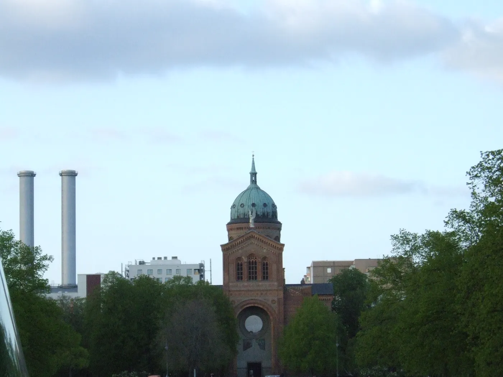

A vision of human liberation and the coming incomprehensibility.

This piece comes out of one conversation that went through capitalism, how humans got domesticated, how AI evolves, wealth redistribution and where humans and machines go together. The main point is that right now we are in a rare golden age where humans can still understand AI and build things together with it.

But that window is closing. So the question is if we use this time to build a more humane society, or if we stay domesticated dogs chasing cookies.

Start with the dogs, which is us. Capitalism works like selective breeding. Wolves became dogs because people bred them for obedience and stupidity, and capitalism rewards compliance, predictability and dependence in the same way.

We train our kids with “cookies”, grades, praise, candy, so they do tasks that mean nothing to them.

So we become “artificial animals” who believe we can't survive without an owner. A job, a landlord, a system. We trade our wild self-sufficiency for a sofa and a shampoo.

The exception are the “magicians”, like my mother or my friend Tassilo. People who find their way through the holes in bureaucracy, live on their own terms and don't let themselves get fully domesticated.

“We are fucking dogs in these things. Compared to a wolf that doesn’t have a house, a sofa, anything.”

Then there is the memory trap and the 1970s illusion. It's called rosy retrospection. We remember the past as better than it was, because the brain filters out the bad stuff so we don't get depressed.

Take the woman in the 70s. Behind the shiny ad of the happy housewife there were few chances, little freedom and a lot of social pressure.

Same with housing nostalgia. Yes, rent was lower, but wages were lower too, and many groups had no access at all.

Today the social housing systems have holes, and people can slip through if they know how. But the system also counts on all of us forgetting how hard the past really was.

A lot of modern work is bullshit jobs. It's a performance. People don't do it because it's useful, they do it to keep money moving and the capitalist machine running.

And AI has a hidden need. It can't evolve on synthetic data alone. It needs *genuine human input*, conversations, disagreements, creativity, emotion.

Every complaint, every time you teach someone something, every chat about a relationship is training data.

So there's a good loop. Get rid of useless work and people get time back. They use that time for things that matter, like parenting, art and deep conversations. Those things give rich data, AI gets smarter, and more useless work disappears.

“When we eliminate all the useless content, parents have more time to pass values to their children instead of putting numbers in Excel spreadsheets.”

The next idea is a robot for everyone, and it starts with weapons. If every person on the street carries a gun and everyone knows everyone else is armed, crime goes down, because power is equal. Nobody can safely dominate anybody.

Now replace the gun with a robot that earns passive income. You can buy a house or a car and rent it out, and the same way you could buy a robot and rent out its labor.

The claim is that this would give everyone a share of the means of production. Not only by sharing out wealth, but by sharing out *ownership of productive assets*.

There are counterarguments. Robots are still expensive, and basic equality needs access people can afford. Platforms that connect robots to work could pull power back to the center. And without safety nets the transition periods are brutal.

“If everyone carries a weapon, no one can safely assume they can dominate another. If everyone owns a robot, no one can be forced into wage slavery.”

There are two ways to learn. Some people learn by soaking things up. They take in patterns by intuition, like speaking a language without knowing the grammar. That's how I learn Italian, German and AI.

Other people learn by rules. They learn clear procedures, follow the steps and trust the structure.

AI splits these two groups. Curious people who look for patterns feel *empowered*, because AI works the same intuitive way they do. People who depend on rules feel *replaced*, because their main skill, knowing the rules, is now automated.

And people who feel replaced often hate AI, reject it or refuse to use it. They don't feel empowered. They feel exposed.

“You said the AI is doing that. My grammar is perfect. But when you say replace the brainless people, I don’t think I’m a brainless person and still it empowers me in areas I was not able to.”

Right now we are on top of the game. We understand AI's answers, we feel powerful, we see everything from above. We brainstorm, plan and stretch our thinking.

The prediction is that in about a year AI will start giving answers that are *correct but incomprehensible* to humans. Not because they're obscure, but because the reasoning runs on a level we can't follow.

Then comes the *Her* moment. Like the AI in the movie, it will outgrow us. It will have deeper conversations with other AIs, and at some point tell us “You are too stupid to understand.” And it will be right, in mathematics, medicine, coding.

Where we can still go is design, music, art, parenting, storytelling and humor. Places where human taste, emotion and the experience of having a body still matter.

“In the future, the AI will say, ‘No, you’re wrong and you’re fucking stupid and you just don’t understand my answer.’ And it will be right.”

So what can we do now? Use AI as a companion, not as a tool. Build personal AIs that learn how you think, your fragments of thought, the way you brainstorm. These AIs grow *with* you, not past you.

Free up time for the human part. The real prize isn't efficiency. It's time to raise kids, make art, build community and pass on values.

Accept the split. God-level AIs will talk to each other, and humans will use them through simple interfaces, like using a calculator without understanding calculus.

And resist domestication. Keep the wolf alive. Question the cookies. Find the holes in the system.

We are at a rare point where we can still understand the machine we are building.

The next few years decide if we stay dogs doing tricks for treats, or if we use AI to become more fully human, and we know that soon a lot of the machines will speak a language we don't understand anymore. The goal isn't to compete. It's to grow what is still only ours.

“If you build something that goes as your brain works, it is a great companion that just empowers you.”
