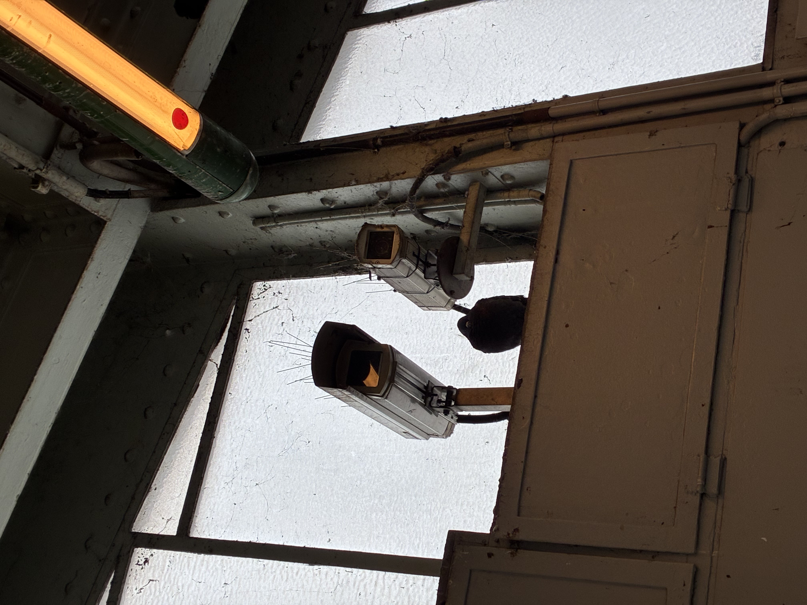

# From Human Colonizers to Cosmic Stomachs, Microbial Life, the Spark Toward Humans and Darwin-Like Selection in Quantum Physics

This post pulls together a chain of questions I kept asking. How many species live on or in humans, and which living beings are closest to us as constant colonizers. If anything sits alone at the top of the food chain on Earth. What kind of alien life we will most likely find. If a meteorite like Murchison could be the one event that started life. What exactly could count as the spark that makes a human possible. And if physics, especially quantum entanglement and decoherence, has processes that work like Darwinian evolution. The thread through all of it is information. In biology information gets copied and selected, and that is Darwinian evolution. In physics information can be kept, spread out, recorded many times or filtered by stability, but that doesn't have to be Darwinian at all.

## 1) What does living on or in humans constantly even mean?

I asked for all identified species, ordered from most to least, that live on or in humans constantly. The first problem is the definition. "All identified" is not a closed set, because metagenomics keeps growing the catalogs, especially for viruses and for microbes nobody has cultured. "Constantly" can mean in every human, in most humans or in humans as a species, so the global pool, and those are very different things. And "species" is easy for animals but harder for microbes and even harder for viruses, which are often defined by sequence clusters and not by the classic idea of a species. So a practical way is to split the global pool of human-associated species from what a typical person hosts at one time, and to treat viruses on their own, because a lot of people don't count them as alive.

## 2) How many microbial species are human-associated, and which groups lead by species count?

### 2.1 The global pool, across humans and many body sites

A framing from the NIH Human Microbiome Project that gets cited a lot says humans host roughly 10,000 bacterial species globally, while one person hosts around 1,000 species at a time. Beyond that headline number, the newer reference catalogs show why "all identified" keeps moving. For gut bacteria and archaea, the prokaryotes, the UHGG catalog reports 4,644 gut prokaryote species, meaning species-level groups from large genome collection work. For gut viruses, which are mostly bacteriophages, a big metagenomic survey reported more than 140,000 gut viral "species", groups defined by sequence, and a lot of them new. For fungi, the mycobiome, reviews count more than 390 fungal species across the places they live on the human body. And archaea are less diverse than bacteria, but they get described better all the time, and large genome-based surveys show a lot of archaeal genome diversity in humans.

### 2.2 Most to least by species count, global and human-associated

If you count viruses as living, then viruses most likely lead by species-level group counts in the current catalogs. If you don't, bacteria lead among cellular life. The rough order by identified diversity goes like this. Viruses come first, if you count them, with extremely high diversity in the gut virome catalogs. Then bacteria, thousands globally and around 10,000 species in the framing of the Human Microbiome Project. Then fungi, with hundreds identified across human body sites. And then archaea, fewer than bacteria, but not trivial and better cataloged than people used to think.

## 3) If we only count things with a brain and a heart, what are the closest human colonizers?

I suggested making it simpler and only looking at organisms closer to humans, so animals with a nervous system and a pump that works like a heart. That moves the whole question from microbiomes to ectoparasites and to arthropods that live on the skin. And here "constant colonizer" gets narrow. The most normal long-term residents are mites. Lice and scabies are obligate human parasites, but not everyone has them. Others like bed bugs, botflies and sand fleas are tied to humans, but they usually don't stay for good.

Here are the top ten animal colonizers and human-associated parasites that act like residents, going roughly from the most common long-term residents to the ones that are less common, more regional and more occasional. First is Demodex folliculorum, the face mite. It's common on humans and lives in hair follicles, especially on the eyelashes and the face, often without any symptoms. Second is Demodex brevis, also a face mite, common on humans too, and it tends to live in the sebaceous glands, so the oil glands, and in follicles. Third is the head louse, Pediculus humanus capitis, a parasite that feeds on blood, lives on the scalp and lays eggs on the hair shafts. Fourth is the body louse, Pediculus humanus humanus, also called corporis. It usually lives and lays eggs in the seams of clothes and goes to the skin to feed, and it can stay as long as the conditions that expose people to it stay. Fifth is the pubic louse, Pthirus pubis, a louse that looks like a crab, lives in coarse hair, usually in the pubic region, and feeds on blood.

Sixth is the scabies mite, Sarcoptes scabiei var. hominis. Fertilized females burrow into the top layer of the skin and lay eggs, so without treatment it can stay for a long time. Seventh is the common bed bug, Cimex lectularius. It doesn't live on the body, but it's a persistent blood feeder that lives near where people sleep and feeds on them again and again. Eighth is the tropical bed bug, Cimex hemipterus, and it's the same story, it lives in the environment, in beds and furniture, and feeds on people again and again. Ninth is the sand flea or chigoe, Tunga penetrans. Adult females can burrow into the skin, often in the feet, and stay there while they produce eggs, and that's called tungiasis. And tenth are the larvae of the human botfly, Dermatobia hominis. They can grow in human skin for weeks, which is called furuncular myiasis, but it only happens in some regions and only now and then.

The important caveat is that only a few of these are real constant colonizers in normal healthy adults, mainly Demodex. The rest are better called parasites or infestations that can stay for a long time when the social and ecological conditions are right.

## 4) Who is the ultimate master of Earth at the top of the food chain?

I asked for one single being that is on top of the food chain alone and doesn't get eaten, like humans. In ecology the question doesn't really fit. Apex predators can be hard to hunt while they are alive, but no organism escapes being eaten by decomposers in the end. A better way to see it is my later idea of the stomach of the world, so the organisms that in the end digest everything. And there the closest answer is the decomposers, especially fungi and bacteria. They close the food webs by breaking down dead organic matter and recycling the nutrients. So if master means the final consumer, the stomach of the biosphere, it's the microbial decomposers. If master means whoever shapes the surface of Earth the most right now, you can argue for humans, but that's about technology and global impact and not about never being eaten in the long run.

## 5) What's the most likely alien life we'll find?

My intuition was that the first aliens we find will most likely be microbes, and that fits the mainstream strategy in astrobiology. Microbes are simpler and tougher, and they can use chemical energy in dark places like oceans under the surface. NASA discussions about detecting life on Europa and Enceladus usually focus on biosignatures that fit microbial life and on how realistic it is to take samples for them. I also raised a second point without saying it directly. We may detect biosignatures, so chemical, isotopic or mineral patterns, before we ever see a cell. That's why sample return and life detection on site are big priorities for Mars and for the ocean worlds.

## 6) Is there one single event in world history, like the Murchison meteorite bringing the building blocks of life?

My idea was that a carbonaceous meteorite brings amino acids and other organics and seeds Earth with the building blocks for microbes. Murchison is a good symbol for that, because there's strong evidence it contains a lot of organics, including many amino acids, with isotopic signatures that point to an origin outside Earth. Isotopic and enantiomeric analyses support that many of the Murchison amino acids come from space and are not contamination from Earth. And reviews mention dozens of amino acids identified in Murchison, and many more found across carbonaceous meteorites. But it's best to see this as one input stream and not as the origin event. Early Earth most likely got organics from many sources, made on Earth itself and brought by many impacts, and in a lot of different environments.

## 7) "Good luck explaining the origin of life", so here is a more specific path to humans

I pushed for a concrete spark and not just "billions of years happened". The spark that is useful in science is not a random amino acid. It's something else, and it comes in two steps.

### 7.1 The earliest spark that makes humans possible

The first one is a self-copying system with heredity and variation that can go through Darwinian evolution. People often talk about it as an RNA-like replicator, which stores information and does catalysis, coupled to compartments, the protocells. This is the point where chemistry turns into an evolutionary process and stops being just reactions. Work on fatty acid vesicles that hold genetic polymers is one line backed by experiments for how systems like protocells could appear and couple growth with division. And the RNA world literature explains why RNA, or a polymer like RNA, is attractive. It can carry information and catalyze reactions, so it's a bridge from chemistry to heredity.

### 7.2 The later spark closest to a human

I also asked what the spark of a human is, and not only of life. A strong candidate for the big transition that made complex multicellular life possible is eukaryogenesis with mitochondria. Mitochondria come from an ancestral alphaproteobacterium that lived inside another cell as an endosymbiont, and this event is tightly linked to the rise of the complex eukaryotic cell. From there the path to humans is the standard evolutionary history, multicellularity, then animals, vertebrates, mammals, primates and hominins.

## 8) My physics analogy, chain reactions, heat mixing and matter competing to be the same

I suggested that physical processes like nuclear chains, fusion and fission and even warm and cold air mixing look like competition, variation and keeping information, and that maybe there is an RNA-like flow of information in matter itself. A careful way to put it goes like this. A lot of physical systems show amplification, like chain reactions, and pattern formation, like convection, and they can keep information at the microscopic level. But Darwinian evolution needs one special thing, high-fidelity copying from a template with variation that gets inherited, so adaptation can add up. Turbulent mixing and thermal equilibrium usually erase the useful macroscopic information, even if the microscopic dynamics stay reversible in principle, and that's the opposite of what genomes do. So my analogy works best if you read it as physics far from equilibrium producing structures that last, while open-ended Darwinian evolution needs heredity through templates.

## 9) Entanglement, if A changes then B changes, so why doesn't B's environment change?

This was the knot I kept coming back to. The answer is that people mean two different things when they say "state change".

### 9.1 What does change instantly, in the joint description

If A and B are entangled, a measurement on A lets you update the conditional state you give to B, based on the outcome at A.

### 9.2 What does not change locally at B, without classical communication

The local physics at B follows the reduced state of B. The no-communication principle, also called no-signaling, says local operations and measurements on A can't be used to send information to B faster than light. The local outcome statistics at B stay the same until a classical signal arrives.

### 9.3 How entanglement is proven in experiments

I asked how we influence it and prove it, and if we need to change both sides at the same time. A standard approach is to choose the measurement bases on each side independently, record the outcomes and then show that the correlations violate a Bell inequality, for example CHSH. That rules out explanations with local hidden variables, under the assumptions of the experiment. A landmark loophole-free Bell test with separated systems is one example of this kind of experiment. And the answer to my timing question is no, you don't need to change both sides at the same time. You need measurements on both sides and an analysis of the correlations, and spacelike separation is used so normal causal coordination is ruled out.

## 10) Is entanglement only spin zero or one, and does spin matter for fusion and fission?

I asked if entanglement only works with two states, spin up and spin down, and if spin has real physical effects in nuclear processes.

### 10.1 Degrees of freedom in entanglement

Entanglement can involve many degrees of freedom, like polarization, path, energy and time bins or orbital angular momentum. And systems are not limited to two levels. Qudits and continuous-variable entanglement exist in principle and in practice.

### 10.2 Does spin matter in fusion?

Yes. The probability of a reaction can depend on how the spins are set up. Spin-polarized fusion is studied for exactly this reason, because aligning the spins of the reactants can increase the cross sections. First-principles nuclear calculations and fusion research report that fully aligned D–T polarization can increase the D–T fusion cross section by about 50%, so roughly a factor of 1.5, with ideal polarization. This is a local effect. Spin changes the nuclear reaction channels and the cross sections. It's not an example of remote entanglement making matter far away behave differently.

## 11) My goal, an experiment where entanglement triggers a Darwinistic reaction on both sides

I asked for the closest experiment where two entangled systems each interact with their own local environment in a way that looks Darwinian, so things persist, compete and stable winners come out. The closest framework that is well developed is Quantum Darwinism. Decoherence filters out the fragile superpositions. A small set of stable pointer states survives the contact with the environment, and that's called environment-induced superselection, or einselection. And then the environment stores many redundant records of the pointer state information, so many observers can agree on the same classical reality. A recent experiment with superconducting circuits reports a full demonstration that fits these Quantum Darwinism signatures, the branching structure and the redundancy, with the plateau in mutual information.

### 11.1 A concrete two-sided design that matches what I suggested

Step 1, prepare A and B in an entangled state.

Step 2, couple A to a local environment E_A, many ancilla qubits or photonic modes, and couple B to an independent local environment E_B.

Step 3, build the coupling so each environment monitors its system, selects pointer states and imprints redundant copies of the classical information of the system into many fragments of the environment.

Step 4, check for behavior like Darwinism by showing that small fragments of E_A, and separately of E_B, each reveal basically the same pointer state information, the redundancy plateau, while the quantum coherences underneath are suppressed.

This is Darwin-like only in a precise and limited sense. The selection is that pointer states are the stable survivors of decoherence. The replication is that the environment stores many copies, redundant records, of those survivors. What it is not is the open-ended adaptation of biological evolution, through variation that gets inherited over generations.

## 12) My universe-scale extension, black holes, expansion and chaos far away

I suggested a speculative extrapolation. If distant systems are entangled, for example black hole interiors with Hawking radiation or other cosmological degrees of freedom, maybe one side could create changes or chaos somewhere else in a Darwin-like way. A careful statement that fits what we know goes like this. Black holes and Hawking radiation raise deep questions about entanglement and information, like the black hole information paradox and the Page curve. There are speculative ideas that link entanglement and geometry, for example ER=EPR, a conjecture that wormholes and entanglement are related. But entanglement alone doesn't give you a causal channel you can control. It reshapes correlations, and it doesn't change local dynamics in a way you could use to force effects in a distant environment, because no-signaling is still the rule. So my picture of black holes, expansion and creation is best treated as research-level speculation about global correlations, and not as a mechanism for remote Darwin-like causal influence.

## The whole arc in short

Humans host a huge biodiversity, mostly microbial. Global catalogs suggest around 10,000 bacterial species associated with humans and about 1,000 per person at one time, the gut prokaryote catalogs are at 4,644 species, the gut viromes at more than 140,000 viral groups and the mycobiomes at more than 390 fungal species. If you only count animals with a brain and a heart, the closest colonizers are mainly Demodex mites, plus lice and scabies as parasites that stay, and the others like bed bugs, sand fleas and botfly larvae come and go or live in the environment. No organism escapes being eaten in the end, and the decomposers, bacteria and fungi, are the final digesters of the biosphere. The first alien life we find will most likely be microbial, and we may detect biosignatures before we find organisms.

Meteorites like Murchison probably brought organics, including amino acids, to early Earth, but they were most likely one part of a bigger chemical supply chain. The spark for life that is easiest to defend is a templated self-copying system that can go through Darwinian evolution, probably in compartments like protocells. The spark for human-level complexity that is easiest to defend is eukaryogenesis with mitochondria. Entanglement creates strong nonclassical correlations, verified with Bell tests, but it doesn't allow remote causal control of a distant environment, because of no-signaling. And the closest thing to Darwinism in physics is Quantum Darwinism, where decoherence selects stable pointer states and the environment copies their information again and again.

