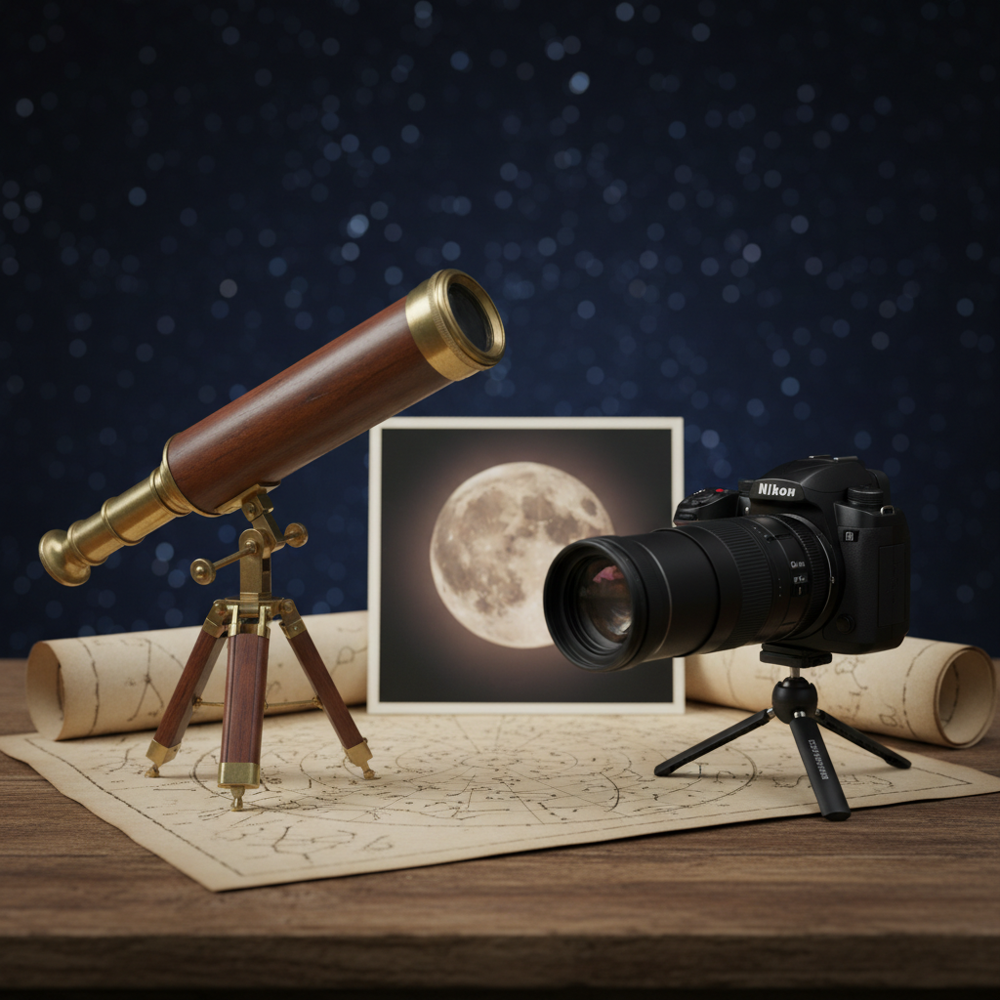

In 1609 Galileo Galilei didn't just point a tube of glass at the sky. He pointed a method at it. With a handmade refracting telescope that he made better from Dutch designs, he saw things and then dared to publish them, and they made the "perfect heavens" look messy and physical. Mountains on the Moon, the phases of Venus, and four small moons going around Jupiter.

Four hundred years later the Nikon Coolpix P1000 (2018) is not an astronomical telescope at all. It's a bridge camera, built for wildlife, sports and "I want that thing way over there". But its extreme 24-3000mm (equivalent) zoom, the stabilization and the instant digital capture let normal people take pictures of the Moon and the bright planets in a way that would have felt like magic in 1610.

So what happens if we look at them as two answers to the same human wish, to bring the sky closer, and compare them honestly?

Galileo didn't invent the telescope. That was Dutch spectacle makers around 1608. But he kept improving it, again and again, until it was a serious tool for astronomy.

A typical "best" Galilean telescope around early 1610 was a refractor with a convex lens in front and a concave eyepiece. The front lens was about 37 mm wide (the surviving reconstructions differ a bit), it magnified about 20× and the focal length was roughly 1 meter.

And it was hard to use. Early lenses had bubbles, uneven zones and a lot of color fringing. The field you could see was tiny, so following an object was like looking through a keyhole. And there was no photography, so every observation had to be drawn, described and then argued for.

What made it historic is that the claims could be checked. Anyone with a similar telescope could see for themselves that the Moon has mountains and valleys (you see it in the shadows and along the line between light and dark), that Jupiter has moons and they move from night to night, and that Venus shows phases, which supports the idea that the planets go around the Sun.

The telescope didn't "win" because it was perfect. It won because it let nature speak louder than authority.

The P1000 is a camera with a small sensor and a ridiculously long zoom. That sounds like a toy until you see what it gives you for bright things in the sky. It has a 16 MP sensor of the 1/2.3" type, a lens that goes from 24 to 3000mm equivalent (125× optical zoom), an aperture from f/2.8 at the wide end to f/8 at full zoom, and optical VR stabilization plus modern metering and exposure.

At full zoom the actual focal length is about 539 mm. With f/8 at the long end, the opening of the lens is about 67 mm wide. So it collects a lot more light than Galileo's 37 mm lens.

There are tradeoffs. The sensor is small, so you get noise quickly at high ISO on dim objects. For planets the limit is often the air, what astronomers call seeing, and not how sharp the lens is. It's amazing for the Moon and bright planets, but it's not built for deep-sky astrophotography.

Still, you can shoot, check, stabilize and share a close-up of the Moon in minutes, and that really puts it in everyone's hands.

A telescope is something you look through, so it's about magnification. A camera makes images, so it's about resolution, sampling and processing. So instead of a fake "×" war, it makes more sense to compare the things that decide what you can see or record. These are rough numbers, not marketing.

| Metric | Galileo (c. 1610) | Nikon P1000 (2018) | Notes |
|---|---:|---:|---|
| Objective / entrance pupil | ~37 mm | ~67 mm (at full tele) | Light gathering scales with area. |
| Magnification / image scale | ~20× visual | 539 mm actual focal length (3000mm equiv.) | Different categories, camera uses sensor sampling. |
| Diffraction limit (theoretical) | ~3-4 arcsec | ~1.7 arcsec (67 mm @ 550 nm) | Real-world is worse due to optics + seeing. |
| Usable field & ergonomics | narrow, manual | wide-to-narrow, stabilized, LCD/EVF | P1000 wins massively on usability. |
| Recording | hand sketches | 16 MP files, video, bursts | Digital permanence changes everything. |

Galileo's telescope, or a good modern copy of it, teaches you how discoveries happen. It shows you the "big" moments like the phases of Venus and Jupiter's moons, and it makes the sky feel physical with almost no tech.

The P1000 makes the Moon easy, again and again. It makes "proof" trivial because you have photos and videos. And you learn by trying, with settings, focus and exposure, instead of by arguing.

Galileo's real superpower wasn't the tube. It was that he kept going and he published. He looked again and again, drew carefully and wrote in a way that forced people to talk about it.

The P1000's superpower is different. It removes the distance between being curious and having evidence. You don't need a patron, a workshop or a printing press. You need a clear night and a battery.

And both have the same last enemy, the air above your head.

At extreme focal lengths turbulence blurs the details, no matter how modern your gear is. In a poetic way the atmosphere keeps the sky a little out of reach, so we keep trying.

If the goal is "show me the Moon up close tonight", the Nikon Coolpix P1000 wins without mercy. It's brighter at the long end, a lot easier to use, and it records what it sees.

If the goal is "remind me what it felt like when the universe changed", nothing replaces Galileo's telescope. It's the moment when careful looking stopped being decoration and became an argument.

Next clear night point whatever you have at the Moon, a P1000, binoculars or a cheap refractor, and you're part of the same tradition. Evidence first, wonder always.

## Sources

- Galileo Galilei, *Sidereus Nuncius* (1610)
- Museo Galileo (Florence), historical context and instrument reconstructions
- Nikon technical specifications for the Coolpix P1000 (lens range, aperture, sensor)
