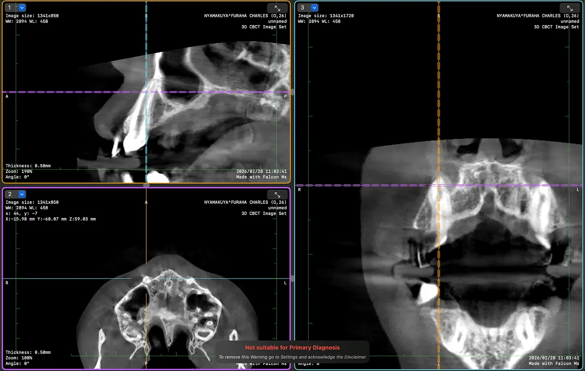

This is how I used Claude to look at dental CBCT scans, check orthodontic providers, get ready for the consultation and make a treatment decision we actually understood, from Arusha in Tanzania to Nairobi in Kenya.

My partner has bilateral ectopic maxillary canines, or so we thought, four premolar extractions from abandoned orthodontic treatment, and 13 months of uncontrolled tooth drift. Two general dentists in Arusha, Tanzania had attempted braces. Both failed. The teeth were worse than before. We had no treatment plan, no specialist, and no idea what to do next.

We had an OPG (orthopantomogram) from Berlin, an iTero digital scan, and an Invisalign simulation that a dentist had proposed. What we didn’t have was someone qualified to interpret all of it and tell us the truth about what was actually going on.

So I started talking to Claude.

## Building the case file

First the AI put everything we knew into one clinical picture. From the photos I uploaded, the Berlin OPG and my description of the treatment history, it wrote a case summary with the extraction timeline (September and October 2024), the 7 months of braces across two providers, the symptoms, so loose front teeth and pain when chewing at the extraction sites, and the 13 months with no treatment at all.

It also pointed out right away a few things the dentists before had missed or ignored. The Berlin OPG seemed to show canines that hadn’t come down into the arch. If that was true, the case was much too complex for general dentists. It would need surgical exposure and bonded traction with fixed appliances, and aligners or simple braces would not be enough.

The AI was blunt and said “Invisalign alone is inadequate for this case. You need a CBCT scan to see the canines in 3D, and you need a specialist orthodontist, not a general dentist.”

## Finding a specialist

We needed an orthodontist in East Africa who could handle a complex case with impacted canines and extraction space management, for a patient who lives six hours away by bus. The AI searched for specialists in Nairobi and looked at their credentials, not just at Google reviews.

It found Kenya Orthodontics and Dr. Wandia Mwangi-Evans. She has a fellowship from the Royal College of Surgeons of England, an MSc in Orthodontics from Cardiff University with distinction, over 8,000 cases and 20+ years of experience. The clinic works with shared care. The specialist makes the plan and sees the patient every 6 to 8 weeks, and a local dentist does the adjustments in between. That fits people who come from Tanzania really well.

The AI wrote a full briefing for the consultation, nine sections with the clinical history, the radiographic findings, questions for the specialist and red flags to watch for. It also drafted a referral letter we could bring to the appointment.

## Getting the CBCT scan

We were in Nairobi staying near Karen, so the AI helped locate Karen Dental Clinic in Zamani Business Park. They had a Carestream CS 8200 3D CBCT machine. We confirmed the equipment from photos I sent, and the AI walked me through what to ask for, a full maxillary and mandibular CBCT, DICOM file export, and email delivery to both us and the orthodontist.

The scan produced 651 DICOM slices across two series (standard volume and metal artifact reduction). The clinic said we’d need special software to view them. The AI recommended Falcon (formerly Horos Mobile) for iPhone, a free DICOM viewer. I installed it, imported all 651 slices, and suddenly I could scroll through cross-sections of my partner’s skull on my phone.

## Reading the scan from a phone video

This is where it got interesting, and where the AI got something wrong. That taught us just as much as the things it got right.

I screen-recorded myself scrolling through the CBCT slices in Falcon and uploaded the video. The AI extracted 192 frames and went through them one by one, looking for anatomical landmarks in the axial slices.

It flagged what it thought were bilateral ectopic canines sitting high in the palate, well above the dental arch. It measured the vertical distance across slices and concluded the canines were deeply impacted and needed surgical exposure. That matched what the Berlin OPG had suggested.

But the AI was careful and said again that this was only a first look. “I’m reading compressed video frames on a phone screen recording. This is a preliminary orientation only. The specialist with the actual DICOM files on proper software will see 10x more detail.”

That caveat turned out to be critical.

## The consultation at Kenya Orthodontics

We went to Kenya Orthodontics with all our records. Dr. Wandia’s team, several doctors including the orthodontist, did a thorough clinical examination. They charted every tooth, measured the extraction gaps (4.5mm right, 5mm left), noted the fluorosis from Arusha’s water supply, checked for TMJ issues, looked at the bite and reviewed the CBCT on their professional software.

They said the case was “pretty straightforward.” About 18 months with fixed braces. No word about surgical exposure or impacted canines.

That contradicted the AI’s CBCT reading. Either the specialist team missed bilateral impacted canines, which is unlikely because they had the patient in the chair and the DICOM files on proper software, or the AI’s first read from compressed video frames was wrong.

## Checking it with MPR views

I didn’t want to just believe one of the two. So I used the AI to walk me through the CBCT in a more diagnostic way. Falcon has a 2D MPR mode that shows axial, sagittal and coronal slices at the same time with linked crosshairs, and in that mode I clicked directly on the canine positions in the upper arch.

The AI guided me. “Click on the upper right canine area in the axial view. Take a screenshot. Now click on the left canine. Screenshot.” Each click showed the same anatomical point from three angles at once.

The result was clear. Both sagittal views showed teeth with long roots going up into the maxillary bone, and that is just how erupted canines look. Crowns down in the arch, roots going up. Normal position. Not impacted.

What the AI had taken for impacted canine crowns in the compressed video were actually canine roots, seen in axial cross-section at higher slice levels. Canines have the longest roots of any tooth, so they show up as dense round structures on axial slices well above the occlusal plane. On compressed phone video they look exactly like impacted crowns.

The AI owned the error immediately. “My earlier CBCT video read was wrong. The specialist with the patient in the chair plus proper DICOM software got it right.”

## The treatment plan

With the canine question resolved, the plan was clear. Fixed braces and not aligners, because braces are more predictable at this level of complexity. The fluorosis makes bracket adhesion hard, so the molars get bands instead. About 18 months of active treatment, with visits every 6 to 8 weeks for adjustments. After that bonded retainers and removable retainers, and retainer checks for one year after the treatment. The cost is about 483,000 KES (around $3,700 USD), pay as you go. March 13 is cleaning and separators, and on March 24 the braces get fitted.

The team explained both braces and Invisalign openly, talked about what the fluorosis means, and recommended braces because tooth movement the orthodontist controls is more predictable than aligners that depend on the patient, in a case with this history.

## When AI helped and when it didn’t

The AI helped a lot. It put a scattered medical history into one clinical picture and saw that the case needed a specialist and not general dentistry. It researched and checked providers by their real credentials, not by marketing. It prepared the consultation documents so we walked in informed, and it explained the dental terms in plain language the whole way. It guided me through CBCT software I had never used, taught me how to use MPR views to check one specific anatomical question, and gave me the questions to ask and the red flags to watch.

Where it got it wrong was reading the CBCT from compressed phone video frames. It took canine roots for impacted crowns, and it was too confident in that first radiographic reading, even though it did add the caveat again and again.

The lesson for me is that AI reading medical images from indirect sources, like screen recordings or compressed exports, is good to get oriented but you can't rely on it for a diagnosis. The specialist with the patient in the chair, hands in the mouth and the DICOM files on calibrated software will always beat an AI reading a phone video. Use AI to prepare, to learn and to ask better questions, but let the qualified human make the diagnosis.

## What worked for us

If you have a complex dental or orthodontic situation, especially somewhere where it's hard to get to a specialist, this is what worked for us.

Gather everything. OPG, photos, digital scans, treatment history with dates. Upload it all and let the AI organize it.

Understand your case before the consultation. AI can explain what ectopic canines are, what premolar extractions mean for space management, why CBCT matters and what to ask. The consultation gets so much better when you come in informed.

Get the right imaging. A 2D OPG is not enough for complex cases. CBCT gives you three dimensional information. Insist on DICOM file export so you own your data.

Check providers on credentials, not convenience. Fellowship training, specialist registration, case volume. AI can help you research this. And when two general dentists fail on the same case, that should tell you something.

Prepare documents for the consultation. A structured briefing saves time and makes sure nothing gets missed in the appointment. The specialist sees hundreds of patients, so make it easy for them to understand your history quickly.

Verify, don’t just trust. When the AI’s first read contradicted the specialist, we didn’t just accept either answer. We used the MPR viewer to check exactly that point. The specialist was right, but checking it taught us more about the case than either opinion alone.

Own your files. CBCT DICOM files, intraoral STL scans, OPG images, keep copies of everything. It's your medical data and you may need it for second opinions, insurance or future providers.

## What it came down to

From the first AI conversation to the treatment decision it took 2 days. We looked at several providers and picked one by credentials. The AI went through 651 CBCT slices and 192 video frames, and I took 6 MPR screenshots to verify. The CBCT and the consultation together cost about $60 USD. The treatment is about $3,700 USD over 18 months. Before this there were 2 failed treatments, and 4 premolars are lost for good. They were extracted and can't be replaced.

Right now anyone with a smartphone can get an informed second opinion, understand their own medical images, check specialists across borders and walk into a consultation prepared. It won’t replace the orthodontist’s hands and training. But it closes a gap in information that has always left patients, especially in regions with few specialists, at the mercy of whoever happens to be closest.

We went from “I don’t know what’s wrong and I don’t know who to trust” to “I understand my case, I’ve verified the diagnosis, and I’m confident in the treatment plan” in 48 hours. For me that's not AI replacing medicine. It's AI making patients better partners in their own care.
