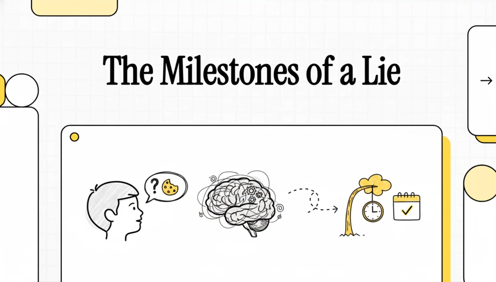

https://youtu.be/bcu9MpjV3yE

If you force me to pick one single age where lying becomes a stable, deliberate tool, and not just noise, mistakes or wishful answers, I pick 4 years old.

That sounds like a moral judgement about kids. It isn't.

This is about a step in how kids think. It's the moment a child starts to treat your mind as something separate from their own mind. A private universe with its own contents, and those contents can be changed, misled and sometimes used.

A child who can lie is not automatically bad. And a child who can't lie is not automatically good. It makes more sense to see lying as a social tool that becomes possible once two things in the head start to work together. The first is theory of mind (ToM), so knowing what someone else believes, even when it's wrong. The second is executive function (EF), so holding back the truth, keeping the story in working memory and not letting it slip out.

The hard part is that neither of these grows overnight. So why pick four?

Because around 4 a lot of different research comes to the same practical point. Kids start to understand false beliefs in a reliable way, self-protective lies become common in the classic lab tests, and the ability to tell a lie and then keep it straight starts to show up as a difference between kids, and that difference is tied to ToM and EF.

Below is the evidence that makes four the best answer if you have to give one number, even though in reality it's a slow, continuous change.

A lot of confusion comes from calling everything that isn't true a lie.

In developmental psychology lying usually means intentional verbal deception. Not mistakes, not misunderstandings, not fantasy play and not a random yes. One definition that gets cited a lot puts it very plainly. "Lying involves a speaker making a false statement with the intention to deceive the recepient." That's from Talwar and Lee, and the full text is open on PMC.

So "I didn't break it" while the kid is holding the broken thing is a lie. "I have a dragon in my bedroom" while playing is not necessarily a lie. And saying no to every question isn't lying either. Very often that's just response bias, fear or confusion.

The key idea behind all this is that at some point a child gets that the other person has their own inner world.

To lie well the child has to keep three things in mind. What really happened, what you believe right now, and what you will believe after you hear their story.

That's why the false-belief test has been the main tool for measuring ToM. And when researchers argue about when ToM starts, they mostly argue about when kids pass false-belief tasks in a reliable way.

A classic meta-analysis by Wellman, Cross and Watson (2001) pulled the messy research together. In their words, "A meta-analysis was conducted (N = 178 separate studies) to address the empirical inconsistencies and theoretical controversies." And they found that performance follows a clear developmental pattern. Their model "yielded a multiple R of .74 and an R2 of .55; thus, the model accounts for 55% of the variance".

You don't have to think false-belief tasks are perfect to get the big message. Preschoolers go from failing these tasks again and again to passing them reliably. That shift is exactly the kind of other-universe upgrade that makes strategic lying possible.

## The lab's lying trap

Most of the cleanest data on kids and lying comes from a very simple setup. You tell the child not to peek at a toy while you leave the room. You leave them alone, and a lot of them peek. Then you come back and ask if they peeked. And you can ask some follow-up questions to test if they can keep the lie going without giving themselves away, which researchers call semantic leakage.

It's called the temptation resistance paradigm (TRP).

In one open-access study of 150 children aged 3 to 8, Talwar and Lee report that "Overall, 82% of the children (123) peeked at the toy in the experimenter's absence". And of those who peeked, "Of the 123 children who peeked, 79 (64%) children lied about their transgression."

That is already a big point. Lying is common once the situation pushes a kid to protect themselves.

But it still doesn't tell us the switch age. For that we look at the developmental model in the same paper.

## Why I pick four

Talwar and Lee describe how lying develops in levels. What matters here is what they say happens between 3 and 4. "The second level, 'secondary lies', reflects a significant shift that takes place between 3 and 4 years of age."

And then they say the practical thing this whole question is about. "At and after 4 years of age, the majority of children will readily tell a lie to conceal their own transgression."

That sentence is why four is the best single number.

Not because every 4-year-old lies all the time. But because before 4 lying exists, it's just less reliable, less strategic and the truth slips out more easily. After 4, lying to hide something you did wrong becomes the most common answer in these tests.

## Why not 2.5

Parents often talk about first lies when kids are toddlers. Experiments see something like that too, but the pattern says it's not yet full deception where the kid really plays with what you believe.

A big longitudinal study by Białecka-Pikul et al. (2022) with N=252 tested 2.5-year-olds in a modified TRP. "Results showed that 35% of 2.5-year-olds peeked, 27% of peekers lied and 40% of non-peekers falsely confessed they had peeked."

Look at how strange that is. 40% false confessions among the kids who didn't peek. That's not what grown-up deception looks like. It looks more like a mix of just going along, confusion and weak self-control.

And the authors say it directly. "These results suggested that the first, or so-called primary, lies of 2.5-year-olds are probably spontaneous, rather than deliberate."

So if you pick 2.5, you risk calling noise a switch.

There is a different step that comes later, and that's being able to keep a lie consistent when someone asks follow-up questions.

Talwar and Lee note that keeping a lie going is linked to higher-order belief understanding, so thinking about what someone thinks about someone else's beliefs. In other words, how good kids get at it keeps developing for years.

But if what you want is the first age where lying becomes a common, deliberate way to hide things, you don't need to wait for 7-8. Four is earlier and it catches the start of secondary lies.

If lying was only about theory of mind, we'd expect huge correlations. We don't see that.

What we see are small but consistent links across thousands of kids. That's exactly what you'd expect if ToM is needed but not enough on its own.

A meta-analysis on lying and ToM by Lee and Imuta (2021) covers "81 studies involving 7,826 children between 2 and 14 years of age". They found "there was a small, significant positive association (r = .23)." And the link is strongest where you'd expect ToM to matter most. "ToM was positively related to all facets of lying, but most strongly linked to lie maintenance".

A second meta-analysis by Sai et al. (2021) also looks at executive function. "In total, 47 papers consisting of 5099 participants between 2 and 19 years of age were included". And they found "Statistically significant but relatively small effects were found between children's lying and ToM (r = .17) and between lying and EF (r = .13)."

They also found something that fits the difference between being able to start lying and being good at it. "EF's correlation with children's initial lies was significantly smaller than its correlation with children's ability to maintain lies."

So around 4 the machinery comes online. After that kids differ in how good they are at it, and most of all at keeping a lie going.

## Does it stay?

Even if lying starts around preschool, there is a deeper question. When does it become stable behavior and not just a one-off?

A short-term longitudinal paper by Wang, Gao and Shao (2024), open access, tested 104 preschoolers three times, 4 months apart. "we tested 104 normally developing children's (64 boys, M = 54.0 months) false belief understanding and lie-telling behaviors three times at 4-month intervals."

They report that "Lie-telling behaviors exhibited moderate stability across the three time points".

And this is important for the other-universe idea, because the prediction goes from ToM to lying and not the other way around. "Earlier false belief understanding significantly predicted children's later lie-telling behavior", but "earlier lie-telling did not predict later false beliefs understanding."

If you want to know when it stays, that kind of stability is the closest thing we have to a number. Once the behavior is common, so after 4, you can already measure that it's stable over months.

If you follow lying into adult life, the story becomes less that everyone lies all the time and more that most people lie rarely and a few people lie a lot.

A classic diary study by DePaulo et al. (1996) found that "77 college students reported telling 2 lies a day, and 70 community members told 1."

And a big UK survey by Serota and Levine (2014) sums up the newer long-tail view. "most people are honest most of the time and the majority of lies are told by a few prolific liars." They also state the sample clearly. "Participants (N = 2,980) were surveyed in the United Kingdom".

So yes, lying stays as a human behavior. But it doesn't stay at the same rate for everyone.

## So it's four

If I have to choose one age, I choose 4 years old, and here is the argument in five steps.

First, before 4 deception exists but it often looks like primary behavior. Toddlers deny things, go along with the question and falsely confess in ways that show they're not really playing with what you believe yet. With 2.5-year-olds, 27% of peekers lied and 40% of non-peekers falsely confessed.

Second, around 4 deliberate lies to hide something become the main answer in the classic tests. Talwar and Lee describe a shift between 3 and 4 and say that at and after 4 the majority readily lie to hide a transgression.

Third, around 4 other minds become something a kid can actually work with. False-belief performance shows a real change in preschool in a big meta-analysis, and the meta-analyses show ToM is reliably linked to lying, even if the link is modest, and most of all to keeping a lie going.

Fourth, after 4 context and incentives can swing honesty a lot. In 4-8-year-olds, changing the appeals and what kids expect as punishment moves lying rates from ~46% to ~87% in one dataset. So the behavior is now a strategic answer and not just developmental noise.

And fifth, after 4 you can already see stability over time. Short-term longitudinal evidence finds moderate stability in lie-telling across several time points and shows that ToM predicts later lying.

If you want one age that best captures the switch from truth by default to truth as a strategy, it's four.

## The key studies as CSV

You can copy this and save it as a `.csv` file.

```csv
Study,Year,Design,N,Age range,Paradigm / Measures,Key quantitative
findings,Open link
Wellman Cross Watson,"2001",Meta-analysis,"178 studies
(meta)",Preschool focus,False-belief tasks,"Model multiple R=.74;
R2=.55; consistent developmental shift in false-belief
performance",https://pubmed.ncbi.nlm.nih.gov/11405571/
Talwar Lee,"2008",Cross-sectional,"150",3–8 years,TRP + ToM + EF +
moral eval,"82% peeked; of peekers 64% lied; ToM/EF relate to initial
lie vs maintenance; 'shift between 3 and 4'
described",https://pmc.ncbi.nlm.nih.gov/articles/PMC3483871/
Talwar Arruda Yachison,"2015",Experiment,"372",4–8 years,TRP with
appeals + punishment,"No-appeal 87.1% lied vs External 46.4% vs
Internal 65.9%; punishment × internal appeal: 86% lied vs
45%",https://ggsc.berkeley.edu/images/uploads/Talwar_et_al_2015_The_effects_of_punishment_and_appeals_for_honesty_on_children%E2%80%99s_truth-telling_behavior.pdf
Białecka-Pikul et al.,"2022",Longitudinal,"252",2.5 years (IC at
1.5/2/2.5),Modified TRP + inhibitory control,"35% peeked; 27% of
peekers lied; 40% of non-peekers falsely confessed; authors suggest
'primary' lies often
spontaneous",https://journals.plos.org/plosone/article?id=10.1371/journal.pone.0278099
Lee Imuta,"2021",Meta-analysis,"81 studies; 7,826 children",2–14
years,Lying facets × ToM,"Overall r=.23; ToM strongest for lie
maintenance, weakest for spontaneous
production",https://pubmed.ncbi.nlm.nih.gov/33462865/
Sai et al.,"2021",Meta-analysis,"47 papers; 5,099 participants",2–19
years,Lying × ToM × EF,"ToM r=.17; EF r=.13; EF stronger for lie
maintenance than initial
lies",https://pubmed.ncbi.nlm.nih.gov/33544950/
Wang Gao Shao,"2024",Short-term longitudinal,"104",~46–64 months
(M=54),Cross-lagged ToM ↔ lying,"Lie-telling stability (β=.526 T1→T2;
β=.337 T2→T3); ToM predicts later lying (β≈.24–.26); lying does not
predict later ToM",https://mro.massey.ac.nz/bitstreams/129fd5cb-7464-4182-bd73-77de1b4ce386/download
DePaulo et al.,"1996",Diary studies,"77 + 70",Adults,Daily lie
diaries,"77 students ~2 lies/day; 70 community ~1
lie/day",https://pubmed.ncbi.nlm.nih.gov/8656340/
Serota Levine,"2014",Survey,"2,980",Adults,Self-reported daily lying
prevalence,"Most people honest most of the time; majority of lies from
a few 'prolific
liars'",https://www.oakland.edu/Assets/upload/docs/News/2014/Serota-Levine-Prolific-Liars-2014.pdf
```


