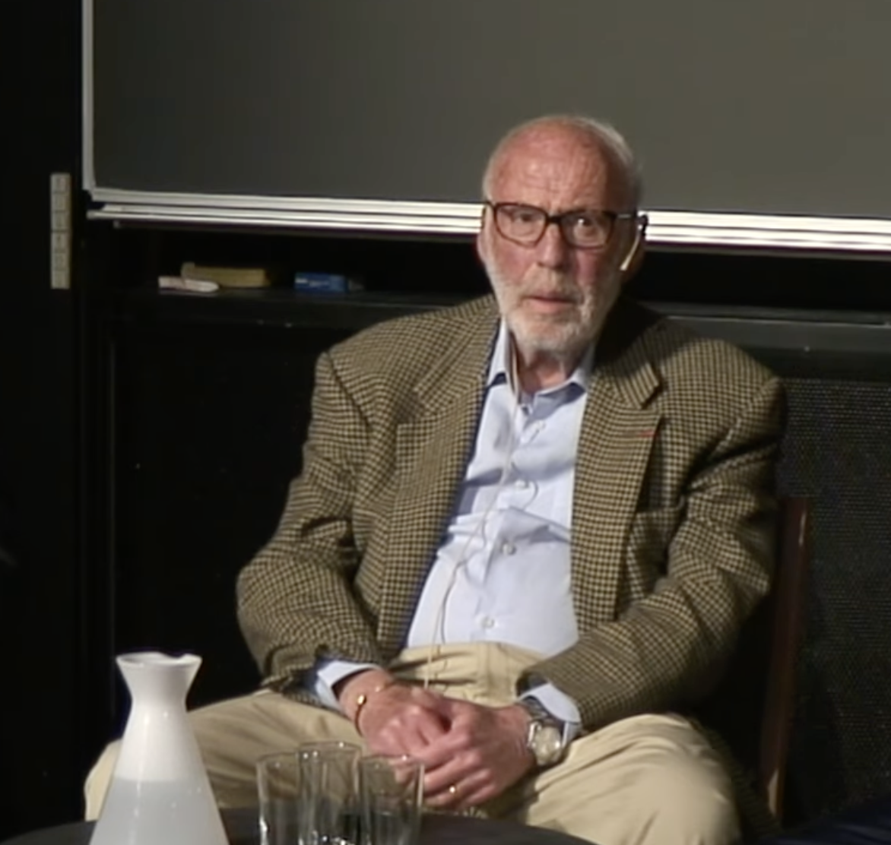

A summary of Jim Simons' talk "My Life in Mathematics, Finance, and Philanthropy" at the National Museum of Mathematics (MoMath). The ideas and quotes are his.

## Mathematics and code breaking

The talk has six parts. In the first one Simons talks about how he got fascinated by mathematics early on and about his time at MIT and Berkeley.

Then he tells about a time at the Institute for Defense Analyses (IDA), where he worked as a code breaker for the government during the Vietnam War. He worked on cracking Russian codes, and he says that he was supposed to do government work but spent a lot of time on his own geometry. In his words, "They said you can spend half your time doing your own math and half the time doing their stuff. I did a little bit of their stuff and a whole lot of my math, and they didn't seem to mind." [00:02:15]

He also talks about his work on "Minimal Varieties", where he solved a piece of the Plateau Problem, which is about the geometry of soap films in higher dimensions.

The takeaway from this part is that going deep into hard, abstract problems builds the mental stamina you need for high stakes problem solving in other fields too.

## Stony Brook and Chern-Simons

The second part is about his time as Chairman of the Math Department at Stony Brook and his work with the legendary mathematician Shiing-Shen Chern.

Together they came up with the Chern-Simons invariants. At first they were pure geometry, but later they became essential to theoretical physics. "I didn't know any physics... and Chern didn't know any physics. We were doing geometry. Ten years later, it turned out to be the exact thing needed for string theory." [00:08:12]

The takeaway here is that basic research often gives its biggest value in places the people who did it never saw coming.

## The mid-life switch

In the third part he describes the "mid-life" switch, when he decided to leave the university and start a trading business, first called Monemetrics. He wanted to see if he could apply mathematical models to how messy the financial markets are. "I started trading. I didn't know much about it, but I thought maybe there's some structure here... and there was." [00:10:05]

The takeaway is to not be afraid to change careers when you believe your skills can solve a problem in a totally different field.

## Renaissance and the Medallion Fund

The fourth part goes into the culture of Renaissance Technologies and the Medallion Fund, which became the most successful hedge fund in history.

Simons famously didn't hire the usual Wall Street "experts". "We didn't hire from Wall Street. We hired mathematicians, physicists, and computer scientists. You can teach a physicist finance, but it's very hard to teach a finance person physics." [00:14:02]

The firm was built on "tick-by-tick" data and on total transparency inside the company. "Everyone saw everyone else's code. There were no silos. If you found a way to improve the model, everyone benefited." [00:29:46]

The takeaway is that success in complex systems comes from people working together and being strict about data, and not from "gut feelings".

## Five rules

In the fifth part Simons shares the five rules that guided his work and his life.

Rule number one is to be guided by beauty. "Just as a mathematical theorem can be beautiful, a well-run business or a clever experiment can be beautiful." [00:19:32]

Rule number two is to surround yourself with the best. "If you're the smartest person in the room, you're in the wrong room. Hire people who are better than you." [00:20:06]

Rule number three is to not follow the pack and be original. "If everyone is trying to solve the same problem, go solve a different one. It's much easier to be the first if you aren't following the crowd." [00:20:26]

Rule number four is to not give up easily. "Sticking with it is half the battle. Some of our best algorithms took years to perfect." [00:21:01]

And rule number five is to hope for good luck. "You need to be prepared, but you also need to be lucky. I've been very lucky." [00:21:13]

## The Simons Foundation

In the last part he talks about the Simons Foundation and how he pushes basic science research forward.

He founded the Flatiron Institute, a center for computational science that gives scientists the tools to analyze huge datasets in biology, astronomy and physics. "We wanted to create a place where scientists could just do science, supported by the best programmers and the best computers in the world." [00:34:05]

The takeaway is that real legacy means using your success to help the next generation of thinkers and explorers.

You can watch the full talk here: https://www.youtube.com/watch?v=QUTaQvnwLzM

