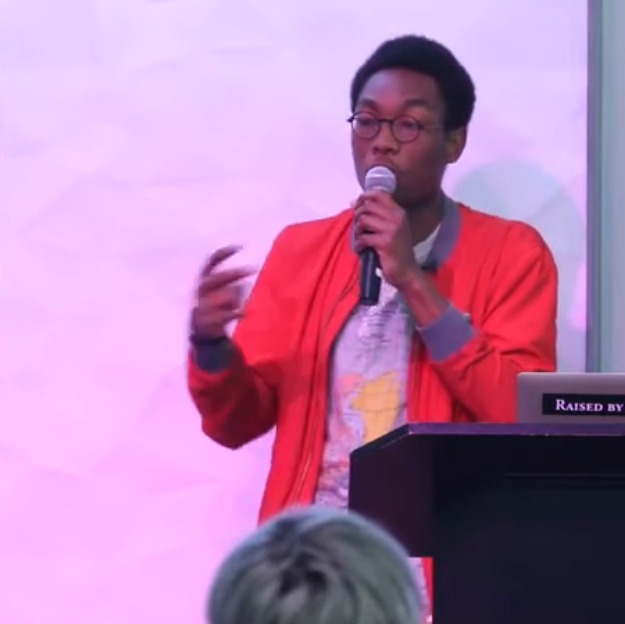

A summary of a talk by Laolu "Roasbeef" Osuntokun. The times in brackets point to the spot in the talk.

[00:00:26] The talk goes past the high-level idea of Lightning and into how it really works. Laolu explains the commitment protocols, how the Lightning Network Daemon (LND) is built, and where routing could go next with something called Flare.

[00:01:27] Everything starts with a payment channel that works in both directions. A channel is basically a 2-of-2 multisig escrow on the Bitcoin blockchain. Two people put money into this funding transaction. Once it's confirmed, they can do as many transactions off-chain as they want. They just update how the money is split between them, and the main blockchain never sees it.

[00:01:51] For this to be safe, Lightning needs a fix for malleability, like SegWit. Without it, someone could change the ID of the funding transaction before it's confirmed. Then the commitment transactions, the ones that let you get your money back, are no longer valid, and the money can be stuck forever.

[00:03:01] Off-chain transactions are just promises, so there has to be a way to stop someone from publishing an old state where they had more money. Lightning does this with revocation. Every time there is a new state, the old one gets revoked by sharing a secret key. If one side tries to cheat and publishes an old state, the honest side can use that secret and take all the money in the channel right away, as a penalty.

[00:04:42] To pay someone you don't have a direct channel with, the network uses Hash Time-Locked Contracts (HTLCs). The payment gets locked across a chain of people. The recipient can only claim the money by showing a secret, the preimage. Once they show it to the person before them, that person can show it to the one before them, and so on, until the payment of the original sender is settled.

[00:13:33] Then Laolu goes into the Lightning Commitment Protocol (LCP). That is the language nodes use to talk to each other, peer to peer. It adds HTLCs, removes them and signs new states. And it's asynchronous, so you don't have to wait for one payment to finish before you start the next one.

[00:14:14] To get real speed, LND does pipelining. A lot of payment updates can go into a channel at the same time. Nodes can batch these updates under one signature, which saves processing power and lets a single channel handle more transactions per second.

[00:16:02] It works a bit like TCP on the internet. Lightning has a window that limits how many state updates a peer can have in flight without an answer. So one node can't flood another one with more updates than it can handle. This is the revocation window.

[00:21:53] LND is written in Go. Laolu picked Go because it's very good at concurrency, with goroutines and channels, and that fits well when you have thousands of payment requests at the same time. It also gives you a clean way to do complex networking.

[00:25:24] Inside, the daemon is split into a few parts. The RPC Server takes requests from users over gRPC or REST. The Wallet Controller handles the actual Bitcoin keys and the on-chain transactions. The Chain Notifier watches the blockchain for things like a channel closing. The HTLC Switch is like a router inside the node and moves payments from one channel to another. And the Breach Arbiter is the security part. It watches for anyone trying to cheat and sends out the penalty transactions on its own.

[00:28:16] Then there is a live demo between a node in New York and a node in San Francisco. Laolu shows that it can push thousands of micropayments through almost instantly. At [00:35:45] he says the current implementation hits 1,000 transactions per second (TPS) on a single channel. That is a lot faster than the Bitcoin blockchain underneath.

[00:40:04] To find a path to a recipient, nodes need to know the topology of the network. Nodes send out announcement signatures to prove they have a real channel on the blockchain. That stops spam nodes from filling the network with fake routing info.

[00:42:31] When the network gets big, no phone can know the whole map anymore. So Laolu explains Flare, a routing algorithm that mixes local knowledge, who is near me, with beacons, which are known nodes further away. That way a node can find a path across the whole global network without storing gigabytes of map data.

