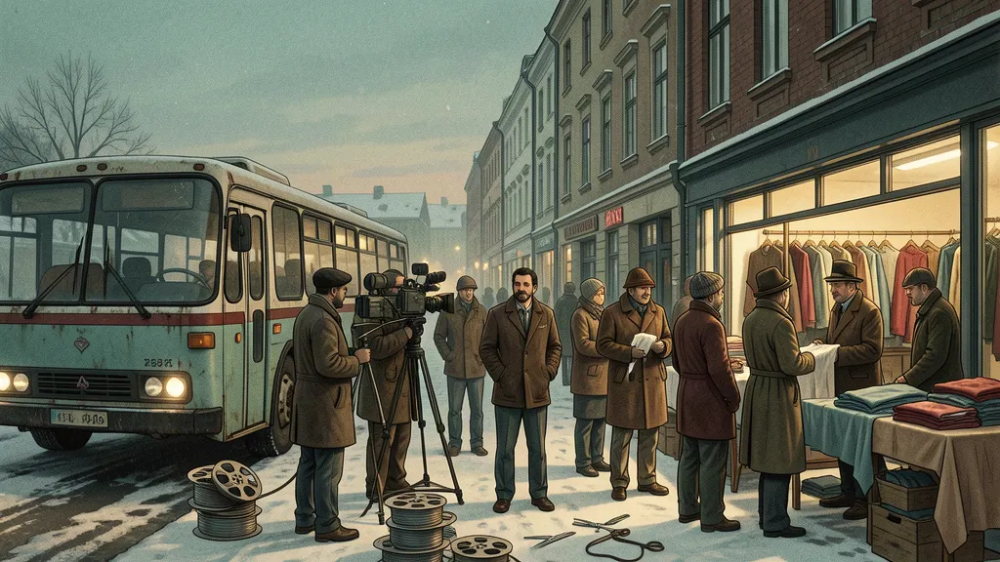

## Hasan Gül remembers Otobüs, Gül Hasan, and the Turkish migrant film circle that turned a tailoring workshop into a production office

*Original editorial illustration created for this article. It evokes the world described in Hasan Gül's interview and does not depict a specific photographed event.*

My father, Nurettin “Nuri” Sezer, never fitted neatly into one role. He acted, produced, wrote screenplays, worked backstage, and often became the person who made things happen. He was born in Kandıra in 1938, worked in theatre in Istanbul, and later became part of the Turkish cultural scene in Berlin.[3][4]

The chapter I wanted to understand better happened in Sweden. There, Turkish migrant workers with no formal film training became actors, financiers, drivers, location scouts, and crew. Together with filmmakers including Tunç Okan and Tuncel Kurtiz, they helped make films that still provoke arguments half a century later.

Hasan Gül was one of those workers. He acted in *Otobüs* and later financed and starred in *Gül Hasan*. He was also Nuri’s friend and business partner. His long Turkish-language interview is funny, wounded, contradictory, and unusually direct.[1] It is not a neutral account. Oral history rarely is.

I have translated and edited Hasan’s words into English, corrected names distorted by the raw transcript, shortened repetition, and organised the chronology. Claims about disputed events remain clearly attributed to Hasan. Where other participants remembered events differently, I say so.

## “We will make cinema with the money we earn”

Hasan arrived in Sweden from Kulu, Konya, on 12 June 1966. He was sixteen. He entered with a visa, but without a work permit, and shared a room with three other men. They bought hot water to make tea. Food was difficult to identify when nobody could read Swedish. Hasan remembers one friend proudly serving canned meat before they realised it was pet food.

His first job was clearing dishes in a Stockholm restaurant. He did not intend to stay there.

*“I had already worked four years as a tailor. I said, ‘I did not come here to wash dishes.’”*

He found work in tailoring, learned Swedish among Swedish colleagues, and attended a cutting academy. The tuition cost money, so he studied during the day and washed dishes at night. He later opened his own garment business. At its height, he says, the workshop employed around forty people in a 650-square-metre space with its own cafeteria and sauna.[1][2]

Then Nuri entered the story.

Nuri had known Tuncel Kurtiz since a 1969 theatre tour through Anatolia. He later moved to Sweden as a worker and became friends with Hasan. Önder Özdemir’s history of *Gül Hasan* describes the chain clearly: Tuncel knew Nuri; Nuri knew Hasan; and Nuri connected the filmmakers to the workers and resources they needed in Stockholm.[2][6]

Hasan remembers the sentence that convinced him to make Nuri a partner in his clothing workshop:

*“We will make cinema with the money we earn.”*

That was the plan, at least. The workshop would earn the money, and the money would pay for films.

## How Hasan found himself in Otobüs

Tunç Okan’s *Otobüs* follows a group of undocumented Turkish workers abandoned in Stockholm. The city around them is cold, alien, wealthy, and difficult to read. For Hasan, the film began without a screenplay and with a haircut in a toilet.

He says Nuri recommended him after an earlier group around the production had dispersed. Okan hesitated. Hasan looked too self-assured to play one of the film’s frightened, exhausted workers.

*“Tunç said, ‘We are filming oppressed people. Look at Hasan. What is oppressed about him?’ But he had no other choice. He said, ‘Cut his hair.’ We went and cut it in the toilet. That is how *Otobüs* began.”*

Hasan says he never received a script. Okan told the non-professional actors where to stand, when to look, and how slowly to move. Hasan had never acted in a film before. Most of the workers had not.

That lack of experience did not make the work unserious. Hasan later called *Otobüs* one of the best Turkish films, praising Okan’s direction and Güneş Karabuda’s cinematography. He remembered seeing the completed film in Ankara after returning to Turkey in the late 1970s. A cinema employee warned him not to announce that he was one of the actors because the audience was sharply divided.

The film’s production history is contested. The raw footage had technical problems and some scenes had to be reshot. Political rumours frightened off participants. Disputes followed over money, ownership, and possession of film reels.[1][2]

Hasan insists that he was not part of the group that withheld the reels. He also rejects the later allegation that Tunç Okan had tricked the workers:

*“Tunç Okan never deceived us. He took us, fed the people who had no work, and promised that they would be paid. When he brought the money, he paid everyone.”*

Other participants remembered the conflict differently. Tuncel Kurtiz described a serious break with Okan. Okan later described *Gül Hasan* as a revenge film aimed at him.[2][6] Hasan’s account should not be turned into a final verdict. Its value is that it preserves one participant’s position inside a quarrel that shaped the films themselves.

## Nuri at the centre of the circle

Nuri’s role went beyond his film credits. He connected people who otherwise might never have met.

He had theatre experience from Turkey. He knew Tuncel Kurtiz. In Sweden he knew Hasan and the worker community around the garment workshop. Through those relationships, filmmakers gained access to performers, locations, transport, labour, and money. Workers gained access to a medium that had usually represented them from outside.

Hasan’s memories of Nuri are not sentimental. He describes trust, friendship, business, debt, and disappointment. He says he let Nuri join the workshop because he trusted him and because Nuri was older. He did not interrogate every request. The partnership eventually collapsed, and Hasan remained angry about what happened to the business.

*“If I trusted someone, and I trusted Nurettin, I did not question him. He was older than me.”*

Hasan also describes Nurettin as an older-brother figure. He says he tried to intervene when he felt Tuncel treated Nurettin disrespectfully.[1] That makes the later anger in his account easier to understand. For Hasan, this was not only a failed business relationship. The friendship had taken on the weight of family.*“If I trusted someone, and I trusted Nurettin, I did not question him. He was older than me.”*

Hasan also describes Nurettin as an older-brother figure. He says he tried to intervene when he felt Tuncel treated Nurettin disrespectfully.[1] That makes the later anger in his account easier to understand. For Hasan, this was not only a failed business relationship. The friendship had taken on the weight of family.

A polished tribute would hide the actual texture of their relationship. They were migrants trying to run a factory and make films at the same time. Friendship, money, politics, and cinema were never separate.

## Before Stockholm: Kandıra, a sister, and a theatre on the road

Nuri’s habit of connecting people did not begin in Sweden. Tuncel Kurtiz remembered an earlier moment when six unemployed friends formed their own theatre company and tried to tour Anatolia. Their first performance of *Yağmurcu* in İzmit drew twelve people to a cinema built for one thousand. The company was almost finished before it had started. Nuri suggested trying his hometown, Kandıra. They stayed as guests in local homes, performed in smoke-filled rooms, rented a jeep, and kept the tour going for another five or six months.[6]

His sister Mahmure was part of this mobile artistic life. In a published family interview, she said that Nuri left his electrical-engineering studies in Istanbul for theatre and cinema. Before she married, she travelled with him through much of Europe and stayed in Sweden for a long time.[7]

Hasan’s recording adds a more specific family detail. Four minutes and thirty-nine seconds into the interview, he says:

*“Two of Nurettin’s sisters came here. They worked for me.”*

He does not name the two sisters. Mahmure’s separate account confirms that she spent a long time in Sweden, but the surviving evidence does not establish which two sisters Hasan meant or exactly when they worked in his workshop.[1][7]

*“Because my brother Nurettin entered theatre and cinema before completing his electrical-engineering studies in Istanbul, I had the chance to travel with him through almost every country in Europe, and I stayed in Sweden for a long time.”*

Mahmure remembered meeting Seden Kızıltunç, Haldun Dormen, Yıldız Kenter, and Tuncel Kurtiz through that period. She later became the first woman in Kandıra to open a formally registered tailoring business. She taught herself by taking apart trousers and shirts, making patterns from them, and sewing new pieces to order.[7]

That detail changes how I see the Stockholm story. Tailoring ran through both sides of Nuri’s life. His sister built a livelihood from it in Kandıra. Hasan built a factory from it in Sweden. Between those two workshops stood Nuri, convinced that money earned through ordinary work could be turned into cinema.

## Before Stockholm: Kandıra, a sister, and a theatre on the road

Nuri’s habit of connecting people did not begin in Sweden. Tuncel Kurtiz remembered an earlier moment when six unemployed friends formed their own theatre company and tried to tour Anatolia. Their first performance of *Yağmurcu* in İzmit drew twelve people to a cinema built for one thousand. The company was almost finished before it had started. Nuri suggested trying his hometown, Kandıra. They stayed as guests in local homes, performed in smoke-filled rooms, rented a jeep, and kept the tour going for another five or six months.[6]

His sister Mahmure was part of this mobile artistic life. In a published family interview, she said that Nuri left his electrical-engineering studies in Istanbul for theatre and cinema. Before she married, she travelled with him through much of Europe and stayed in Sweden for a long time.[7]

Hasan’s recording adds a more specific family detail. Four minutes and thirty-nine seconds into the interview, he says:

*“Two of Nurettin’s sisters came here. They worked for me.”*

He does not name the two sisters. Mahmure’s separate account confirms that she spent a long time in Sweden, but the surviving evidence does not establish which two sisters Hasan meant or exactly when they worked in his workshop.[1][7]

*“Because my brother Nurettin entered theatre and cinema before completing his electrical-engineering studies in Istanbul, I had the chance to travel with him through almost every country in Europe, and I stayed in Sweden for a long time.”*

Mahmure remembered meeting Seden Kızıltunç, Haldun Dormen, Yıldız Kenter, and Tuncel Kurtiz through that period. She later became the first woman in Kandıra to open a formally registered tailoring business. She taught herself by taking apart trousers and shirts, making patterns from them, and sewing new pieces to order.[7]

That detail changes how I see the Stockholm story. Tailoring ran through both sides of Nuri’s life. His sister built a livelihood from it in Kandıra. Hasan built a factory from it in Sweden. Between those two workshops stood Nuri, convinced that money earned through ordinary work could be turned into cinema.Gül Hasan, the film made after the argument

After the conflict surrounding *Otobüs*, Tuncel Kurtiz directed *Gül Hasan* in Sweden. The film was shot in 1978 and released in 1979. Nuri worked as producer, co-screenwriter, and actor. Hasan financed part of the production and played the title role. Public film records credit Nuri’s work on the film, and *Gül Hasan* later received a screenplay award at the Antalya Film Festival.[2][3]

The plot follows a Turkish film director, played by Kurtiz, who arrives in Sweden and exploits migrant workers while claiming to make a film about them. The director is called Bay Okan, a clear reference to Tunç Okan. That choice made the private conflict around *Otobüs* part of the new film’s public story.

Hasan says he again worked without seeing a screenplay. He provided money, cars, locations, introductions, and practical support. Yet when he finally saw the completed film, he disliked it.

*“They did not even give me a script for *Gül Hasan*. Tuncel did not tell us what to do. He carried the film through dialogue.”*

He also rejected the film’s implication that Okan had cheated the workers. In Hasan’s version, the film accused Okan of doing what Hasan believed other people had done to him.

Here Hasan does not protect Nuri or Tuncel because they were friends. He says what he thinks they got wrong. At the same time, his whole entry into cinema was made possible by that circle.

Hasan never resolves that contradiction, and I do not want to resolve it for him.

## The workers were not helpless

Some Turkish critics argued that *Otobüs* humiliated migrant workers by showing them as frightened, confused, and unable to understand the modern city around them. Hasan rejects that reading.

He tells stories that sound almost too extreme to be true because migration itself could be extreme. A cousin once spent an entire day unable to find his way out of Stockholm Central Station. Some new arrivals kept the same tie knotted for months because they feared they would never manage to tie it again. Men from villages saw major cities for the first time only while travelling abroad for work.

Hasan does not tell these stories to ridicule them.

*“They were the most honest people in the world. They worked and struggled. They sacrificed their lives for their wives and children. I hope their children went further.”*

For him, *Otobüs* did not invent the fear or confusion. If anything, he says, worse stories remained untold. The film captured the first stage of a journey. It did not show everything those workers later built.

Hasan himself is proof. He arrived at sixteen, washed dishes, learned languages, trained as a tailor, and built a factory. He also lost much of it.

## The film that never returned

Hasan later tried to make a film called *Dönemeyenler*, “Those Who Could Not Return.” It was conceived as a continuation of the migrant story: six workers in Sweden who plan to return to Turkey but remain abroad because life intervenes.

He developed the story with writer Selim İleri and approached established Turkish actors. The project stalled amid disputes over direction, rights, money, and footage. Then Hasan travelled to Turkey. After the 1980 military coup and problems surrounding his military service, he could not return to Sweden for years. His workshop closed. Machines disappeared. The film was never completed.[1][2]

The title became autobiographical. Hasan wanted to make a film about people who could not return, and then he became one of them.

When he eventually returned to Sweden, the factory and the scale of his earlier business were gone. He tried other ventures. Some worked, others failed. He speaks about those years without asking to be turned into either a victim or a hero.

*“When I look back and ask where I made mistakes, almost everything I did was a mistake. The best thing I did was my profession. My work gave me respect, cleanliness, and an income. Money came and went.”*

## What Hasan’s account reveals about Nuri

A standard biography gives the outline. Nurettin Sezer was born in Kandıra on 10 October 1938 and died in Berlin on 14 April 2014. He worked in theatre, film, production, and screenwriting. His credits include *Otobüs*, *Gül Hasan*, *Bereketli Topraklar Üzerinde*, *Kardeşim Benim*, *Polizei*, and *Evet, ich will!*.[3][5]

The credits do not show the work Hasan describes.

Nuri made introductions. He stayed in contact across borders. He helped bring Turkish theatre people into the world of workers in Sweden and brought workers into cinema. He moved between art and ordinary labour without treating them as separate lives. The money from a garment workshop could finance a film. A worker could become an actor. A friendship could become a production company and then a dispute.

He was also my father.

I do not need Hasan’s account to be flattering. I need it to be honest about how these people remembered one another. Nuri appears here as a connector, an organiser, a dreamer, a difficult business partner, and a man who believed cinema could be made from whatever people had at hand.

Hasan remembers Nuri saying, “We will make cinema with the money we earn.” They did, and the result was messy, expensive, politically charged, and personal.

Hasan ends his story with a sentence I cannot forget:

*“The public noticed me, but I did not understand what the public wanted from me.”*

Between that line and Nuri’s promise sits their version of migrant cinema: people who earned money with their hands, placed it in film, argued over what the film meant, and left behind films that still circulate while the arguments remain unresolved.

## Watch the complete interview

The full Turkish-language interview with Hasan Gül runs for 1 hour and 49 minutes and can be watched on Vimeo.[1] The automatic transcript contains repeated fragments and misheard names, so it is not reproduced here as if it were a reliable verbatim record. The quotations above were translated and lightly edited for clarity without changing Hasan’s position.Watch the complete interview

The full Turkish-language interview with Hasan Gül runs for 1 hour and 49 minutes and can be watched on Vimeo.[1] The automatic transcript contains repeated fragments and misheard names, so it is not reproduced here as if it were a reliable verbatim record. The quotations above were translated and lightly edited for clarity without changing Hasan’s position.

### Editorial note

This article is an English adaptation of a Turkish oral-history interview with Hasan Gül, recorded in Stockholm by Tayfun Luxembourgeus. I translated and edited the transcript for clarity and structure. The original speech contains repetitions, incomplete sentences, and names distorted by automatic transcription. Disputed claims are presented as Hasan’s recollections, not as independently established facts. Additional context comes from Önder Özdemir’s Sinematek research and published film records.

**Cover image:** Original editorial illustration created for this article. It evokes the world described in the interview and does not depict a specific photographed event.

## Sources

[1] [Hasan Gül video interview, recorded by Tayfun Luxembourgeus](https://vimeo.com/358666132/12ea9dd799)

[2] [Önder Özdemir: Tuncel Kurtiz’in Gül Hasan filmi ve Hasan Gül’ün öyküsü](https://sinematek.tv/tuncel-kurtizin-gul-hasan-filmi-ve-hasan-gulun-oykusu)

[3] [Nuri Sezer biography and filmography](https://de.wikipedia.org/wiki/Nuri_Sezer)

[4] [Ballhaus Naunynstraße: Nuri Sezer](https://ballhausnaunynstrasse.de/person/nuri_sezer)

[5] [IMDb: Nuri Sezer](https://www.imdb.com/name/nm0786917)

[6] [Tuncel Kurtiz interview, 2010](https://www.sacitaslan.com/tuncel-kurtizden-samimi-aciklamalar-haberi-47339)

[7] [Mahmure Sezer interview: Nurettin, European travel, and Sweden](https://kandiraninsesi.com/2021/05/07/sarkilara-konu-olan-kandirali-mahmure/)[7] [Mahmure Sezer interview: Nurettin, European travel, and Sweden](https://kandiraninsesi.com/2021/05/07/sarkilara-konu-olan-kandirali-mahmure)

### Editorial note

This article is an English adaptation of a Turkish oral-history interview with Hasan Gül, recorded in Stockholm by Tayfun Luxembourgeus. I translated and edited the transcript for clarity and structure. The original speech contains repetitions, incomplete sentences, and names distorted by automatic transcription. Disputed claims are presented as Hasan’s recollections, not as independently established facts. Additional context comes from Önder Özdemir’s Sinematek research and published film records.

**Cover image:** Original editorial illustration created for this article. It evokes the world described in the interview and does not depict a specific photographed event.

## Sources

[1] [Hasan Gül video interview, recorded by Tayfun Luxembourgeus](https://vimeo.com/358666132/12ea9dd799)

[2] [Önder Özdemir: Tuncel Kurtiz’in Gül Hasan filmi ve Hasan Gül’ün öyküsü](https://sinematek.tv/tuncel-kurtizin-gul-hasan-filmi-ve-hasan-gulun-oykusu)

[3] [Nuri Sezer biography and filmography](https://de.wikipedia.org/wiki/Nuri_Sezer)

[4] [Ballhaus Naunynstraße: Nuri Sezer](https://ballhausnaunynstrasse.de/person/nuri_sezer)

[5] [IMDb: Nuri Sezer](https://www.imdb.com/name/nm0786917)

[6] [Tuncel Kurtiz interview, 2010](https://www.sacitaslan.com/tuncel-kurtizden-samimi-aciklamalar-haberi-47339)
