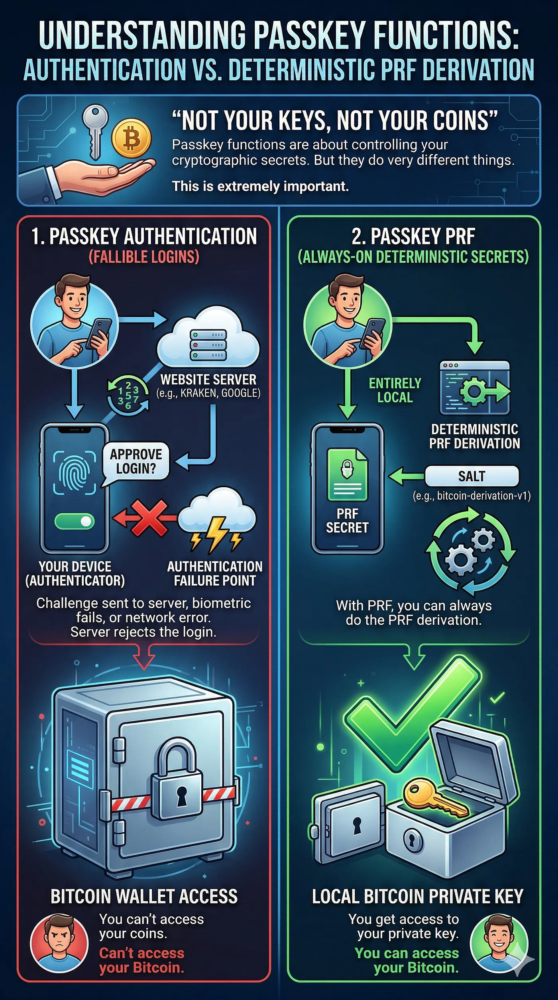

Microsoft just killed the signing certificate of the VeraCrypt developer. No warning, no email, no human to talk to. One day he logs in and his account is terminated. The message says he can't appeal.

This guy maintained VeraCrypt for over a decade. Millions of users. Doesn't matter. The automated system at Microsoft decided he's done, and that's it.

The WireGuard developer? Same thing, right now. Account suspended, a 60 day appeal, no explanation.

And this is exactly what is going to happen to your "self-custodial" passkey wallet. Not if, but when.

## Passkey auth is not your key

Passkey auth is not your key. Let's get this straight, because the whole industry gets it wrong.

When you log in with a passkey on Privy, Dynamic, Turnkey or whatever, you are authenticating. That's it. The passkey proves that you are you.

It does not give you your private key. It gives you access to infrastructure that holds your private key, or parts of it.

Privy splits your key into shards with Shamir's Secret Sharing and spreads them over their servers. Your passkey is the door key to the vault of Privy. But it's still their vault.

Privy goes down? Shards gone. Privy gets bought by Stripe, which already happened, and the new management shuts the product down? Shards gone. The auth server of Privy has a bad day? You can't sign.

Yes, they have an export button. Hidden in the settings. How many of the 75 million accounts at Privy have really exported their private key? I'd bet less than 1%.

And the other 99%? They think they're self-custodial. They're not. They are one company decision away from losing everything.

## PRF is not auth

PRF is not auth. Nobody talks about this part, and everybody needs to understand it.

The WebAuthn PRF extension is a completely different thing than passkey authentication. It's not about proving who you are. It's about getting key material straight from your hardware.

This is what happens with PRF. Your authenticator, so the Secure Enclave, a TPM, a YubiKey or whatever, holds a secret that is bound to your credential. That secret never leaves the hardware.

Never. When you authenticate with PRF turned on, the authenticator takes a salt that you give it and computes HMAC(credential_secret, salt). It gives you back the same 32 byte output every time.

Same credential and same salt means same output. Always, forever. Just math, no server.

That 32 byte output is your input key material. Run it through HKDF and you get your Bitcoin private key. Always the same one, on your device, offline if you want.

This is what Nuri does. Your passkey doesn't unlock a vault. Your passkey is the vault. The key material comes straight from hardware you hold in your hand. No shard on any server, no company in the middle, nothing you depend on.

## What if nuri.com disappears

"But what if nuri.com disappears?" Good question, and the answer is that it doesn't matter.

WebAuthn credentials are bound to a Relying Party ID, which is basically a domain name. Your passkey for Nuri is bound to nuri.com. The authenticator checks the SHA-256 hash of that name when it picks the credential.

But here is what it does not check. DNS, the certificate authority, or if the domain is even live on the internet.

So if nuri.com disappears tomorrow, you do this. Edit /etc/hosts and point nuri.com to 127.0.0.1. Run a local HTTPS server with a self-signed cert for nuri.com.

Open [https://nuri.com](https://nuri.com) in your browser. Trigger the passkey and ask for PRF with the documented salt. You get the same 32 bytes you always get, and you derive your private key.

No internet, no server, no permission from anyone.

Or you skip the browser and use libfido2 to talk to your authenticator directly over CTAP2. Set rpId = "nuri.com", give it your credential ID and the salt.

The authenticator doesn't care where the request comes from. It just runs the HMAC and gives you the output.

This works because PRF runs on the hardware. The domain is only used to pick which credential to use, not for the math itself.

The authenticator doesn't know or care if nuri.com is a Fortune 500 company or a localhost page you started in 30 seconds.

With Privy this is just impossible. If their servers are gone, the shards are gone. There is no local recovery, no offline way to get your key back, nothing.

## Auth vs PRF

So here is the real difference between auth and PRF.

Passkey auth, like Privy, Turnkey and Dynamic, works like this. The passkey proves who you are to a server, and the server gives you access to key material it controls.

Server down means no access. Domain dead means no access. You have to export your key while the service is still alive, or you lose it.

Passkey PRF, like Nuri, works like this. The passkey gets the key material straight from your hardware, and no server holds any part of your key. Server down doesn't matter, you derive it locally.

Domain dead, you start a localhost page and derive the same key. There is nothing to export, because you can always get the key from your passkey.

One is authentication, the other is getting a key out of your hardware with cryptography. Both use passkeys. They are not the same thing at all.

## What about smart accounts

And what about smart accounts? ZeroDev and other ERC-4337 providers are better than Privy. Your passkey signs directly and there is no key sharding. But you still need their bundler to send your transactions, and your passkey is still bound to their domain.

You can solve the domain part the same way, the localhost trick works. But you also need a bundler, and you can't host the ZeroDev bundler yourself. So you depend on finding another one. You can recover, but it's not sovereign.

With Nuri and PRF you depend on no infrastructure. Zero. You derive your key, you have a normal Bitcoin private key, and you can use it with any wallet software there is.

Electrum, Sparrow, Core, whatever. Because what comes out of PRF and HKDF is just a private key. It doesn't care which wallet reads it.

## The VeraCrypt lesson

That's the VeraCrypt lesson. Microsoft didn't warn the developer, didn't explain and gave him no way to fight it. An automated system made a decision, and a decade of trust was gone with one login.

Every central auth provider, every company that sits between your passkey and your private key, is one automated decision away from doing the same to you.

The only thing that protects you is how the system is built. Not promises, not export buttons, not "we would never do that". How it's built.

If your key exists because a server computed it, stored it or holds a piece of it, you are not self-custodial. You are renting access to your own money, and the landlord can change the locks whenever he wants.

PRF doesn't ask for permission. PRF doesn't phone home. PRF is math that runs on hardware you hold in your hand.

Not your keys, not your coins. Still true, more true than ever.

Nuri is a self-custodial Bitcoin and stablecoin wallet. It uses passkeys with the WebAuthn PRF extension to always derive the same key. No server holds your keys and no company can lock you out. nuri.com

