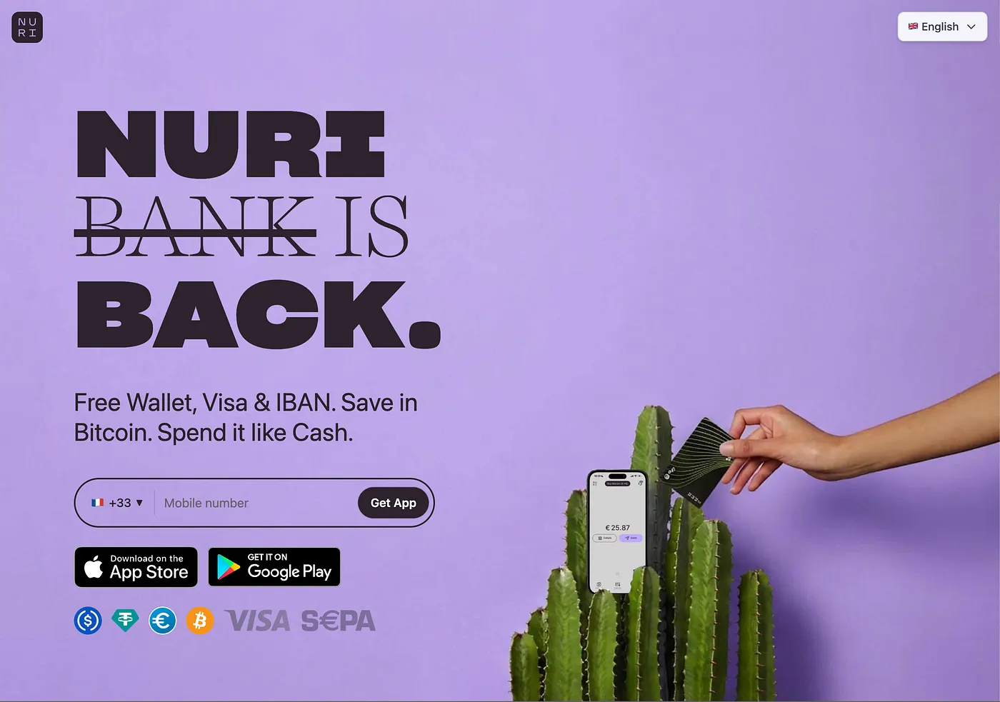

*The Bitcoin Neobank returns — ****without the bank.***

In 2015, a small team in Berlin had a simple idea: make Bitcoin spendable. They called it Bitwala. Over the next six years, the company grew to 500,000 users across 32 European countries, raised €42 million in venture capital, and became one of Germany’s most recognizable crypto brands. In 2021, Bitwala rebranded to Nuri — short for “new reality” — and pushed into mainstream banking territory with savings plans, investment pots, and a partnership with Solarisbank.

Then everything collapsed.

## What went wrong

The crypto winter of 2022 hit Nuri at exactly the wrong time. The collapse of Terra/Luna, Three Arrows Capital, and — most critically — Celsius Network created a chain reaction that starved the company of liquidity. Celsius was a key partner powering Nuri’s interest-earning products. When Celsius froze withdrawals, Nuri’s business model fractured overnight. Adding pressure trying to get a banking licence in Germany.

On August 9, 2022, Nuri filed for insolvency in Berlin. Three months of restructuring attempts followed. No acquirer was found. No new investors stepped in. On October 18, 2022, CEO Kristina Walcker-Mayer asked all customers to withdraw their funds by December 18. Nuri shut down.

The 500,000 users had to withdraw their funds from wallets and bank account. The original founders relaunched under the old Bitwala name with a stripped-down Bitcoin focused app. The Nuri brand and [nuri.com](http://nuri.com) domain were sold to new owners.

That’s where this story picks up.

## A new Nuri

We, a group of Bitcoin builders from Berlin and early users of Bitwala, acquired the Nuri brand because we believe the original vision was right — but a few things went wrong. The idea of combining Bitcoin with everyday spending power is more relevant today than it was in 2021. What killed the old Nuri wasn’t the product idea. It was counterparty risk. Custodial infrastructure. Dependence on a partner that went bankrupt and took the business down with it.

The new Nuri is built from scratch. Entirely. No legacy code, no legacy architecture, no legacy risk. And one fundamental difference: there is no bank.

## How it works

When you open Nuri, you create a passkey. That passkey — through a cryptographic process called PRF — derives your private key directly on your device. There is no account on a server. There is no database that stores your credentials. There is no company that holds your money. The passkey *is* the wallet.

From that moment, you can send and receive Bitcoin, Euro, and Dollar stablecoins. No ID verification required. No forms. No waiting. Touch your fingerprint, and you have a wallet.

If you choose to verify your identity, you unlock additional features: a free Visa debit card, an IBAN for bank transfers, and the ability to move money between the crypto world and the traditional banking system. But the wallet works without any of that. Permissionless entry, full-featured destination.

## What we learned from the old Nuri

The old Nuri failed because it trusted a third party with user funds. We don’t. Your Bitcoin sits in a self-custodial wallet secured by MuSig2 Taproot multisig. Your stablecoins live in a Safe Smart Account on Gnosis Chain. Your Visa card is powered by Gnosis Pay. Your IBAN and bank transfers run through Monerium’s e-money infrastructure.

Every partner provides a service. None of them hold your money. If any single partner disappears tomorrow, your funds remain yours, onchain, accessible with your passkey.

This is the difference between a neobank and a neobank without the bank.

## Save in Bitcoin. Spend it like Cash.

Nuri is not a trading app. It’s not an exchange. It’s not a place to speculate on altcoins.

Nuri is a wallet that treats Bitcoin as money — not as an asset to flip. You save in Bitcoin because it’s the hardest money ever created. You spend through your Visa card because the world still runs on Euro and Dollar. The conversion happens in the background. You don’t think about it.

We support USDT, USDC, and EURe and more stablecoin local currencies. But the native global cash currency of the internet are not stablecoins, its Bitcoin. Stablecoins are the bridge. The Visa card is the interface. Bitcoin is the foundation.

## Magic Internet Money

Magic Internet Money — the oldest Bitcoin meme / reddit ad, and still the most honest description of what this is. Money that lives on the internet. Money that doesn’t need a bank, a government, or anyone’s permission to work. Money you can send to anyone, anywhere, instantly.

The old financial system asks: Who are you? Where do you live? How much do you earn? May we see your documents?

Nuri asks: Would you like to create a passkey?

That’s the product. That’s the vision. Money for everyone.

## Available now

Nuri is live on iOS and Android in 32 European countries (and expanding to another 40 within the next 3 month). Download the app, create a passkey, and start sending and receiving Bitcoin, Euro, and Dollar — in seconds.

Free wallet. Free Visa card. Free IBAN. No minimum balance. No monthly fees.

Your money, freed.

*Get the app at *[*nuri.com*](https://nuri.com)
