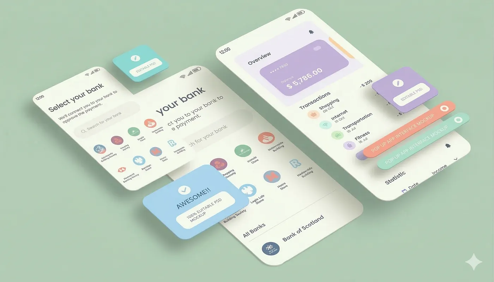

## The IBAN is a Bridge, Not a Feature

[Nuri.com](https://nuri.com) is a self-custodial Bitcoin and Stablecoin Emoney Cash Wallet.

Not a bank. Not a neobank. A wallet.

Every verified user gets an IBAN. That IBAN is not an account — it is a bridge between the legacy banking system and the blockchain. When someone sends a SEPA Instant transaction to your IBAN, e-money gets minted as stablecoins directly into your wallet. When you want to send money out, stablecoins get burned and a SEPA Instant transaction leaves through the IBAN to whoever you’re paying. Mint in, burn out. The IBAN is just the pipe.

This means there is no bank balance. There is no ledger entry sitting in some database at some financial institution. Your money lives on-chain, in a wallet only you control. The IBAN is purely the on-ramp and off-ramp. If Nuri disappears tomorrow, your funds don’t. That’s the whole point.

Now — what’s missing.

## The Problem With IBANs

IBANs work. But IBANs are painful. You copy 20+ characters, switch apps, paste them into your banking app, confirm with 2FA, wait, hope you didn’t make a typo. It’s 2025 and we still do this. People don’t want to do this. They want to press a button and be done.

This is exactly what open banking solves. Not as a product. As plumbing.

## Two Use Cases

## 1. Top Up by Bank

The user opens the Nuri app. Clicks “Add Money.” Gets redirected into their mobile banking app. Confirms the amount. Done. Money lands in the wallet as stablecoins.

No IBAN copying. No manual entry. No app-switching gymnastics. One button, one confirmation, funds arrive. The SEPA Instant transaction happens in the background — same as before — but the user never sees the IBAN. Open banking handles the initiation. The blockchain handles the settlement.

This is the same pattern every modern fintech uses for top-ups. Nala does it for remittances. Revolut pushes it aggressively. The UX is proven. The difference is that here the money doesn’t land in a bank account. It gets minted into a self-custodial wallet. That’s new.

## 2. Pay by Bank at Checkout

Merchants increasingly offer “Pay by Bank” as a checkout option. Lower fees than Visa. Instant settlement. No chargebacks. It’s growing fast and for good reason.

We want Nuri users to be able to use this. A user shops online, selects “Pay by Bank,” gets deep-linked into the Nuri app, confirms the payment, and a SEPA Instant transaction fires from their IBAN to the merchant. Stablecoins burn. Merchant gets euros. Done.

The user never leaves the flow. No IBAN lookup, no manual transfer, no friction. From the merchant’s side it looks like any other open banking payment. From the user’s side it looks like paying from a bank — except there is no bank. Just a wallet that speaks the same language.

## What This Actually Is

This is deep linking between wallets and banks. Nothing more.

Open banking is not the product. The wallet is the product. Open banking is the compatibility layer that makes a blockchain-native wallet behave like a bank account in every context where banks are expected. Top-ups, checkouts, payment links — all of it.

The IBAN already gives Nuri banking compatibility at the protocol level. Open banking gives it banking compatibility at the UX level. Together, you get a wallet that is indistinguishable from a bank account in daily use — but fundamentally different under the hood.

No bank. No custody. No counterparty risk. Just a bridge that works both ways and a button that makes it invisible.

## Rollout

Stage one: Top up by bank. One button, money in. This alone removes the biggest friction point for new users funding their wallet.

Stage two: Pay by bank on payment links. Nuri already generates payment links where payees choose how to pay — crypto, stablecoin, or bank transfer. Adding a “Pay by Bank” button to this flow means the sender doesn’t even need to be a Nuri user. They click, authorize in their own banking app, and the payment arrives as stablecoins in the merchant’s wallet.

Stage three: Full open banking checkout compatibility. Nuri users can pay anywhere that accepts Pay by Bank. This requires deeper integration — the wallet needs to be recognized as a valid payment initiation source in the open banking ecosystem. Technically it works: a button triggers a SEPA Instant transaction from the user’s IBAN. Whether the ecosystem accepts a non-bank wallet as a participant is the open question.

## Why This Matters

Nobody said contactless payments would get big. Now nothing else exists.

People choose comfort and speed over everything. Every time. Copying an IBAN is not comfortable. Clicking a button is. The users will tell us, but the bet is simple: given the choice between copying 22 characters and pressing one button, people will press the button.

Open banking doesn’t change what Nuri is. It changes how invisible the bridge becomes.

## How It Works Under the Hood

Nuri is not a bank. Nuri is a self-custodial wallet for stablecoins and Bitcoin. The banking rails exist because of Monerium, a regulated e-money institution, which connects to LHV Bank for IBAN issuance and SEPA Instant processing. Nuri plugs into Monerium. Monerium plugs into LHV. The user never has a bank account — they have a wallet with a pipe attached.

When a SEPA Instant transaction arrives at the user’s IBAN, Monerium mints EURe stablecoins directly into the wallet. When the user sends money out, EURe burns and Monerium initiates a SEPA Instant transaction from the IBAN to the recipient. If a transaction fails or gets reversed, the stablecoins simply return to the wallet — same path, opposite direction. There is no limbo state. Funds are either on-chain in your wallet or in transit through the IBAN. The bridge works both ways, always.
