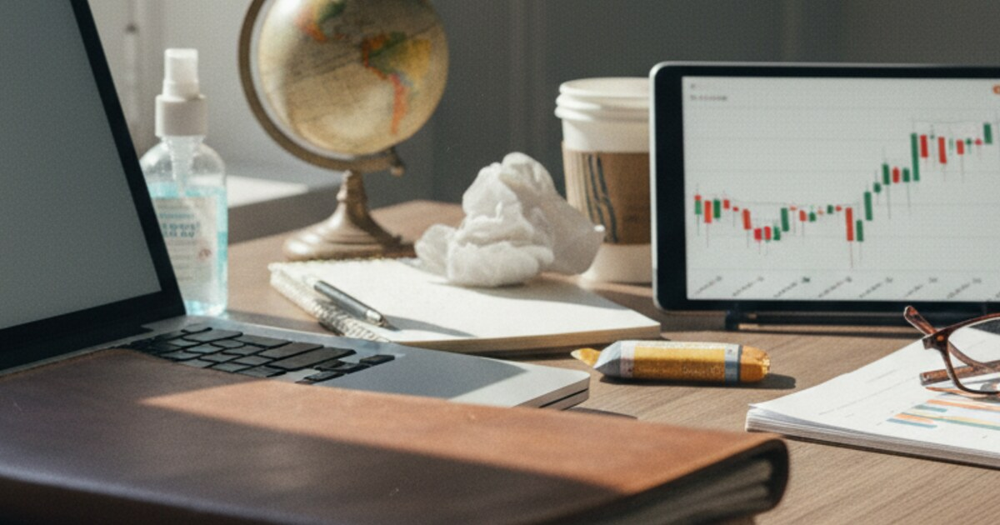

# The 2020 Investment Protocol, a Crisis Management Case Study

This is about March and April 2020, when markets went wild all over the world and the economy was in lockdown. I wanted to write down a clear investment plan with a 10-year horizon, at a time when nobody knew anything.

In March 2020 the markets moved like almost never before. I wrote the document *2020 Let's Go - Investing* on Day 12 of the lockdown, as a way to sort my thinking and not decide on emotions. The main goal was to stop looking at short term noise and to build value over the long run.

The starting point was very clear.

> "I am not a trader, so my focus is on companies I believe in and I believe will grow in their stock value over the next 5 to 10 years. In short: they will be worth more in 10 years as they are on the day I buy them."

So this is a look back at that plan, at the companies I picked and at my reasons, right in the middle of the crisis.

I tried to make complex market data simple. I looked at how a stock did in the past, in a picture you can just see, and at how good the real products are.

First, the graph. I didn't lean on complicated technical indicators but on the long history of a stock.

> "First I look at their graph for the past 3, 5, and 10 years. If the graph goes up constantly with a few bumps, I believe that this company will also handle the current Corona crash..."

Second, the corona discount. I read all the red in the market as a cash panic and not as top companies failing as businesses. So I expected prices to go back to normal.

> "As all stocks crash more than 10-15% over the past month, the minimum return I hope to get is getting back that 10-15 % over the next few years."

Third, skin in the game as a way to learn. Putting money in was not just about returns, it also forced me to do the research.

> "The moment you are financially invested into something, your interest rises... You will automatically stick to it, and sticking to it will make you more confident and knowledgeable."

## What I bought and why

The portfolio from that time falls into four groups. Digital infrastructure, value and stability, contrarian and deep value bets, and venture and seed money.

The first group is digital infrastructure and payments, and the idea was that everything goes digital anyway and the pandemic only speeds it up.

Visa and Mastercard were a hedge against crypto and a bet that cash goes away for good.

> "I believe digital payments will grow unstoppable over the next ten years - or forever... Mastercard and Visa can be found and included everywhere, they definitely have a bright future and a strong market position."

I picked Amazon and Adobe because they own basic infrastructure, cloud and commerce, and the tools creative people work with.

> "Amazon is just crazy... with servers and software they sell and provide. They are growing and growing."

> "Adobe has such robust standing that it is very unlikely that they will disappear within the next ten years - or ever."

TSMC, Taiwan Semiconductor, was the pick and shovel play for the whole tech industry, with strong numbers.

> "Past development is important for me... I’m also not happy with companies who only have a profit margin of 1-4%."

The second group is value, hardware and healthcare. Here my reasons came from using the products and from people on the inside, what some call scuttlebutt investing.

With Lenovo the stock price and the quality of the products just didn't match.

> "I own a Thinkpad Laptop and a Motorola phone and both of them are great... For me, it doesn’t make sense why their stock price declines all the time."

Getinge, a med tech company, came from first hand info from someone in my family who works there, about production going up.

> "Most important for my decision was a conversation with my brother... who told me that he’s happy and that the company is going to ramp up production because of the corona."

Pfizer and Bayer looked too cheap for something so essential. I picked Bayer even with the Monsanto risk to its name, because I have a long trust in how German companies are run.

> "The chance that they will grow due to high demand in healthcare just 'makes sense' for me."

The third group is contrarian and infrastructure bets. These companies had big problems or ethical questions, and I bought them because the system needs them.

I saw Rheinmetall and Airbus as too big to fail, pillars of infrastructure and defense.

> "It is extremely unlikely that the government won’t catch Airbus if they fall... Airbus is a great bet that it will come back to old strength."

> "I wanted to invest into an infrastructure, big player, based in Germany... It is nearly impossible to stay out of the swamp if you start looking into high profitable businesses."

The fourth group is alternative assets and venture money. High risk, for returns that don't move with the market and for early growth.

Bitcoin was a bet on the halving and on digital scarcity.

> "I’m buying 0.1 Bitcoin every day now... I believe this year could become huge for Bitcoin because of the Bitcoin halving."

Gold was a hedge against the currency losing value.

> "The Euro will just lose value over time. Gold is the most commonly known asset that has been stable for decades... I plan to invest at least 10% of my Euro cash assets into Gold."

And then seed investments through crowdfunding. Xolo OU, because I already used it myself. Mevo, a 10-year bet on live streaming. And Koawach, a bet on alternative food in the DACH region.

## The Day 22 checklist

By April 9th I moved from gut feeling to hard numbers. Buying had started to feel like an addiction, so I set up a strict checklist to slow it down.

A company needed a profit margin above 20%, to filter out shaky business models. Debt to equity should be below 60%, so the company is healthy. Revenue and earnings had to grow steadily over 5 years. I used P/E, price to earnings, and P/B, price to book, to find companies that are cheap compared to the cash they will make later. And looking at the competitors was a must, to see if the market share can hold.

In the end the 2020 Let's Go document is a case study in handling your own head as an investor. I accepted that markets could fall even more, 30-40 or even 50%, and that took away the freeze that so often comes with a crash.

I mixed buying compounders like Visa and Amazon with uneven bets like Bitcoin and seed investments and with safe hedges like gold. So the portfolio was spread out and built not on predictions but on a clear belief in how things work.
