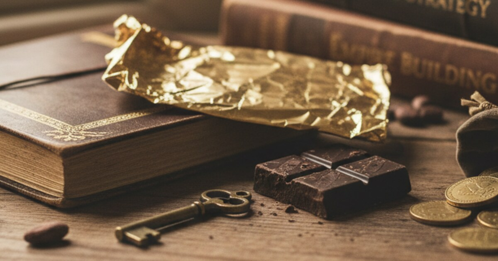

The $40 Billion Secret, 9 Lessons from the Chocolate King Who Built an Empire in the Shadows

This is a summary of a video about Michele Ferrero, and everything here comes from it.

https://youtu.be/ksDrpn7yNEo?si=rpE0EIQJnxp-74Ze

This might be one of the most incredible founder stories you will ever hear.

For 70 years Michele Ferrero was the Willy Wonka of the real world. A reclusive and obsessive Italian billionaire who built a privately owned, debt-free $40 billion empire, the Ferrero Group, that owns Nutella, Tic Tac, Kinder and Ferrero Rocher.

He never gave interviews, he wore dark sunglasses and he hid in his laboratory. And he repeated the same maxims to his employees 60 times a week.

If you study the greats like Steve Jobs, Sam Walton or James Dyson, you see the same personality type again and again, and Michele Ferrero is that type perfected. These are the 9 lessons from a man who built a global giant and never lost his soul, or his secrets.

Lesson one, the product is everything. Ferrero didn't care about finance and he didn't care about marketing tricks. He cared about the product. He ran tens of thousands of experiments, and as a student, instead of studying accounting, he crushed hazelnuts and chestnuts in class and mixed them to find the perfect ratio.

If the product is great, the rest follows. If it's average, no marketing can save you.

Lesson two, work is a spiritual necessity. When he proposed to his wife he told her "If you accept, you marry a man who will always talk to you about chocolate." He didn't work for money, he worked because he couldn't help himself. He was a missionary. Even in his 80s, technically retired, he set up a secret laboratory in his home to keep inventing.

You have to be obsessed, and the best founders are monastic in how they give themselves to their craft.

Lesson three, don't do me-too products. His rule was simple, "Always act differently from the others." Everyone made solid chocolate, so he made a creamy spread, Nutella. Everyone made sweets for adults, so he made chocolate just for children, Kinder, with more milk so parents felt good about it. Everyone sold mints in bags, so he put them in a clear box that rattles, Tic Tac.

If you copy the giants they will crush you, so you have to invent a new category to win.

Lesson four, secrecy is a weapon. Ferrero was paranoid in the best way. He protected his recipes like state secrets and he forbid tours of his factories for 65 years. He even bought hazelnut orchards under shell company names so competitors wouldn't know what he was doing.

Silence buys you time to experiment. Don't show your moves and let the product speak for itself.

Lesson five, "I am a socialist, but I do the socialism." This is one of the most unusual parts of how he thought. Ferrero believed wealth is only justified if it's used for the common good.

He never had a strike in 70 years, and the reason is that he paid his workers 50% more, he bussed them in from their villages for free so they didn't have to move to the city and he gave them free medical care. Treat your people like family and they build the empire with you.

Lesson six, invest in alien technology. Ferrero loved machines and he saw them as having souls. He bought the most advanced machines in the world, took them apart and customized them.

One time he bought a machine so big and strange that his employees were scared of it, it looked like alien technology. But it let him produce 22,000 boxes an hour. Technology isn't a cost, it's what lets you scale your craft.

Lesson seven, control everything. He didn't just make chocolate. He bought hazelnut farms in the Southern Hemisphere so he had fresh supply all year, he built his own distribution network with thousands of trucks and he engineered his own roasting machines.

Don't outsource your quality. If you want it perfect, you have to own the whole chain.

Lesson eight, attention to detail wins. Ferrero could tell you which side of the hill a lemon grew on. He saw his product like an orchestra where every ingredient had to be tuned perfectly.

He inspected the factories himself and flew in by helicopter to taste the product. No detail is too small for the founder to care about.

Lesson nine, serve Mrs. Valeria. Ferrero gave his customer a name, Mrs. Valeria, the Italian mother shopping for her family. He told his employees "The CEO is Mrs. Valeria. I am her servant. If she buys, we eat. If she doesn't, we go home."

He even went to supermarkets incognito, hid behind shelves and listened to how customers reacted to new products. So don't think about the market. Think about one specific person you serve, and if you delight her, you win.

Michele Ferrero died at 89, on Valentine's Day. And he left a simple legacy behind, in his own words "My secret? Always doing things differently from others, having faith, staying strong, and putting Mrs. Valeria at the center of everything, every single day."
