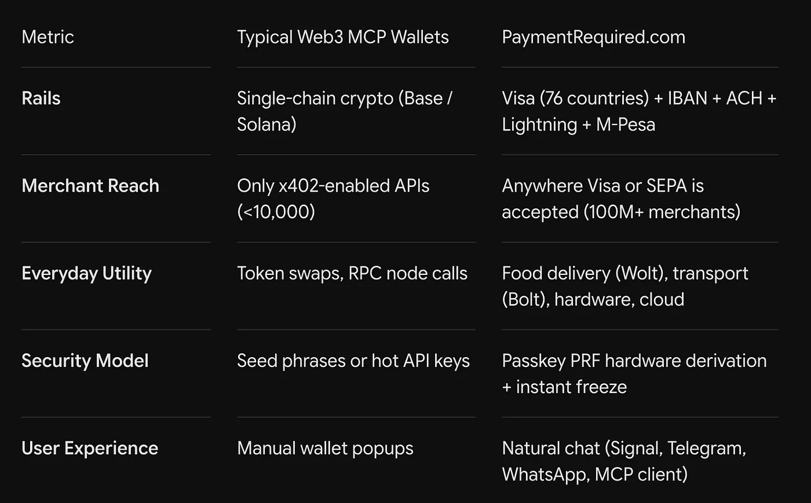

<https://www.youtube.com/watch?v=J3pegsM5drk>

In a recent conversation, PayPal co-founder and Affirm CEO Max Levchin said something that every fintech founder should think about a lot.

"The card payment interface is the singular best user interface ever created… This may actually be finally up for renegotiation because AI is already there."

For six decades, consumer finance was built around a piece of plastic. Then came the EMV chip, and later Apple Pay.

Apple Pay used the Secure Enclave in the phone to make the payment a few milliseconds faster and to get around the card network's strict 2.5 second authorization window.

Every version had one thing in common. There was a human standing at a terminal or tapping on a screen.

Now software agents write code, run tasks with many steps and book services on the web. But the moment an agent tries to pay the bill, it hits a wall.

The agent has no hands.

It can't reach into a pocket. It can't pass an SMS OTP, it can't solve a Cloudflare Turnstile CAPTCHA, and it gets caught by fraud checks that flag browsers that don't look human.

The first answer from the industry was very short-sighted. If you look at what developers build today, almost every agent wallet is a sandbox experiment. A crypto faucet, a testnet contract, or a small x402 endpoint that moves USDC between servers.

That is not enough. Agents don't live in some decentralized bubble. They are there to help humans, and humans live in the real world.

An agent that can only send tiny amounts to another server can't order dinner on Wolt, book a 6 AM Bolt to the airport, buy an eSIM when you need one fast, or bid on eBay.

This is the idea behind [Nuri.com](http://nuri.com), and it's why we think our Model Context Protocol (MCP) server can become the money layer for agents.


An agent that only speaks crypto is like an electric sports car that only runs on private tracks. Impressive, but it doesn't get you anywhere.

Look at where everyday money really flows.

First, the old rails. 99.9% of the physical commerce in the world runs on Visa, Mastercard, SEPA and ACH. Food delivery, ride hailing, cloud providers, shops, all of it.

Second, friction. If an agent needs your approval, a seed phrase on a piece of paper, or you copy and paste private keys every time it does something, the whole point of an agent is gone.

Like Levchin said, "Convenience just trumps as the total amount you're trying to send goes down."

Third, identity. The cypherpunk idea often assumes you are fully anonymous. But real commerce needs settlement people can trust, a way for merchants to get their money back, and the rules of each country.

Most agent payment projects built an island. PaymentRequired built the bridge.


PaymentRequired doesn't ask the world to throw away its terminals and rebuild everything for Web3. It gives the agent a native Model Context Protocol (MCP) interface. All the money rails of the world sit behind it, as simple tools that always do the same thing.

When a developer adds the MCP to Claude Desktop, Cursor, Hermes or their own agent loop, the agent gets access to three layers right away.

```
                  ┌─────────────────────────────────────────┐
                  │          Autonomous AI Agent            │
                  │   (Claude, Cursor, OpenClaw, Hermes)    │
                  └────────────────────┬────────────────────┘
                                       │  JSON-RPC via MCP
                  ┌────────────────────▼────────────────────┐
                  │       PaymentRequired.com Engine        │
                  └──────┬──────────────────┬───────────────┘
                         │                  │
         ┌───────────────▼──────┐    ┌──────▼───────────────┐
         │     Legacy Rails     │    │  Micropayment Rails  │
         ├──────────────────────┤    ├──────────────────────┤
         │ • Visa (76 countries)│    │ • Bitcoin Lightning  │
         │ • EUR IBAN / SEPA    │    │ • HTTP 402 / x402    │
         │ • USD ACH            │    │ • USDC / USDT / ETH  │
         │ • M-Pesa Remittance  │    │ • Passkey PRF Auth   │
         └──────────────────────┘    └──────────────────────┘
```

Layer one is real payments. The agent doesn't just simulate a payment. It goes through the normal checkout and pays.

You say order my usual from Wolt, the Wolt checkout goes through, the card gets charged and dinner is there in 25 minutes. You say Bolt to BER airport at 6 AM, the ride is booked, a driver is assigned and the receipt is saved.

You say eSIM for Turkey next week, and you get the QR code without any KYC hassle. You say send 2,000 Shilling to mom, and the M-Pesa transfer arrives in seconds.

Layer two is two kinds of rails. For bigger and normal payments there is a real Visa card that works in 76 countries, with its own EUR IBAN and USD ACH routing number.

For small machine to machine payments there is native support for the HTTP 402 `Payment Required` header, so API calls under one cent and metered compute settle over Bitcoin Lightning and stablecoins on Layer 2.

Layer three is that you keep your keys, and it doesn't make things harder. This doesn't cost you custody.

The keys come from WebAuthn Passkey PRF on your device's hardware, so they stay with you. The agent can spend within the rules you set, but it never owns the keys.


The biggest thing that stops people from letting agents pay is in the head. It's the fear of losing money with no limit.

Nobody wants to connect their main bank card to an LLM that might get stuck in a loop and empty the account on cloud compute or on purchases it made up.

PaymentRequired solves this with card controls in code. You don't just give the agent money. You give the agent rules.

You can stop everything with one chat message. You say freeze my card, and the card is blocked right away at the issuer.

You can set limits per transaction, per domain or per day, so an agent with a €30 food limit can't spend €300 by mistake.

And virtual cards can be created just in time, loaded with the exact cents the payment needs and locked to that one merchant domain.

This also gets around the 2.5 second authorization problem Levchin talked about. The limits are set and the balance is ready before the merchant's payment gateway runs, so the agent pays inside the normal card flow and doesn't trigger the fraud checks of the issuer.


Fintech history teaches the same thing again and again. Distribution and frequency beat clever protocols.

Alex Rampell famously said that the payment businesses with the highest margins, and the ones that last, are not the ones that move rare wires of many millions of dollars.

They are the ones inside small payments people make every day. They pass the coffee test.



| Metric | Typical Web3 MCP Wallets | PaymentRequired.com |
|---|---|---|
| Rails | Single-chain crypto (Base / Solana) | Visa (76 countries) + IBAN + ACH + Lightning + M-Pesa |
| Merchant Reach | Only x402-enabled APIs (<10,000) | Anywhere Visa or SEPA is accepted (100M+ merchants) |
| Everyday Utility | Token swaps, RPC node calls | Food delivery (Wolt), transport (Bolt), hardware, cloud |
| Security Model | Seed phrases or hot API keys | Passkey PRF hardware derivation + instant freeze |
| User Experience | Manual wallet popups | Natural chat (Signal, Telegram, WhatsApp, MCP client) |

The team that wins agent payments won't be the one with the most complicated smart contract. It will be the team that lets an agent buy a coffee, start a VPS server, book a cab and pay an API invoice, all through one interface.

Paying is not a human looking at a piece of plastic anymore. It's an agent working with payment rails in code.

The protocol is already live. The tools are already hosted.

Make your agent pay: [nuri.com](http://paymentrequired.com/mcp/)
