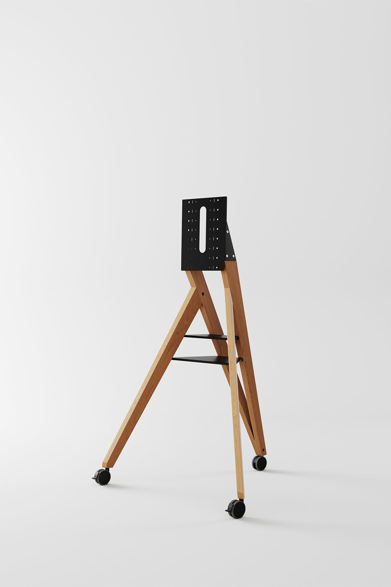

This is a summary of a video that goes through Paul Johnson's essay on Pablo Picasso, and the video is linked at the bottom. Picasso's life is a hard paradox. He was a man with a creative output and a financial success like nobody before him, and by many accounts he was also a "monster of assured egoism". Based on the video's analysis of the essay, here is a ranking of the "bad and crazy" facts about him, going from his most disturbing behavior to his most impressive achievements.

## The most negative and disturbing behavior

Picasso reportedly beat his most gifted mistress and left her unconscious on the floor. He took pleasure in hurting women and made situations on purpose where his mistresses would confront each other, and once he watched two of them fight physically on the floor while he calmly kept painting. He said openly that for him women were either "goddesses or doormats", and his own goal was to turn a "goddess" into a "doormat", step by step. He stole the wives of his friends and then told the husband he was "honoring" him by choosing to sleep with her. Johnson describes him as missing the basic human ability to tell right from wrong or truth from lies, and as seeing kindness and generosity as weaknesses to exploit. And his cruelty left a dark mark on his family. After his death his widow killed herself by shooting herself, and his eldest son died of alcoholism.

## The crazy and arrogant side

People often heard him repeat "I am God, I am God" to himself. And even with all his fame he would admit now and then, "I am nothing but a clown", which suggests he sometimes felt his huge success was a "con".

## The impressive side, genius and wealth

Between the ages of 20 and 91 Picasso made on average one new piece of art every single day, and over 71 years that adds up to 26,075 published works. He was a master of marketing who "always knew what would sell". He was a millionaire by 1914 and died as the richest artist in history. His enormous selfishness destroyed his personal life, but it also gave him a level of focus that helped him change the visual experience of the 20th century.

## A few more things worth knowing

Picasso changed his style again and again and broke his own rules, and that's part of why he stayed on top of culture for decades. He treated making work like a compulsion, and for him creating was closer to breathing than to "inspiration". He built his persona as carefully as he made his paintings, because he understood fame as a medium. He also kept everything, a huge amount of work and material, and that made his place in history stronger and later fed a huge estate. And the same traits that made him unstoppable in art made him brutal in relationships.

The source video is https://www.youtube.com/watch?v=9_QO_zYjvro

