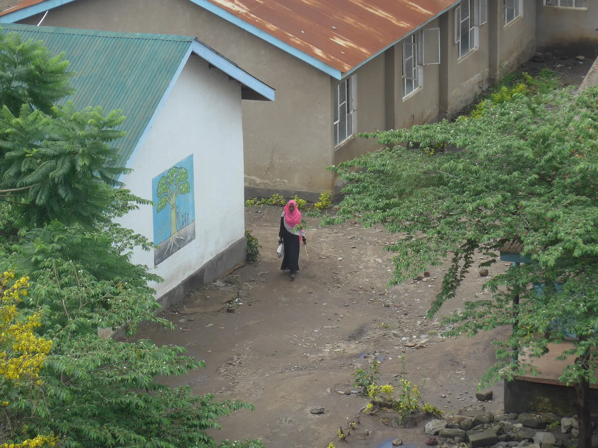

# The Echoes of Cold War Diplomacy: Romania, Tanzania / Zanzibar, and the Legacy of the 1972 Visa Abolition Agreement

Think about this: You are a European digital nomad or a tourist looking for a tropical getaway in the 2020s. You look at a map of East Africa, specifically the pristine, white-sand beaches of Zanzibar. If you hold a passport from the UK, France, Germany, or almost anywhere else in Europe, you are pulling out your credit card to pay for a visa.

But if you hold a Romanian passport, you walk right through.

Today, Romania remains the only European country whose citizens enjoy continuous, unencumbered visa-free access to the United Republic of Tanzania (which includes the semi-autonomous archipelago of Zanzibar). This isn’t a modern tourism initiative or a recent European Union trade deal. It is the living, breathing legacy of a bizarre chapter of Cold War geopolitics — a story involving a rugged 4x4, two men who ruled like monarchs, and a legendary diplomatic flex involving an oil refinery built for a king.

## The “Two Monarchs” and the 1972 Visa Abolition Agreement

To understand this geopolitical anomaly, we have to travel back to the spring of 1972. The Cold War was at its height, and newly independent African nations were navigating a fragile path between the capitalist West and the communist East.

Enter Nicolae Ceaușescu, the communist dictator of Romania. Ceaușescu was desperate to carve out a foreign policy independent from Moscow’s suffocating grip.1 He wanted to position Romania as a “brotherly” developing nation to the Third World, offering industrial aid without the imperialist baggage of the West or the domineering control of the Soviets.1

In March 1972, Ceaușescu embarked on a massive diplomatic tour of Africa, eventually landing in Dar es Salaam, Tanzania. There, he met with Tanzanian President Julius Nyerere. Nyerere, known affectionately as *Mwalimu* (The Teacher), was the architect of *Ujamaa*, a localized form of African socialism.3

Though operating in vastly different worlds, the two leaders shared striking similarities. Both were engaged in massive, uncompromising social engineering projects — Nyerere with his rural “villagization” and Ceaușescu with his hyper-industrial “systematization”.3 Because both men ruled with the absolute authority and lengthy tenures usually associated with dynastic kingship, historians and political analysts have often referred to their bond as the “friendship of the two monarchs.”

This personal rapport culminated on March 28, 1972, when the two nations signed a formal Visa Abolition Agreement.6 The treaty bypassed standard bureaucratic restrictions, establishing a frictionless travel corridor between the two socialist states. Astoundingly, this treaty survived the bloody fall of Ceaușescu in 1989, Romania’s integration into the EU, and Tanzania’s transition to multiparty democracy. Successor governments simply never revoked it.

## The Legend of “Aru Jeep Chauchenko”

Treaties are just ink on paper, but Ceaușescu knew how to leave a physical mark. He was a master of “car diplomacy,” and he brought with him Romania’s ultimate mechanical ambassador: the ARO 240 series off-road vehicle.7

The ARO (Auto Romania) was not a luxury SUV. It was a rugged, utilitarian beast designed to survive the harshest terrains without relying on complex, fragile electronics.7 During his 1972 visit, Ceaușescu gifted several brand-new ARO 240 jeeps to the Tanzanian leadership and the revolutionary government of Zanzibar.5

These weren’t just symbolic gifts. The Romanian jeeps were immediately deployed into the unforgiving East African bush, where they proved their immense worth. They were easily repaired by local mechanics and quickly became a ubiquitous symbol of Romanian-Tanzanian cooperation.

Because the vehicles were synonymous with the dictator who gifted them, the locals in Tanzania and Zanzibar merged the manufacturer’s name with a phonetic approximation of the dictator’s name. “ARO” was softened to “Aru,” and “Ceaușescu” mutated into “Chauchenko.”

For decades, the “Aru Jeep Chauchenko” roared across the savannah — a linguistic and mechanical artifact of Eastern European industry thriving under the African sun.5

## Oil, Engineers, and Fueling the King’s Cars

But the story of Romanian mechanical diplomacy doesn’t end in the Tanzanian bush. It stretches across the Indian Ocean to the historical rulers of Zanzibar: the Sultanate of Oman.

For centuries, Zanzibar was the seat of the vast Omani Empire, and the cultural and demographic ties between Oman and the East African coast remain inseparable today.8 As Romania aggressively exported its “hard modernity” across the Non-Aligned world, its most valuable asset wasn’t just the ARO jeep — it was oil expertise.

The Romanian School of Petroleum had formed a highly specialized workforce, and by the 1970s and 1980s, Romania had become the second-largest exporter of oil machinery in the world.9 According to the rich diplomatic lore of the era, the intersection of Romanian automotive pride and Middle Eastern statecraft led to an extraordinary exchange: to ensure the newly ascended Sultan of Oman, Qaboos bin Said, had the refined fuel necessary to drive his royal fleet of vehicles, Ceaușescu sent elite Romanian engineers to the region to assist in the development of oil refinery infrastructure.

This legendary flex perfectly encapsulated Ceaușescu’s strategy. By supplying the engineers and the technology to refine crude oil, Romania wasn’t just building factories; it was building deep, personal geopolitical debts. The Romanian engineers who arrived in the region were part of a massive human capital export strategy, trading technical brilliance for diplomatic goodwill and raw resources.1

## Completing the Loop: The 2020 Omani Visa Exemption

In a fascinating twist of modern geopolitics, the historical echo of this diplomacy recently completed a perfect circle.

In December 2020, the Sultanate of Oman, looking to boost its tourism sector, unilaterally lifted entry visa requirements for citizens of over 100 countries for stays of up to 14 days.10 Prominently featured on that list was Romania.

Thanks to the lingering goodwill of 1970s “car and oil” diplomacy and modern economic strategy, a Romanian passport holder today possesses frictionless access to both historical halves of the former Omani Empire: the East African jewel of Zanzibar (secured by Ceaușescu and Nyerere in 1972) and the ancestral Arabian homeland of Oman (liberalized by the Sultanate in 2020).

## Summary: The Power of Personal Statecraft

**Chauchenko**

Nicolae Ceaușescu, former communist leader of Romania.

**Aru Jeep**

The ARO Jeep, a rugged Romanian off-road vehicle gifted to Tanzania.

**The Two Monarchs**

The metaphorical title for Ceaușescu and Nyerere, highlighting their absolute rule.

**Oil Diplomacy**

Romania’s status as a top global exporter of oil technology, used to build refineries and curry favor with Middle Eastern royalty.

**The Visa Loop**

The enduring result of these historical ties, granting modern Romanians free access to Tanzania, Zanzibar, and Oman.

Today, as thousands of Romanians flock to the beaches of Zanzibar — unbothered by the visa queues holding up the rest of Europe — they are inadvertently participating in the final chapter of a Cold War saga. It is a story written by two “monarchs,” driven through the mud in an Aru Jeep Chauchenko, fueled by Romanian refinery engineers, and sealed by the powerful, enduring inertia of diplomatic history.

### Works cited

1. Into Africa: Nicolae Ceauşescu’s tour of March–April 1972 — Journals, accessed on March 10, 2026, [https://journals.lwbooks.co.uk/tcc/vol-2018-issue-15/article-9215/](https://journals.lwbooks.co.uk/tcc/vol-2018-issue-15/article-9215/)
1. Exporting hard modernity: construction projects from Ceaușescu’s Romania in the ‘Third World’ — ResearchGate, accessed on March 10, 2026, [https://www.researchgate.net/publication/241728057_Exporting_hard_modernity_construction_projects_from_Ceausescu's_Romania_in_the_'Third_World'](https://www.researchgate.net/publication/241728057_Exporting_hard_modernity_construction_projects_from_Ceausescu's_Romania_in_the_'Third_World')
1. Socialisms Between Cooperation and Competition: Ideology, Aid and Cold War Politics in Tanzania’s relations with East Germany — OpenEdition Books, accessed on March 10, 2026, [https://books.openedition.org/editionsmsh/51520?lang=en](https://books.openedition.org/editionsmsh/51520?lang=en)
1. Romanian rural systematization program — Wikipedia, accessed on March 10, 2026, [https://en.wikipedia.org/wiki/Romanian_rural_systematization_program](https://en.wikipedia.org/wiki/Romanian_rural_systematization_program)
1. Communist dictator Ceauşescu’s ARO jeep put up for auction again for lower price, accessed on March 10, 2026, [https://www.romaniajournal.ro/society-people/communist-dictator-ceausescus-aro-jeep-put-up-for-auction-again-for-lower-price/](https://www.romaniajournal.ro/society-people/communist-dictator-ceausescus-aro-jeep-put-up-for-auction-again-for-lower-price/)
1. Volume IV — Annexes | INTERNATIONAL COURT OF JUSTICE, accessed on March 10, 2026, [https://www.icj-cij.org/index.php/node/142428](https://www.icj-cij.org/index.php/node/142428)
1. ARO 24: Eastern Europe’s Answer to Jeep and Land Rover — YouTube, accessed on March 10, 2026, [https://www.youtube.com/watch?v=m7BIFXcwxMo](https://www.youtube.com/watch?v=m7BIFXcwxMo)
1. Tanzania Consulate General Zanzibar — زنجبار قنصلية عامة تنزانيا | fm.gov.om, accessed on March 10, 2026, [https://www.fm.gov.om/en/missions/om-tz-zanzibar-cg/](https://www.fm.gov.om/en/missions/om-tz-zanzibar-cg/)
1. History of Romanian Technology and Industry | springerprofessional.de, accessed on March 10, 2026, [https://www.springerprofessional.de/history-of-romanian-technology-and-industry/26543184](https://www.springerprofessional.de/history-of-romanian-technology-and-industry/26543184)
1. Entry visas | fm.gov.om, accessed on March 10, 2026, [https://www.fm.gov.om/en/visitors/entry-visas/](https://www.fm.gov.om/en/visitors/entry-visas/)
