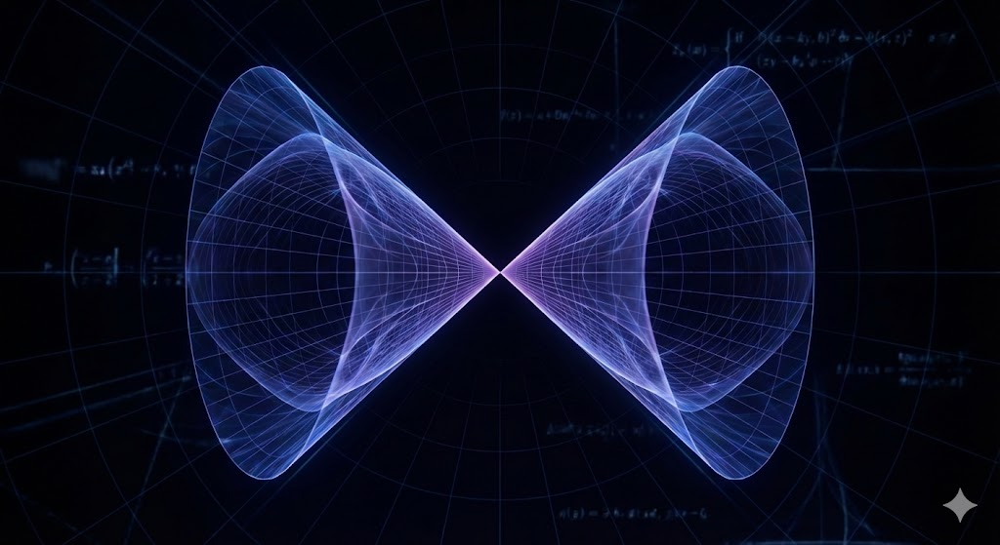

This is a summary of Jim Simons' talk at MoMath, [Jim Simons at MoMath: My Life in Mathematics](https://www.youtube.com/watch?v=QUTaQvnwLzM).

In the talk Simons tells the story of one of the big breakthroughs in modern mathematics. It's how he and a few brilliant colleagues found a crack in the universe of geometry, and showed that in higher dimensions the most efficient shapes aren't always smooth.

To get the Simons Cone you first need to see how nature behaves. Simons explains it with the Plateau Problem, named after a scientist who played with soap films. If you take a wire frame and dip it into soapy water, the soap film that forms is a minimal surface. It stretches across the frame with the smallest area possible. For hundreds of years mathematicians believed these efficient surfaces were always smooth, so perfectly rounded like a ball or a wave, with no sharp corners or spikes.

In the world we can see, in 3D, these soap films are always smooth. And mathematicians proved that the rule still holds as you go into dimensions we can't see. In 2D, 3D, 4D, 5D and 6D every minimal surface is perfectly smooth, and in the end it was proven for the 7th dimension too. So at that point most mathematicians thought it was a universal law, and no matter how many dimensions you have, the most efficient shape is always smooth.

Simons looked at what happens when you step into the 8th dimension, and he found something that shocked the mathematical world. A shape, now called the Simons Cone, that is perfectly efficient and uses the least possible area, but it isn't smooth. It has a singularity right in the middle. Think of two infinitely sharp cones meeting exactly at their tips. In his own words, "It turned out that seven was the magic number. Up to seven dimensions, the area-minimizing variety is smooth. But in eight dimensions, there’s a thing called the Simons Cone... it has a singularity at the origin, and it is area-minimizing." [00:05:10]

This was more than a math fact. It was a counterexample that broke a 50-year-old assumption, and it matters for three reasons. First, it showed that as things get more complex, with more dimensions or variables, efficiency doesn't need smoothness anymore, and in high-dimensional space the most perfect and efficient shape can be sharp and jagged. Second, he found a cliff in mathematics. Everything works one way up to 7 dimensions, and at the 8th dimension the rules of the game change completely. Third, it gave mathematicians and physicists a new way to study singularities, the points where the math breaks or becomes infinite, and that turned out to matter a lot for things like black hole physics and string theory.

Simons sees it as a moment of pure aesthetic discovery. He wasn't trying to make money or crack a code, he was looking for a beautiful truth in geometry. He talks about the excitement of finding that seven was the magic number, and he says nature has these strange hidden boundaries. And he reads it as a lesson in not following the pack. While others tried to prove that smoothness lasts forever, Simons looked where nobody else was looking and found the exact spot where the theory fell apart.

The Simons Cone is still one of the most famous objects in geometry. It stands for the moment we saw that high-dimensional space is a lot weirder than we ever thought. For Simons it was the proof that if you dig deep enough into the math, you find structures that are terrifyingly complex and also beautiful.

