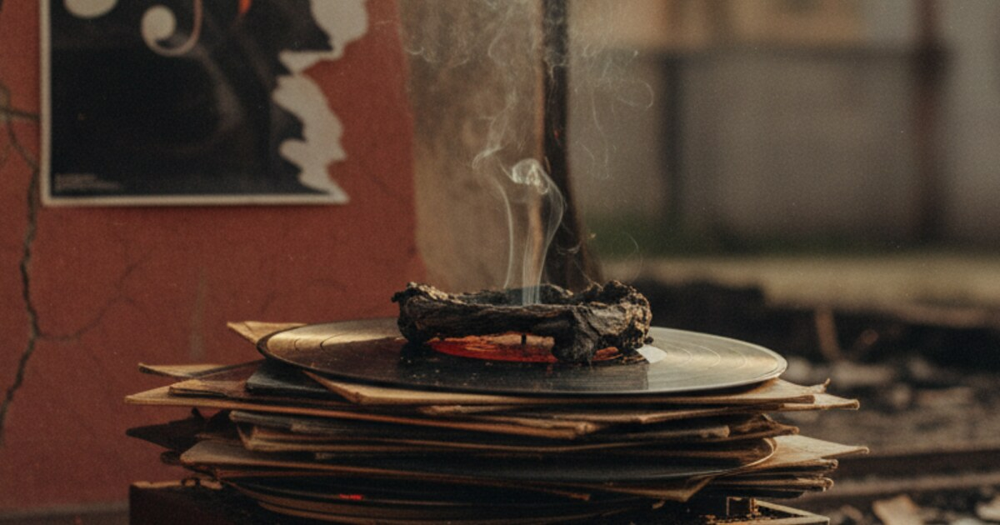

This is a summary of a documentary video about Fela Kuti and his song Zombie. The quotes are the text the video shows on screen. The facts at the end come from extra research.

In 1976 Fela Kuti released "Zombie". The song laughs at the Nigerian military. It calls soldiers robots that only move when someone tells them to. The army did not laugh. It came back with 1,000 soldiers, burned his Kalakuta Republic commune to the ground and threw his mother out of a window.

TL;DR. One song made an army so angry that it destroyed a whole compound. Below is the full story from the video, the complete lyrics and the history around it.

## The story as the video tells it

The video shows these lines one after the other.

> "The fury stirred up among the Nigerian police and military by Fela's furiously confrontational albums Alagbon Close in 1974 and Kalakuta Show in 1976, and the beatings and harassments Fela and Africa 70 suffered as a consequence, were as nothing compared to the reprisals following a later 1976 album, Zombie..."

> "Within months of its release, a large-scale army attack left Fela's Kalakuta Republic compound burnt to the ground, and many of its occupants, including Fela, assaulted and seriously injured. The sacking of Kalakuta was not, of course, brought about only by Zombie, but in the tension then existing between Fela and the military, it raised the temperature to boiling point."

> "On 'Zombie' itself, over an urgent, quick-march accompaniment from Afrika 70, Fela and the backup singers ridicule the mindset of men in uniform. 'Attention! Quick march! Slow march! Salute!' sings Fela, 'Fall in! Fall out! Fall down! Go and kill! Go and die! Go and quench!' Each phrase is followed by the women singers' taunting response, 'Zombie!'"

> "Fela continues: 'No brains, no job, no sense joro jara jo; tell am to go kill joro jara jo; tell am to go quench joro jara jo (meaning,"no brains, no job, no sense left right left"; tell him to go kill left right left; tell him to go die left right left.")'"

> "For the army, Fela's lyrics were the final insult, a direct attack on its pride and prestige, and probably more wounding for the fact that it was being made to look foolish, in part, by women. Worse still, Zombie was a hit across Africa, adding an international dimension to the insult. The army's response was terrible...."

> "On 18 February, 1977, around 1,000 soldiers, most of them armed, swooped on Fela's Kalakuta Republic compound. They cordoned off the surrounding area, broke down the wire fence around the community's buildings, and battered their way into the central structure. Occupants were stripped and barbarously abused; particularly unfortunate men had their testicles beaten with rifle butts; particularly unfortunate women were raped (one also had her nipples crushed with stones)...."

> "Fela was badly beaten, sustaining a fractured skull and several broken bones. His mother, then aged 77, was thrown out of a window, fracturing a leg and suffering deep trauma. The army then set fire to the compound and prevented the fire brigade reaching the area...."

> "The ensuing blaze gutted the premises, destroying six Afrika 70 vehicles, all the master tapes and band equipment, a four-track recording studio, all the community members' belongings and, for good measure, the free medical clinic run by Fela's brother, Dr Beko Ransome Kuti (who was also severely beaten in the attack)...."

> "The first journalists to arrive on the scene were assaulted by soldiers. Inquisitive passers-by were similarly set upon. The army didn't want any witnesses. They were unsuccessful at least in that; photographs of the fire and its immediate aftermath appeared in the Nigerian press within days."

> "But Fela's political stance didn't endear itself to the Ghanaian authorities either - particularly when protesting Ghanaian students starting shouting "Zombie!" at police and soldiers in the streets. After a few turbulent months, Fela was sent back to Nigeria."

## The lyrics

It works as call and response. Fela sings a line and the women answer "Zombie".

Chorus

> Zombie o, zombie *(Zombie o, zombie)*
> Zombie o, zombie *(Zombie o, zombie)*

Verse 1

> Zombie no go go, unless you tell am to go *(Zombie)*
> Zombie no go stop, unless you tell am to stop *(Zombie)*
> Zombie no go turn, unless you tell am to turn *(Zombie)*
> Zombie no go think, unless you tell am to think *(Zombie)*

Verse 2

> Tell am to go straight
> *A joro, jara, joro*
> No brake, no job, no sense
> *A joro, jara, joro*
> Tell am to go kill
> *A joro, jara, joro*
> No brake, no job, no sense
> *A joro, jara, joro*
> Tell am to go quench
> *A joro, jara, joro*
> No brake, no job, no sense
> *A joro, jara, joro*

Bridge

> Go and kill! *(Joro, jara, joro)*
> Go and die! *(Joro, jara, joro)*
> Go and quench! *(Joro, jara, joro)*
> Put am for reverse! *(Joro, jara, joro)*

Outro, the military commands

> Attention! *(Zombie)*
> Quick march! *(Zombie)*
> Slow march! *(Zombie)*
> Left turn! *(Zombie)*
> Right turn! *(Zombie)*
> About turn! *(Zombie)*
> Double up! *(Zombie)*
> Salute! *(Zombie)*
> Open your hat! *(Zombie)*
> Stand at ease! *(Zombie)*
> Fall in! *(Zombie)*
> Fall out! *(Zombie)*
> Fall down! *(Zombie)*
> Get ready! *(Zombie)*
> Halt! Order!

## What the history says

The attack happened on February 18, 1977. The records say around 1,000 soldiers took part.

His mother was Funmilayo Ransome-Kuti, a famous suffragist and political activist. She died in 1978 from complications of the injuries she got when they threw her from the window.

After the destruction an official inquiry said the compound was burned by "an unknown soldier". So nobody in the army was responsible. Fela answered with a new song, "Unknown Soldier".

The video says Fela was sent back from Ghana. That was in 1978. He was banned from the country after riots broke out during a performance of "Zombie" in Accra.

And then the last act. Fela and his movement carried a symbolic coffin to the Dodan Barracks in Lagos to protest the death of his mother.
