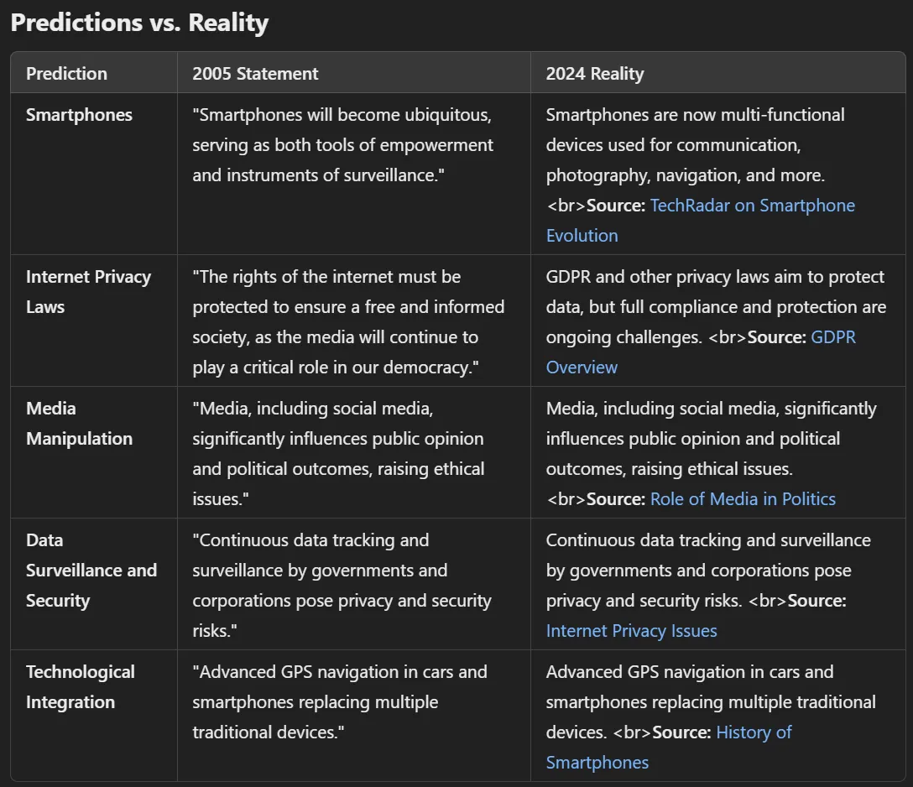

Manipulation through media and technology is everywhere, and it shapes how we see things and what we do. In 2005, at the age of 17, I wrote "Theory vs. Reality" as a school thesis, as Emin Henri Mahrt. This post goes through it, my own experiences, political theories and real cases, and how much influence comes from controlling the media.

## Manipulation you don't see

Manipulation is not always open. Often it's a quiet process that shapes our thoughts and actions through the media we consume and the technology we use. In "Theory vs. Reality" I define manipulation as "the covert steering of individuals' perceptions and decisions by those who control the flow of information" (p. 2).

## What I saw in China

Then China. In 2000 I was in China, and I saw firsthand how far state control can go, the systems of surveillance and what they do to everyday life.

Standing on Tiananmen Square you can feel the control. The place is a symbol of China's struggles in the past and of the surveillance state today. I wrote, "Every step I took felt monitored, every movement recorded. The heavy presence of security cameras was a constant reminder of the state's watchful eye" (p. 3).

Jan Wong's eyewitness reports give another view on what happened on Tiananmen Square. She writes, "The square was filled with chaos, but amidst the turmoil, there was a profound sense of unity and defiance" (p. 4). Reports like this show how far the lived reality is from the cleaned-up official story.

And the surveillance goes into the digital world too. Email monitoring in China is extensive, it's a digital panopticon where privacy is a luxury few people can afford. I wrote, "The knowledge that my emails could be read at any moment changed the way I communicated. It was a chilling reminder of the state's reach" (p. 5).

## Power in political theory

Then the thesis goes into political theory, so how thinkers from history and from today dealt with power and control.

Maurice Joly's work is a cornerstone for understanding political manipulation. He argued that "those in power often prioritize maintaining control over the pursuit of truth and reason" (p. 6). That still fits the world today, where information is used as a weapon to keep authority.

Machiavelli and Montesquieu give the historical view on how power is used. Machiavelli's pragmatic way of ruling stands against Montesquieu's idealistic vision, but both show the old struggle between authority and freedom. "Machiavelli's teachings, though often seen as ruthless, reveal the cold calculus of power, while Montesquieu offers a vision of balanced governance" (p. 7).

The influence of media and technology also comes up again and again in literature. Neil Postman argues in Amusing Ourselves to Death, "We are amusing ourselves to death", and shows how entertainment media make important issues trivial and weaken public discourse (p. 8). George Orwell's 1984 is more relevant than ever, and his Big Brother is an early picture of the surveillance states we have now. "War is peace. Freedom is slavery. Ignorance is strength." Orwell's slogans echo in the world today (p. 9). And Vance Packard shows in The Hidden Persuaders how quietly advertising manipulates our behavior. "The more you can make people aware of their desires, the more effectively you can control them," Packard says (p. 10).

## Real cases of control

Then the thesis looks at control through modern media, with real cases, where the theory gets concrete.

Boris F., a computer specialist, died in a mysterious way, and a lot of people believe it's connected to what he knew about sensitive information. His case shows the danger for people who uncover how media control works behind the scenes. "Boris's fate is a grim reminder of the risks inherent in uncovering uncomfortable truths" (p. 12).

Kevin Mitnick and Karl Koch show how complex cybercrime is. Their stories are warnings that technology cuts both ways. "Hackers like Mitnick and Koch operate in a gray area, where the line between right and wrong is often blurred" (p. 13).

The systems that collect and analyze information today are huge and sophisticated. They are built to "extract maximum value from every piece of data, turning personal information into a commodity" (p. 14). When data becomes a commodity, that has big consequences for privacy and autonomy.

The techniques to evaluate information go from data mining to psychological profiling, and they work very well. These methods are "designed to manipulate behaviors subtly yet powerfully, shaping decisions in ways we might not even recognize" (p. 15).

## What I predicted in 2005

Looking ahead, manipulation through media and technology will most likely get even more sophisticated. "As technology advances, so too will the methods of control and influence. The digital age brings with it unparalleled capabilities for surveillance and manipulation" (p. 16).

I also saw smartphones coming and what they would do to society. "Smartphones will become ubiquitous, serving as both tools of empowerment and instruments of surveillance" (p. 17). And I wrote how important the internet and the media are for the future of Germany. "The rights of the internet must be protected to ensure a free and informed society, as the media will continue to play a critical role in our democracy" (p. 18).

Smartphones. In 2005 I wrote, "Smartphones will become ubiquitous, serving as both tools of empowerment and instruments of surveillance." In 2024 smartphones are essential devices for a lot of things, communication, photography, navigation, payments, entertainment and much more. The source is TechRadar, Smartphone Evolution.

Internet privacy laws. In 2005 I wrote, "The rights of the internet must be protected to ensure a free and informed society, as the media will continue to play a critical role in our democracy." In 2024 there are laws like GDPR that try to protect personal data and privacy, but enforcement and full compliance are still a challenge. The source is the GDPR Overview.

Media manipulation. In 2005 I wrote, "Media, including social media, significantly influences public opinion and political outcomes, raising ethical issues." In 2024 media and social media play a big role in public opinion, political debate and elections. The source is the BBC, Role of Media in Politics.

Data surveillance and security. In 2005 I wrote, "Continuous data tracking and surveillance by governments and corporations pose privacy and security risks." In 2024 governments and companies collect and analyze huge amounts of personal data, and surveillance and data security are big public concerns. The source is Internet Privacy Issues.

Technological integration. In 2005 I wrote, "Advanced GPS navigation in cars and smartphones replacing multiple traditional devices." In 2024 smartphones have replaced or taken in a lot of separate devices, GPS units, cameras, music players, maps and calculators. The source is History of Smartphones.

## Why a free press matters

In "Theory vs. Reality" I wrote about how important the press is for public opinion and for holding power to account. "A free press is the cornerstone of a democratic society," I wrote. "Without it, the public remains in the dark, unable to make informed decisions or hold leaders accountable" (p. 19). The press is a watchdog, it exposes corruption and makes things transparent. But I also warned that the press can be taken over or manipulated by the people in power. "When the media is controlled or influenced by the state, it ceases to be a watchdog and becomes a tool of propaganda" (p. 20).

"Theory vs. Reality" looks at manipulation through media and technology from a lot of sides. It brings together my own experiences, history and examples from that time, and it shows how much control there is over our lives. It's a call to be aware, to see and question the forces that shape our reality.

If you want to go deeper, here is the original thesis as a PDF.

[https://drive.google.com/file/d/0Bxircl2ROioAZmE5MGVkYTMtZWZlZS00NzViLTlkNTUtNjVkM2RjYWEyZWY0/view?usp=sharing&resourcekey=0-t8LONNTpyonCHQSfXUZLyw](https://drive.google.com/file/d/0Bxircl2ROioAZmE5MGVkYTMtZWZlZS00NzViLTlkNTUtNjVkM2RjYWEyZWY0/view?usp=sharing&resourcekey=0-t8LONNTpyonCHQSfXUZLyw)
