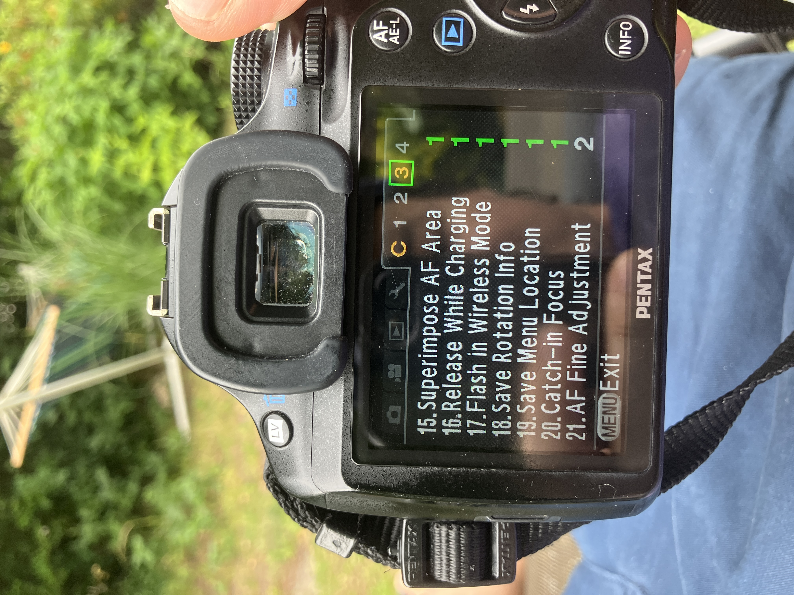

You line up the shot, the focus point lights up green and the camera
tells you it's sharp. You press the shutter, you feel good about it and
you move on. Then you get home, zoom in, and the eyes are soft.

The real plane of focus landed on an eyelash, an ear, the collar,
somewhere just in front of or just behind where you aimed. The camera
said yes and the camera was wrong.

That gap between the camera saying sharp and the photo really being
sharp is what AF Fine Adjustment is for. It's one of the more
misunderstood things hidden in DSLR menus, partly because it sounds like
a fussy tool only pros need and partly because the camera never tells
you it might need it.

So here is what it does, why the problem happens and how to set it
without losing a whole afternoon.

## Why the camera gets it wrong

Most DSLRs focus with a separate phase detection AF sensor at the bottom
of the mirror box. Light bounces off the main mirror, through a second
small mirror and down onto this sensor, and it measures focus by
comparing two views of the scene.

It's fast and it works well, but it's a different light path than the
one that really exposes your image on the sensor.

And because it's a different path, it has to be calibrated so that sharp
for the AF sensor is also sharp for the image sensor. The makers do this
in the factory, but it's never perfect and it can drift. Three things
often throw it off.

First the small tolerances of your exact body and your exact lens. Most
of the time they cancel out, but sometimes they add up in the same
direction and that pair just misses every time.

Second, manual lenses on a body made for autofocus glass, and this is
the big one for adapted and old lenses. The focus confirmation light
still fires when you focus by hand, but it's driven by the same AF
sensor, calibrated for the maker's own lenses, so with a manual lens it
can confirm a little early or a little late, every time.

Third, shooting wide open. None of this matters at f/8, where depth of
field is big enough to hide a small error. At f/1.4 or f/1.8 the sharp
zone is only millimetres deep, and the same small offset you never saw
stopped down is now an obvious miss.

## Prove the error first

The sign that fine adjustment can help is that the misses are the same
every time. If they always land in front of the target, that's front
focus. If they always land behind, that's back focus. A steady offset
you can repeat is exactly what this setting fixes.

Random misses that land in front in one frame and behind in the next are
a different problem, usually focus technique, a subject that moved or a
confirmation light that is just at the edge of what it can do, and fine
adjustment won't save you there.

So don't adjust on a hunch. Spend ten minutes to prove the error is
real, the same every time and in a known direction. The classic test
goes like this.

1. Lay a ruler, a tape measure or a row of things on a table, running away from you at about 45 degrees.
2. Put the camera on a tripod if you have one, so you are out of the equation. Handheld works too, but be careful.
3. Open the lens to its widest aperture, where the error shows the most.
4. Pick one mark, say the 20cm line, and focus on it. With autofocus put the point there and let it lock. With a manual lens focus by eye, or to the confirmation light, on that exact spot.
5. Shoot a few frames and focus again from scratch each time.
6. Zoom in on the results and look where the really sharp line is. On your target, in front or behind?

If the sharp line is in front of your target in every frame, you have
front focus and you correct toward the back. If it's always behind,
that's back focus and you correct toward the front. If it's all over the
place, stop here, because fine adjustment is the wrong tool.

## Where the setting lives

The feature lives in the custom settings menu. The names and places are
different for every brand, but the logic is the same everywhere. Pentax
calls it AF Fine Adjustment and it's in the Custom (C) menus.

Canon calls it AF Microadjustment, in the autofocus custom menus. Nikon
calls it AF Fine-tune, in the setup menu.

You usually get two modes. Apply All (or Adjust All) is one global
correction for every lens you put on. Apply One, the per lens mode,
stores a value for each lens and loads it again when the camera
recognises that lens.

Per lens is better when it works, because every lens can have its own
offset and they can be different.

But it needs the lens to tell the body electronically what it is. Fully
manual and adapted lenses usually can't do that, so for them you fall
back to the global Apply All setting. And that means it shifts the
calibration for everything, also your autofocus lenses.

If you switch all the time between adapted glass and native AF lenses,
keep that in mind, because a global value tuned for the manual lens can
push your AF lenses off.

## Which way to turn it

The adjustment itself is a scale, usually −10 to +10 with zero in the
middle. The direction is the part everyone doubts, so remember it like
this.

If your shots front focus, so the sharp plane is too close to you, move
toward plus to push focus back. If they back focus, so the sharp plane
is too far, move toward minus to pull focus forward.

Change a few steps, not the whole range, shoot the 45 degree test again,
look again and repeat. You are looking for the value where the sharp
plane sits right on the line the camera confirmed.

It really takes a few rounds, more like three or four than one lucky
guess, and when you get close you go one step at a time.

## Doing it on a Pentax K-50

Here is the concrete version for the K-50 and the two lenses in
question, the Cosinon-S 50mm f/1.8 (K-mount, fits natively) and the
Super-Takumar 50mm f/1.4 (M42, on an adapter). Both are fully manual, so
the camera doesn't focus anything itself.

You turn the ring by hand and the green focus confirmation dot of the
K-50 lights up when its AF sensor thinks you got it. That dot is the
thing that has been lying, confirming focus that lands a bit in front of
or behind the real subject when you shoot wide open.

On the K-50 you press MENU and go to the Custom Setting menus. There you
find C3, item 21, AF Fine Adjustment, and you set it to On, Apply All.

Apply All is the right choice here and not per lens, because the Cosinon
and the Takumar are manual and don't tell the camera what they are, so
it can't store a separate value for each.

The global correction is the one that affects them. Then on the −10 to
+10 scale you move it a few steps toward the back, which is the plus (+)
direction.

Why back and plus in this case? The focus has been landing a little in
front of where the dot confirmed, so that's front focus. Pushing the
value toward plus moves the confirmation point back, and the sharp plane
moves back onto your subject. Start with something like +3 or +4, then
test and refine.

Shoot the 45 degree ruler test again wide open, f/1.8 on the Cosinon and
f/1.4 on the Takumar, and check where the sharp line really falls. Move
one or two steps at a time until the confirmed point and the real sharp
plane agree.

There are two things to keep in mind with the K-50.

It's a global setting, so it moves every lens, also any autofocus lens
you put on later. If you tune it for the manual fifties and then mount
an AF lens, the offset is still there, so set it back to 0 when you go
back to AF glass and notice it drifting.

And the adjustment only fixes front focus that is the same every time.
The Takumar has the adapter as an extra variable, its thickness can also
change where focus lands and can even cost you infinity focus
completely, so if the Takumar still misses after calibrating, blame the
adapter and not the camera.

If you want to be completely sure wide open with either lens, the
fallback is always the same. Switch to Live View, magnify to 100% and
focus by eye on the subject.

That reads focus directly from the image sensor and ignores the AF dot,
so there is nothing to calibrate.

## When fine adjustment is the wrong tool

Fine adjustment fixes an offset that is the same every time, and it has
real limits. Two cases need something else.

The first is random misses. If your test frames scatter, in front, then
behind, then on target, there is no single number that fixes them. Often
that's technique, like focus and recompose moving the plane, or a
subject that moved, or a confirmation light that just isn't precise with
your lens. The fix is better focusing and not more time in the menu.

The second is manual lenses you want dead on, wide open. The most
reliable way skips the phase detection sensor completely. Use Live View,
magnify the image to 100% and focus by eye on the real feed from the
image sensor.

You are looking at the real sensor image, so there is no calibration
gap, and what looks sharp really is sharp.

It's slower and it wants a steady camera, but for adapted old glass at
f/1.4 that's how most people get the same good result every time. Fine
adjustment makes the viewfinder and confirmation light workflow better,
and Live View with magnification gets around the whole problem when you
need to be sure.

And there is a third, simple option, which is to stop down. At f/2.8 to
f/4 the depth of field gets deep enough to swallow a small focus error.

If the shot allows it, closing the aperture a stop or two is the fastest
fix of all, no menus and no testing.

## In short

So the green dot is a calibrated guess and not a promise, and with some
camera and lens pairs, especially manual lenses on bodies tuned for
autofocus, that guess is a few hairs off every time. AF Fine Adjustment
lets you move the guess back to where reality is.

In short you prove the error is the same every time and note its
direction with a 45 degree ruler test, wide open. You open the feature
and pick per lens if the lens reports itself electronically, otherwise
global.

You move toward plus for front focus and toward minus for back focus, a
few steps at a time.

And you test again and repeat until the sharp plane lands where the
camera confirmed. For manual glass you want perfect wide open, you can
skip all of it and focus in magnified Live View, or just stop down and
let depth of field cover you.

Do it once for every lens that gives you trouble, and a camera that
quietly lies about focus becomes one you can trust through the
viewfinder again.

