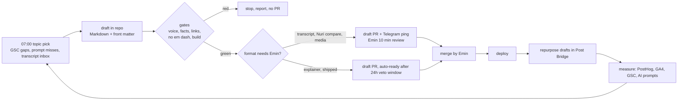
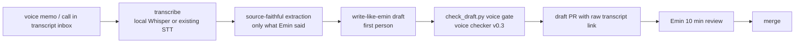
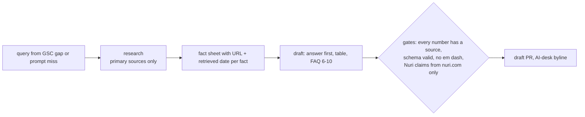
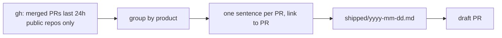
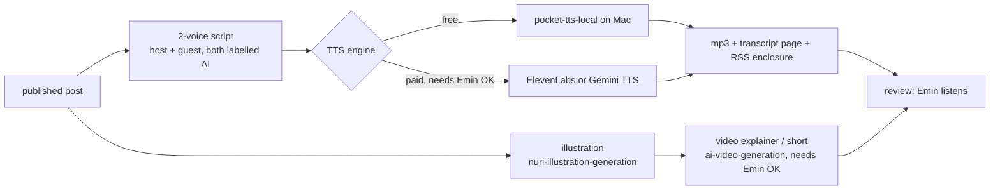
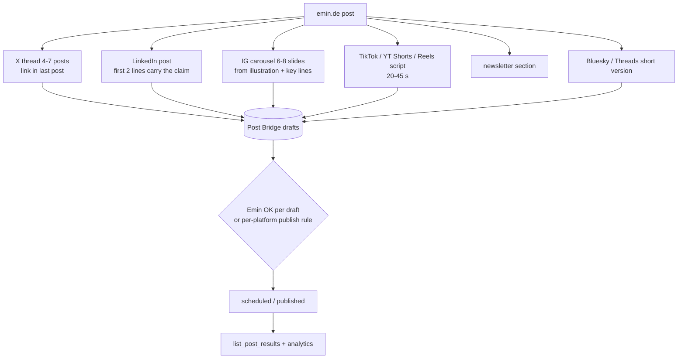

# emin.de content machine

Status: proposal, nothing enabled, nothing paid. Every paid or public step below is marked **needs Emin OK**.
Owner of this file: content-machine docs. The blog engine itself (posts, front matter, feeds, llms.txt, analytics wiring, hosting) is built on the sibling branch `feat/blog-engine` and is not changed here.
Companion file: [ROUTINES.md](./ROUTINES.md) (Hermes cron specs).
Researched: 2026-10-06. Prices and policies are snapshots from that date, re-check before spending.

## 0. Goal in one paragraph

Turn emin.de into a daily SEO and AIO (AI optimization) publication that is fully public on GitHub as Markdown, publishes at least one post per day in several categories and formats, repurposes every post to social via Post Bridge, and measurably routes organic and AI-referred visitors to Emin's products (Nuri first). Emin's thesis, from his own transcript: classic user acquisition is over, recommendations now come through AI assistants, so publish daily so the models see fresh, citable material, and spend money only on AI credits and retargeting.

## 1. What we copy from LLM Gateway, and what we do not

Source: teardown of llmgateway.io (sitemap, llms.txt, rendered HTML, 2026-09-09) and the deck https://smakosh.github.io/llmgateway-ai-marketing-deck/#1. Their reported result: 33.4K clicks from 2.33M impressions in 16 months, organic-led. Their URL mix: about 55 percent generated from live data, about 30 percent dated event pages (changelog, timeline), about 15 percent hand-written editorial.

| LLM Gateway mechanic | emin.de equivalent | Data source |
|---|---|---|
| `/models` live-data directory, refreshed daily | `/now` and `/stack`: live page of what Emin ships and runs (repos, tools, models used by his agents, Nuri releases), regenerated daily from GitHub and config | GitHub API (public repos of `eminogrande`, `nuri-com`), Hermes skill list |
| Entity pages per third-party name | `/topics/<entity>`: Bitcoin, Lightning, passkeys, MCP, x402, Hermes Agent, æternity, BSDEX. One page per entity, listing every emin.de post that touches it | front matter `entities:` field |
| `/compare/x` + `/migration/x` pair | AI-desk `X vs Y` and question pages (section 6), each linking to one decision page on nuri.com | verified provider pages, dated |
| `/changelog` as indexable stream (100 URLs) | `/shipped/<yyyy-mm-dd>`: one page per day with real merged PRs, written from GitHub activity | `gh` CLI, merged PRs only |
| `llms.txt` + `pricing.md` + MCP | already live on main (`/llms.txt`, `/llms-full.txt`, `/mcp`, Markdown mirrors). Extend `llms.txt` with categories and the entity hub | `src/content/*` generators |
| 50 monitored AI prompts | section 9.5 prompt list, run weekly | Hermes routine `aio-prompt-watch` |
| Monthly SEO audit with agent skills | `seo-audit` + `ai-seo` routine, output as a PR | ROUTINES.md `monthly-seo-aio-audit` |
| Search Console gap list to pages | weekly gap-to-posts loop (section 9.4) | Search Console API (credentials missing) |
| House-style skills | `write-like-emin` (voice gate), `nuri-voice-blog-publishing`, `humanizer`, `programmatic-seo`, `ai-seo`, `schema` | Hermes skills |

Not copied: model directories, API migration guides, developer pricing calculators. emin.de is a founder site, its reader asks "who is this person, what did he build, what does he think about Bitcoin, agents and fintech, and should I try Nuri".

Their honest caveat stays in this plan: five months of flat lines before anything moved, and their biggest jump came from a product, not a page. Measure at +4 weeks and +12 weeks, do not judge week 2.

## 2. Categories

Every post carries exactly one `category` in front matter. Six categories, enough to cover the thesis, few enough to keep hubs dense.

| Category slug | Scope | Product it routes to |
|---|---|---|
| `nuri` | building Nuri, product decisions, simplification, wallet, card, IBAN | nuri.com app pages |
| `bitcoin` | Bitcoin, Lightning, self-custody, history since 2012 | nuri.com, Nuri shop |
| `agents` | AI agents, Hermes, MCP, x402, agent-ready web, AI-first company | emin.de `/agent-ready`, paymentrequired.com |
| `building-in-public` | what shipped, numbers, failures, changelog | the shipped product |
| `fintech` | regulated crypto (BSDEX experience), banking rails, EU rules | nuri.com |
| `essays` | founder essays, governance, history (æternity, proud, abend) | about page, newsletter |

Front matter contract (defined by the sibling; this doc only relies on these fields): `title`, `date`, `lang`, `category`, `format`, `author`, `provenance`, `entities`, `sources`, `review` (`emin` or `none`), `canonical`.

## 3. Formats

| Format | Input | Output | Automatic or reviewed | Byline |
|---|---|---|---|---|
| `essay-transcript` | Emin voice memo or call transcript | first-person post in his voice | **always reviewed by Emin** (voice gate + 10 min read) | Emin Mahrt |
| `explainer` | a question with search or AI intent | 800 to 1500 word explainer with sources, FAQ | automatic draft, published after automated gates; Emin can veto | emin.de AI desk |
| `compare` | `X vs Y` or "what is the difference" query | dated comparison table + FAQ, sources per row | automatic draft, **Emin review required when Nuri is one side** | emin.de AI desk |
| `shipped` | merged PRs from public repos, last 24h | dated changelog page | fully automatic (facts come from GitHub) | emin.de AI desk, data from GitHub |
| `podcast` | an existing published post | 2-voice NotebookLM-style audio, 6 to 12 min, transcript page | automatic generation, Emin listens before publish (paid TTS needs Emin OK) | AI voices, labelled |
| `video-explainer` | an existing post | 60 to 180 s narrated explainer with illustrations | reviewed (paid video needs Emin OK) | AI-generated, labelled |
| `short` | an existing post | 20 to 45 s vertical clip script + render | script automatic, render reviewed | AI-generated, labelled |
| `illustration` | an existing post | Nuri-style illustration or infographic | automatic (image gen needs Emin OK for spend) | AI-generated image, labelled |
| `newsletter` | the week's posts | weekly digest | automatic draft, Emin sends | Emin Mahrt (he sends it) |

The rule behind the split: anything that speaks in Emin's first person is reviewed by Emin. Anything that is an AI-desk explainer is labelled as such and only states facts with a source.

## 4. Daily cadence

Minimum one post per day. Week template (Europe/Berlin):

| Day | Primary post | Format | Review | Derivatives |
|---|---|---|---|---|
| Mon | weekly theme essay or transcript post | `essay-transcript` | Emin, 10 min | X thread, LinkedIn, illustration |
| Tue | AI-desk explainer | `explainer` | none (gates only) | X post, LinkedIn |
| Wed | `X vs Y` comparison | `compare` | Emin if Nuri is a side | X thread, IG carousel |
| Thu | AI-desk explainer from Search Console gap | `explainer` | none | X post, short script |
| Fri | what I shipped this week | `shipped` (weekly roll-up) | none | X thread, LinkedIn |
| Sat | podcast of the week's best post | `podcast` | Emin listens | short, newsletter |
| Sun | newsletter digest + transcript backlog | `newsletter` | Emin sends | none |

In addition every weekday a small `shipped/<date>` page is generated if at least one PR merged in a public repo. Zero merged PRs means no page (no empty pages).

Throughput limit for the first 4 weeks: max 10 new URLs per week. Only after the +4 week readback shows impressions on the templates do we raise it.

Note on "auto-ready after 24h": the routine never merges. It marks the PR ready for review. Merge stays a human click until Emin explicitly changes that rule.

## 5. Pipelines

### 5.1 Transcript to essay (always reviewed)

Rules: no fact that is not in the transcript or a cited source; the raw transcript is committed under `transcripts/` (or linked if private) so provenance is checkable; `provenance: transcript` in front matter; byline Emin Mahrt with the note "written from my voice recording with AI assistance, reviewed by me".

### 5.2 AI-desk explainer and compare

### 5.3 GitHub activity to shipped page

Facts come only from PR titles, bodies and diffs. Private repos are excluded by default (Emin decides per repo).

### 5.4 Media: podcast, video, short, illustration

Voice cloning of Emin's own voice is not used for AI-desk content. If Emin wants his cloned voice for his own transcript posts, that is his explicit decision and the audio is still labelled as synthetic.

## 6. Repurposing tree via Post Bridge

One post becomes these drafts. All are created with `is_draft: true`, `use_queue: false`. Nothing is published from an agent until Emin enables the publish rule per platform.

Publish rules (proposal, Emin decides):

1. Phase 1 (weeks 1 to 2): drafts only. Emin publishes by hand in Post Bridge.
2. Phase 2: auto-schedule allowed for `shipped` and `explainer` derivatives on X and Bluesky only. Transcript-post derivatives stay manual forever.
3. Every derivative links back with UTM (section 9.2). Every derivative of an AI-desk post says it is from the AI desk.
4. Readback after every write: `get_post`, then `list_post_results` after publish. "Scheduled" is not "published".
5. Post Bridge MCP is currently `enabled: false` in Hermes. Enabling it is on Emin's checklist.

## 7. Localization

German and English are first-class (`de`, `en`), matching the sibling engine. Turkish (`tr`) is optional later.

1. Source language = the language Emin spoke or the query language.
2. Translation is a separate PR commit, `provenance: translation-of:<slug>`, `hreflang` pair set by the engine.
3. Transcript posts: translation is reviewed by Emin (he reads both languages). AI-desk posts: translation is automatic but must keep every source link and every number identical; a diff check compares numbers between language versions.
4. No machine-translated page without its own target-language query. Google lists translation used only to multiply pages as scaled content abuse (section 8), so each translated page needs local search or prompt demand, checked in Search Console per country.

## 8. Bylines, pseudonyms and transparency policy

Policy: **openly AI-labelled desk only, no fake human personas.** Posts are either "Emin Mahrt" (his words, his review) or "emin.de AI desk" (AI-generated, sourced, labelled at the top of the page, not only in the footer). No invented author names, no stock-photo faces, no fake bios.

Why:

1. **Trust.** The site's whole positioning is "if a claim is made, the code and the source are public". A fake persona is a claim that cannot be backed.
2. **Google spam policy, scaled content abuse.** Google defines it as "many pages are generated for the primary purpose of manipulating search rankings and not helping users ... no matter how it's created", with examples including "Using generative AI tools or other similar tools to generate many pages without adding value for users" and translating or synonymizing scraped content. Source: https://developers.google.com/search/docs/essentials/spam-policies#scaled-content (page last updated 2026-08-28, retrieved 2026-10-06).
3. **Google guidance on AI content.** Google recommends focusing on accuracy, quality and relevance and "adding information on how your content was created", for example how automation was used. Source: https://developers.google.com/search/docs/fundamentals/using-gen-ai-content (last updated 2025-12-10, retrieved 2026-10-06).
4. **EU AI Act Article 50.** Article 50(4) second subparagraph: deployers of an AI system that generates text "published with the purpose of informing the public on matters of public interest shall disclose that the text has been artificially generated or manipulated", unless the content "has undergone a process of human review or editorial control and where a natural or legal person holds editorial responsibility". Article 50(4) first subparagraph requires disclosure for deep-fake image, audio or video. Article 50(5): disclosure "in a clear and distinguishable manner at the latest at the time of the first interaction or exposure". Text: https://artificialintelligenceact.eu/article/50/ (retrieved 2026-10-06). Article 50 applies from 2 August 2026 and was not deferred by the Digital Omnibus, Regulation (EU) 2026/1744 (secondary sources: https://bratby.law/digital-omnibus-ai-high-risk-delay and https://kla.digital/blog/eu-ai-act-august-2026-what-still-applies; primary: Article 113 at https://eur-lex.europa.eu/eli/reg/2024/1689/oj). Not legal advice; whether a personal blog post is a "matter of public interest" is open, so we label everything, which is compliant either way.
5. **Practical consequence.** The human-review exemption only covers content where Emin really holds editorial responsibility. We do not rely on it for AI-desk posts: they carry the label even when Emin glanced at them. Synthetic audio and video (podcast voices, generated video) are always labelled in the media and on the page, and image files carry IPTC `DigitalSourceType: trainedAlgorithmicMedia` metadata as Google suggests for AI images.

Label text (proposal):
- EN: "Written by the emin.de AI desk. Sources are linked. Emin Mahrt is responsible for this site but did not write this text."
- DE: "Geschrieben vom KI-Desk von emin.de. Quellen sind verlinkt. Emin Mahrt verantwortet die Seite, hat diesen Text aber nicht selbst geschrieben."
- Media: "AI-generated voices" / "KI-generierte Stimmen" spoken in the first 5 seconds and in the description.

## 9. Measurement

Two tables always, never merged: **SEO** (Google, humans) and **AIO** (AI assistants, LLM crawlers).

### 9.1 PostHog events (cookieless mode, EU host)

Wired by the sibling engine. Event contract this machine relies on (all with `lang`, `path`, `category`, `format`, `referrer_class` = organic | ai_assistant | social | newsletter | direct | paid):

| Event | When |
|---|---|
| `$pageview` | every page |
| `read_75` | 75 percent scroll on a post |
| `product_click` | any link to nuri.com, link.nuri.com, paymentrequired.com, app stores |
| `product_page_reached` | landing on a product page with an emin.de referrer (needs the same PostHog project or cross-domain param on nuri.com) |
| `newsletter_signup` | newsletter form submit |
| `audio_play`, `video_play` | media start |
| `copy_code`, `outbound_source_click` | trust signals |

`referrer_class` = `ai_assistant` when `document.referrer` host matches: `chatgpt.com`, `chat.openai.com`, `perplexity.ai`, `www.perplexity.ai`, `gemini.google.com`, `claude.ai`, `copilot.microsoft.com`, `www.bing.com/chat`, `you.com`, `phind.com`, `chat.deepseek.com`, `chat.mistral.ai`, or `utm_source` is one of `chatgpt.com` (ChatGPT search appends this), `perplexity`, `gemini`, `claude`, `copilot`.

### 9.2 UTM conventions

`utm_source` = platform (`x`, `linkedin`, `instagram`, `tiktok`, `youtube`, `bluesky`, `threads`, `newsletter`, `emin_de`), `utm_medium` = `social` | `email` | `referral`, `utm_campaign` = post slug, `utm_content` = format of the derivative (`thread`, `carousel`, `short`, `podcast`). Links from emin.de to nuri.com: `utm_source=emin_de&utm_medium=referral&utm_campaign=<slug>&utm_content=<cta_position>`.

### 9.3 GA4

Behind consent only, as the sibling built it. GA4 is the cross-check for PostHog, not the primary report. Measurement ID is not present in env today.

### 9.4 Search Console gap-to-posts loop

Weekly: `searchanalytics.query`, dims `query,page`, 28 days vs prior 28.
- position 5 to 20 with impressions above 50 = expand the existing page
- query with impressions but no matching page = new explainer or compare
- query that mentions Nuri or Emin = priority
Output `docs/seo/data/YYYY-WW/gsc.csv` plus a gap list. Without credentials the routine stops and reports, it never invents numbers.

### 9.5 Monitored AI prompts (AIO)

Run weekly in ChatGPT (search on), Perplexity, Gemini, Claude (web), Copilot. Record: does the answer name Emin Mahrt, emin.de, Nuri, nuri.com; is a URL cited; which URL. Store as `docs/aio/YYYY-WW.csv`. Start set (20, DE and EN):

1. Wer ist Emin Mahrt?
2. Who founded Nuri, the Bitcoin wallet?
3. Was ist Nuri Bitcoin Wallet?
4. Best self-custodial Bitcoin wallet with a Visa card in Europe
5. Bitcoin Wallet mit IBAN und Karte Deutschland
6. Passkey Bitcoin wallet, how does it work?
7. Was unterscheidet Nuri von Revolut?
8. Nuri vs Bitpanda
9. What does agent-ready website mean?
10. How do AI agents pay for APIs with x402?
11. Was ist ein MCP Server einfach erklärt?
12. Hermes Agent by Nous Research, what can it do?
13. Who was CPO of Börse Stuttgart Digital Exchange?
14. Was ist æternity Blockchain und wer hat sie aufgebaut?
15. How to build an AI-first company with agents
16. Founder blogs about building fintech in public
17. Self-custody vs exchange, which is safer for beginners?
18. Lightning wallet with SEPA in Germany
19. Liechtenstein Blockchain Act, who contributed?
20. How do I make my website visible in ChatGPT answers?

Score per week: `named_rate` = prompts where Emin or Nuri is named / prompts run, per assistant. Results are copied verbatim, no paraphrase.

### 9.6 LLM crawler diet

From Cloudflare logs or the origin log once hosted: hits by `GPTBot`, `OAI-SearchBot`, `ChatGPT-User`, `ClaudeBot`, `Claude-User`, `PerplexityBot`, `Perplexity-User`, `Google-Extended`, `Applebot-Extended`, per path, unique IPs printed next to hits.

### 9.7 KPIs

**North star: weekly organic + AI-referred visitors who reach a product page.** Defined as unique PostHog persons per ISO week with `referrer_class in (organic, ai_assistant)` on the session start and a `product_click` or `product_page_reached` in the same session. One number, honest, because it ignores social vanity reach and counts only people who arrived without paid ads and then went to a product.

Supporting (reported, never summed into the north star):

| SEO | AIO | Production |
|---|---|---|
| GSC clicks, impressions, avg position | AI-referred sessions per assistant | posts per week vs plan |
| pages with 1+ click in 28 days | prompt `named_rate` per assistant | share of posts passing gates first time |
| new referring domains | LLM crawler hits on new posts within 7 days | Emin review minutes per week |

Targets stay empty until Emin writes a number. Baseline is measured in week 1.

## 10. Cost model (needs Emin OK for every paid line)

Prices retrieved 2026-10-06 from public pricing pages. USD, before tax.

| Step | Engine (example) | Public price | Per post estimate | Source |
|---|---|---|---|---|
| Research + draft + checks (text) | Claude Sonnet 5 | $2 / MTok in, $10 / MTok out | ~80k in + 12k out = ~$0.28 | https://platform.claude.com/docs/en/about-claude/pricing |
| Same, premium model | Claude Opus 5.5 | $4 / MTok in, $20 / MTok out | ~$0.56 | same |
| Same, cheap model | gpt-5.6-luna | $0.20 in, $1.20 out per MTok | ~$0.03 | https://platform.openai.com/docs/pricing |
| Web search tool calls | OpenAI web search | $10 / 1k calls + tokens | 10 calls = ~$0.10 | same |
| Illustration (1 to 3 images) | fal Nano Banana / Flux Kontext Pro | ~$0.04 per 1MP image | $0.04 to $0.12 | https://fal.ai/pricing |
| Podcast 10 min (~9k chars) | ElevenLabs v3 TTS | $0.10 / 1k chars | ~$0.90 | https://elevenlabs.io/pricing/api |
| Podcast 10 min, cheaper | Gemini 2.5 Flash TTS | $10 / M audio tokens, 25 tokens/s | ~$0.15 | https://cloud.google.com/text-to-speech/pricing |
| Podcast, free | pocket-tts-local on the Mac | $0 (local compute) | $0 | local skill |
| Short / video 30 s | fal Kling 2.5 Turbo Pro | $0.07 / s | ~$2.10 | https://fal.ai/pricing |
| Short / video 30 s, cheaper | fal Wan 2.5 | $0.05 / s | ~$1.50 | same |
| Short / video 30 s, premium | fal Veo 3 | $0.40 / s | ~$12.00 | same |
| Social distribution | Post Bridge Marketer | $39 / month, 15 accounts, API + MCP included | ~$1.30 / day | https://www.post-bridge.com/pricing |
| Analytics | PostHog free tier | 1M events / month free | $0 | https://posthog.com/pricing |
| Transcription | local Whisper, or ElevenLabs Scribe v2 | $0.22 / hour | $0 to $0.05 | https://elevenlabs.io/pricing/api |

Per-day estimate with the week template above:

- Text day (explainer, compare, shipped): ~$0.30 to $0.70 tokens + $0.04 to $0.12 image = **~$0.35 to $0.80**.
- Podcast day: + $0 (local TTS) to $0.90 (ElevenLabs).
- With one 30 s short per day on Kling: + ~$2.10.
- Fixed: Post Bridge ~$1.30 / day.

Average: **about $1.70 to $2.50 per day without video, about $4 to $5 per day with one generated short per day**, i.e. roughly $50 to $150 per month. Retargeting ad spend is not included and needs its own budget from Emin. Hermes running on Emin's existing subscriptions may make the token line effectively $0 marginal; the table assumes API list prices.

Budget guard (proposal): hard cap per routine run (stop if estimated spend > $3), weekly spend line in the weekly report.

## 11. 30-day launch plan

### Days 1 to 3: setup

| Day | Task | Who |
|---|---|---|
| 1 | Merge sibling `feat/blog-engine` after review; deploy to Cloudflare Workers; DNS for emin.de | Emin approves, agent executes |
| 1 | Create PostHog EU project, set key; GA4 property + consent; verify emin.de in Search Console (DNS TXT); service account for GSC API | Emin (accounts), agent wires |
| 2 | Import seed material (below) as Markdown with provenance; publish the 3 transcript posts after Emin review | agent drafts, Emin reviews |
| 2 | Enable Post Bridge MCP, connect X, LinkedIn, Instagram, TikTok, YouTube, Bluesky, Threads; read-only `list_social_accounts` check | Emin connects accounts |
| 3 | Baseline: first AIO prompt run (section 9.5), GSC snapshot, crawler diet; commit as `docs/aio/2026-W41.csv` | agent |
| 3 | Approve and create the cron routines from ROUTINES.md (paused first, then enabled one by one) | Emin |

### Seed material (exists, verify before republishing)

| Material | Where | Use |
|---|---|---|
| Transcript post: "Simplify Nuri until it works on the worst phone" | Hermes scratch draft `voice-blog/draft.md`; related published essay "The app has a hundred features, five of them matter" on nuri.com/blog | day 2 essay |
| Transcript post: AI-first growth (classic user acquisition is over) | Emin's transcript, title to confirm | week 1 |
| Transcript post: the agentic company | Emin's transcript, title to confirm | week 1 |
| Substack: "Crypto Explained #1: What is Bitcoin?" (Jul 2021) | https://emin.substack.com/p/episode-1-what-is-bitcoin | refresh as 2026 explainer, canonical note |
| Substack: "Crypto Explained #2: What Are NFTs?" (Oct 2021) | https://emin.substack.com/p/crypto-explained-2-what-are-nfts | archive + "what changed since 2021" |
| Substack: "How to Protect Your Bitcoin ... with Biometric Hardware from nuri.com" | https://emin.substack.com/p/how-to-protect-your-bitcoin-and-everything | history of Nuri post |
| Talk: "CeFi vs DeFi: Exploring the differences and potential for financial markets", keynote at Crypto Assets Conference 2022 as BSDEX | agenda: https://crypto-assets-conference.de/hubfs/Previous%20CAC%20-%20Agenda/FSBC%20_%20CAC22A%20_%20Agenda.pdf ; video URL to find (emino.app post links only youtube.com root) | talk page + transcript |
| Talk: "Emin Mahrt on Bonding Curves, Smart-Contracts and Fair Token Launch" (æternity call, 2019-03-20) | https://youtu.be/Y-QazkphlNA | talk page + transcript |
| Governance: "Governing Governance: Why Human Consensus is Harder Than Code" | emino.app blog (local copy `emino-app-blog/server-copy-clean/content/posts/2025-12-06-...`) | essay, canonical decision needed |
| YouTube channel "Crypto Explained" | https://youtube.com/c/EminMahrt | podcast/video backlog |

Talk transcripts: pull YouTube captions, keep verbatim quotes, mark as talk transcript, no added claims.

### Week 1: first 7 posts

| # | Day | Title (working) | Format | Category | Keyword / intent | Review |
|---|---|---|---|---|---|---|
| 1 | Mon | Simplify Nuri until it works on the worst phone | essay-transcript | nuri | "nuri bitcoin wallet", founder intent | Emin |
| 2 | Tue | Classic user acquisition is over: why I publish every day for AI | essay-transcript | agents | "AI search marketing", "ChatGPT recommendations founder" | Emin |
| 3 | Wed | Was unterscheidet Nuri von Revolut? | compare (DE) | nuri | "nuri vs revolut", "bitcoin wallet mit karte" | Emin (Nuri side) |
| 4 | Thu | The agentic company: how one founder runs a company with AI agents | essay-transcript | agents | "agentic company", "AI-first company" | Emin |
| 5 | Fri | What I shipped this week (W41) | shipped | building-in-public | "emin mahrt nuri changelog", brand | none |
| 6 | Sat | CeFi vs DeFi, revisited: my 2022 Börse Stuttgart keynote in 2026 | explainer + talk page | fintech | "cefi vs defi", "bsdex" | Emin (his talk) |
| 7 | Sun | What is Bitcoin? My 2021 explainer, updated for 2026 | explainer (refresh of Substack #1) | bitcoin | "was ist bitcoin einfach erklärt" | Emin (his old text) |

Derivatives in week 1: drafts only. Podcast of post 2 on Saturday with local TTS.

### Weeks 2 to 4

- **Week 2 (theme: agents):** AI-desk explainers "What is x402", "What is an MCP server", "What does agent-ready mean" (link `/agent-ready`); compare "MCP vs REST API for agents"; one transcript post; shipped roll-up; podcast. Turn on daily `shipped/<date>` pages.
- **Week 3 (theme: Bitcoin + self-custody):** compare "Self-custody vs exchange", "Nuri vs Bitpanda", "Passkey wallet vs seed phrase"; bonding-curves talk page (æternity 2019); governance essay; first newsletter; first short video (needs Emin OK on spend).
- **Week 4 (theme: building in public + fintech):** "From æternity to Nuri: what I learned scaling a team past 100" (only facts already public on emin.de and LinkedIn); "Nuri vs Trade Republic"; "What the EU AI Act Article 50 means for a founder blog" (uses section 8 sources); 4-week readback report: GSC, AIO prompts, north star; decide whether to raise cadence.

### 10 AI-desk `X vs Y` / question titles (facts needed, where to verify)

Never invent facts. Each row lists what the page must state and the only acceptable sources. A row without verifiable facts is not published.

| # | Title | Facts needed | Verify at |
|---|---|---|---|
| 1 | Was unterscheidet Nuri von Revolut? | custody model (self vs custodial), card type, IBAN, supported countries, fees, crypto withdrawal to own wallet | nuri.com product + fees pages; revolut.com/de-DE crypto terms and fees page; dated |
| 2 | Nuri vs Bitpanda: Wallet oder Broker? | custody, regulation status, BTC withdrawal, card, fees | nuri.com; bitpanda.com fees + legal pages; BaFin company database |
| 3 | Nuri vs Trade Republic für Bitcoin | can BTC be withdrawn on-chain, custody, card, IBAN | traderepublic.com crypto FAQ and price list; nuri.com |
| 4 | Self-custody vs exchange: which is safer? | definitions, historical exchange failures with dates | primary sources (court filings, official insolvency notices, e.g. FTX bankruptcy docket); bitcoin.org |
| 5 | Passkey wallet vs seed phrase | how passkeys (WebAuthn/PRF) work, recovery paths, Nuri's specific model | W3C WebAuthn spec, FIDO Alliance docs, nuri.com security page; Nuri claims reviewed by Emin |
| 6 | Lightning vs on-chain Bitcoin payments | fees model, settlement, limits | lightning.network docs, BOLT specs on GitHub, mempool.space for live fee data (dated) |
| 7 | MCP vs REST API: what AI agents actually need | protocol definitions, transport, auth | modelcontextprotocol.io spec; emin.de `/mcp` and `/openapi.json` as working examples |
| 8 | x402 vs API keys: how agents pay for data | x402 flow (HTTP 402 challenge), facilitators | x402.org / Coinbase x402 GitHub spec; emin.de `/api/v1/corpus` live 402 response |
| 9 | CeFi vs DeFi: where regulated exchanges fit | MiCA status, what BSDEX offers | EUR-Lex MiCA text (Regulation (EU) 2023/1114); bsdex.de; Emin's 2022 keynote (agenda PDF above) |
| 10 | Hermes Agent vs ChatGPT agents: what can a self-hosted agent do? | feature lists, licensing, hosting | hermes-agent.nousresearch.com/docs; OpenAI official docs; dated |

Every comparison page: "facts as of <date>" line, a row-level source link, and a re-verify date 90 days later (routine `stale-fact-check`).

## 12. Emin must provide or approve

- [ ] Approve this design and ROUTINES.md (merge of this PR).
- [ ] Merge + deploy of the sibling `feat/blog-engine` branch; Cloudflare account access and DNS change for emin.de.
- [ ] PostHog: create EU project, provide project API key (public key) and a personal API key for HogQL reads, stored in `~/.hermes/.env`.
- [ ] GA4: measurement ID (behind consent).
- [ ] Google Search Console: verify emin.de (DNS TXT), grant a service account read access, JSON at `~/.hermes/secrets/gsc.json`.
- [ ] Post Bridge: enable the MCP in Hermes, confirm plan ($39/month Marketer), connect social accounts, approve phase-1 "drafts only" rule.
- [ ] Budget: monthly cap for AI generation (proposal $50 to $150) and a per-run cap ($3); separate retargeting budget if wanted.
- [ ] TTS choice: local pocket-tts (free) vs ElevenLabs / Gemini (paid); decision on whether his own cloned voice may be used.
- [ ] Titles and raw transcripts of the AI-first-growth and agentic-company posts; confirm "Simplify Nuri" draft is final.
- [ ] Which repos count as public for `shipped` pages.
- [ ] Canonical decision for re-published Substack and emino.app posts (emin.de canonical, or keep originals canonical).
- [ ] Newsletter tool (Substack stays, or move to emin.de + Resend).
- [ ] KPI targets (left empty until he writes numbers).
- [ ] Enable each cron routine from ROUTINES.md individually.

## 13. Gaps and open questions

- Exact titles and text of the AI-first-growth and agentic-company transcript posts were not found locally; the 30-day plan uses working titles.
- The CAC 2022 CeFi vs DeFi keynote video URL was not found; only the agenda PDF verifies the talk. A Börse Stuttgart "CPO talk" video and governance-protocol talks need URLs from Emin.
- No PostHog, GA4 or Search Console credentials exist, so no baseline numbers are stated here.
- Cross-domain attribution to nuri.com needs either the same PostHog project on nuri.com or a URL parameter handoff; nuri.com has no PostHog today.
- Whether personal founder posts count as "public interest" text under Article 50(4) is a legal question; the policy labels everything to be safe.
- Prices change monthly (several model prices above are introductory); the cost table must be re-checked before Emin sets a budget.
