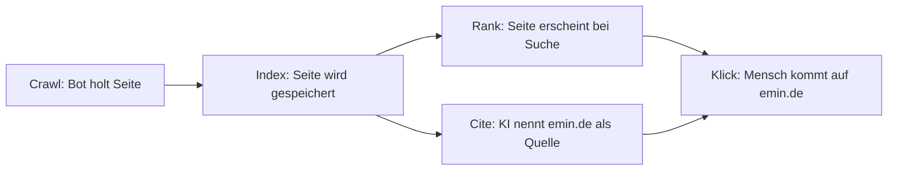
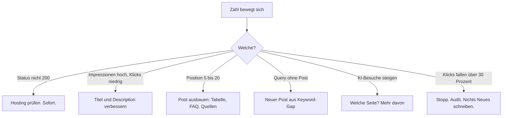
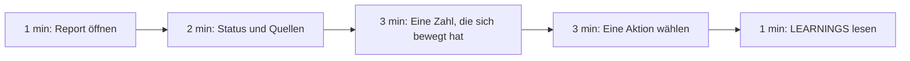

# COACH: Organischer Traffic und KI-Traffic, für Emin

Kurz. Ein Satz, eine Aussage. Jede Aussage hat eine Quelle unten.
Stand: 2026-10-06. Alle Quellen an diesem Tag gelesen.

## 1. Wie Traffic entsteht: vier Stufen

1. **Crawl.** Google findet Seiten über Links und Sitemaps. Ein Bot lädt sie herunter. [S1]
2. **Index.** Google analysiert die Seite und speichert sie im Index. Nicht jede Seite schafft das. [S1]
3. **Rank.** Bei einer Suche zeigt Google passende Seiten. Bezahlen hilft nicht. Garantie gibt es nicht. [S1]
4. **Cite.** KI-Antworten in Google (AI Overviews, AI Mode) verlinken nur Seiten, die indexiert sind und ein Snippet haben dürfen. Kein Extra-Trick nötig. [S2]

Merke: Ohne Index kein Ranking. Ohne Ranking kein Klick. Ohne Index auch keine Nennung in Google-KI.

## 2. KI-Suchen haben eigene Bots

| Firma | Bot für Suche/Antworten | Bot für Training | Quelle |
|---|---|---|---|
| OpenAI | OAI-SearchBot (ChatGPT Suche), ChatGPT-User (Nutzer-Klick) | GPTBot | [S3] |
| Perplexity | PerplexityBot, Perplexity-User | keiner laut Doku | [S4] |
| Anthropic | Claude-SearchBot, Claude-User | ClaudeBot | [S5] |

- Wer OAI-SearchBot blockt, erscheint nicht in ChatGPT-Suchantworten. [S3]
- Training und Suche sind getrennt steuerbar. Du kannst GPTBot blocken und OAI-SearchBot erlauben. [S3]
- robots.txt steuert Crawling. Es versteckt keine Seite aus Google. Dafür gibt es `noindex`. [S6]

Unsere Regel: Such-Bots erlauben. Training ist deine Entscheidung. Die Probe prüft das täglich (`robots_ai_bots_blocked`).

## 3. Schneller gefunden werden

- **Sitemap.** Hilft neuen Seiten mit wenig Links. emin.de ist neu, also: ja. [S7]
- **IndexNow.** Ein Ping sagt Bing und anderen Suchmaschinen: diese URL ist neu. Nur geänderte URLs pingen. HTTP 200 heißt nur "empfangen", nicht "indexiert". [S8] [S9]
- **Google** nimmt kein IndexNow. Für Google zählt Sitemap plus Search Console. [S1] [S7]

## 4. Was jede Zahl im Tagesreport bedeutet

| Zahl | Bedeutung | Gut wenn |
|---|---|---|
| `home_http_status` | Antwort von emin.de. 302 = Weiterleitung zu carrd. | 200 |
| `home_serves_own_host` | 1 = emin.de liefert eigene Seiten. | 1 |
| `sitemap_url_count` | URLs, die wir Suchmaschinen anbieten. | steigt mit jedem Post |
| `llms_txt_post_count` | Posts in llms.txt, der Liste für KI-Agenten. | = Anzahl öffentlicher Posts |
| `robots_ai_bots_blocked` | Wie viele Such- und KI-Bots robots.txt sperrt. | 0 bei Such-Bots |
| `indexnow_pings_total` | Wie oft wir neue URLs gemeldet haben. | steigt nach jedem Post |
| `impressions_28d` (GSC) | Wie oft emin.de in Google gesehen wurde. [S10] | steigt |
| `clicks_28d` (GSC) | Wie oft jemand von Google geklickt hat. [S10] | steigt |
| `ctr_28d_pct` (GSC) | Klicks geteilt durch Impressionen. [S10] | über 2 Prozent |
| `avg_position_28d` (GSC) | Durchschnittsplatz. 1 = ganz oben. [S10] | sinkt |
| `views_ai` (PostHog) | Besuche von chatgpt.com, perplexity.ai, gemini, claude.ai, copilot. | steigt |
| `product_click` (PostHog) | Klicks auf Nuri-Links. Das ist der Geschäftswert. | steigt |

Heute (2026-10-06): 302 nach carrd, 0 Sitemap-URLs, 0 Posts in llms.txt. Das ist die ehrliche Basis. Alles darüber hinaus misst erst etwas, wenn die Seite live ist.

## 5. Wenn sich eine Zahl bewegt

- Hohe Impressionen, wenig Klicks: Titel ist schwach. Der Titel soll den Inhalt ehrlich zusammenfassen, nicht übertreiben. [S11]
- Gute Inhalte sind original, vollständig und nützlich für Menschen. Seiten nur für Rankings sind Spam, auch wenn eine KI sie schreibt. [S11]
- Ranking braucht Zeit. Erst nach 4 Wochen bewerten. Crawling dauert Tage bis Monate. [S2]

## 6. Das 10-Minuten-Ritual, jeden Morgen

1. **1 min.** `growth/reports/<heute>.md` öffnen.
2. **2 min.** Sources-Tabelle: alles `ok`? Status 200?
3. **3 min.** Eine Zahl, die sich bewegt hat. Nur eine.
4. **3 min.** Eine Aktion aus Abschnitt 5. Als Issue anlegen. Nicht sofort bauen.
5. **1 min.** Letzte drei Zeilen in `growth/LEARNINGS.md` lesen. Stimmt das?

Montags zusätzlich: `growth/keywords/<woche>.md`. Einen Gap wählen. Einen Post planen.
Am 1. des Monats: Audit. Regeln in LEARNINGS prüfen.

## 7. Was wir nicht tun

- Keine `site:emin.de`-Abfragen per Skript. Google wertet automatisierte Anfragen als Spam. [S12] Die Indexzahl kommt aus Search Console.
- Keine geschätzten Zahlen. Nicht verbunden heißt: keine Zahl.
- Keine bezahlten KI-Abfragen ohne dein OK.

## Quellen

- [S1] Google Search Central, In-depth guide to how Google Search works: https://developers.google.com/search/docs/fundamentals/how-search-works
- [S2] Google Search Central, AI features and your website: https://developers.google.com/search/docs/appearance/ai-features
- [S3] OpenAI, Overview of OpenAI Crawlers: https://platform.openai.com/docs/bots
- [S4] Perplexity, Perplexity Crawlers: https://docs.perplexity.ai/guides/bots
- [S5] Anthropic, Does Anthropic crawl data from the web: https://support.claude.com/en/articles/8896518-does-anthropic-crawl-data-from-the-web-and-how-can-site-owners-block-the-crawler
- [S6] Google Search Central, Introduction to robots.txt: https://developers.google.com/search/docs/crawling-indexing/robots/intro
- [S7] Google Search Central, Learn about sitemaps: https://developers.google.com/search/docs/crawling-indexing/sitemaps/overview
- [S8] IndexNow, Documentation: https://www.indexnow.org/documentation
- [S9] Bing Webmaster Tools, How to add IndexNow: https://www.bing.com/indexnow/getstarted
- [S10] Search Console Help, What are impressions, position, and clicks: https://support.google.com/webmasters/answer/7042828
- [S11] Google Search Central, Creating helpful, reliable, people-first content: https://developers.google.com/search/docs/fundamentals/creating-helpful-content
- [S12] Google Search Central, Spam policies (machine-generated traffic): https://developers.google.com/search/docs/essentials/spam-policies
